# Suq Insights — Software Development Life Cycle Document

Version 3.0 — September 2026 — Standalone edition. This document is self-contained: it describes the product, its requirements, its design, and how it is built, tested, deployed, and maintained, without depending on any other document.

---

## 1. Introduction

### 1.1 Purpose
This document governs the complete life cycle of the Suq Insights platform: what is being built (requirements), how it is designed (architecture and detailed design), how it is implemented (engineering standards and process), how quality is assured (testing), how it reaches production (deployment and release management), and how it is operated and maintained afterward.

### 1.2 Product summary
Suq Insights is a commercial SaaS analytics platform for small and mid-size merchants in Spanish-, French-, and English-speaking markets (Latin America, France and francophone Africa, and global English markets). Merchants submit whatever record of their sales they already keep — a point-of-sale export, a marketplace back-office file, a hand-kept spreadsheet, a pasted table, or a photograph of a paper ledger — and the platform answers three questions daily: what is selling, what is about to run out, and which customers come back.

Merchants may also simply record the day as it happens. Data arrives through **channels**: named streams the merchant defines and labels, where the label declares what the data asserts — a count of what is on the shelf, a sale that consumes it, a delivery that adds to it. Because intent is declared once per channel rather than guessed per file, quantities relate correctly across time and across input paths: count fifty today, record two sales tomorrow, and stock reads forty-eight without anyone having written that number. The canvas updates live as data lands.

The platform assumes **no structure whatsoever** in what it receives. It infers a domain model from each dataset — from file metadata, header text, and the extracted values themselves — reconciles that inferred model against the analytical concepts it understands, and presents the result to the merchant for inspection and correction before anything is committed. Data that matches no known concept is preserved as typed attributes rather than discarded, and the interpretation stays editable afterward: assigning a role to a field months later backfills the analysis over history already loaded, with no re-upload. This is the product's central technical bet — that meeting merchants where their data actually is beats requiring them to reshape it. The platform is monetized two ways: a free tier supported by contextual business-to-business advertising, and a premium subscription offering unlimited history, predictive alerts over SMS and email, a programmatic sync API, team seats, and an ad-free workspace.

### 1.3 Definitions
- **Merchant**: a business customer; one merchant is one tenant workspace.
- **Upload**: one submitted source — file, pasted table, image, or API batch — passing through the ingestion pipeline.
- **Channel**: a merchant-defined, labelled stream of incoming data. The label declares its intent, and the channel holds the domain model, fill policy, and arrival profile that govern everything sent through it.
- **Intent**: what a record asserts — an observation of state, a decrement, an increment, an adjustment, or reference data. Declared by the channel, never inferred from values.
- **Derived state**: a running quantity computed from the latest observation plus subsequent increments and decrements. Stock is its first configured use.
- **Load**: one delivery of data into a channel through any input path, and the unit a merchant can revert.
- **Dataset**: a named stream of records within a workspace, identified by the structure of the sources that feed it.
- **Domain model**: the platform's interpretation of a dataset — what each field is called, its type, its units, and which analytical concept it represents, if any. Inferred, merchant-editable, and versioned.
- **Role**: an analytical concept a field can represent (transaction time, monetary amount, quantity, item identity, customer identity, category, location, channel, stock level). Roles are what analytics depend on; a field without one is still stored and still usable as a filter.
- **Record**: one interpreted row, holding resolved roles in indexed columns and every other field in a typed attribute payload.
- **Structural signature**: a fingerprint of a source's physical shape, used to recognize a returning file format and apply its confirmed model automatically.
- **Capability**: an analysis a dataset can support, determined by which roles its confirmed model resolves.
- **Rollup**: a precomputed daily aggregate table that dashboards read instead of raw records.
- **Entitlement**: a plan-driven capability flag or quota (for example unlimited history, SMS alerts) enforced by middleware.
- **Advertiser**: a business-to-business supplier buying contextual ad placements shown to free-tier merchants.
- **Slot / trigger context**: a defined position in the dashboard where an ad may render, tied to a merchant state such as an active stockout alert.

---

## 2. Requirements

### 2.1 Functional requirements — core platform (all tiers)

**Accounts and authentication**
- FR-A-1: A merchant signs up with email and password; the email is verified by link or code before uploads are allowed.
- FR-A-2: Login issues a short-lived access token (15 minutes) and a rotating refresh token (30 days); web clients receive them as secure, httpOnly cookies; mobile clients receive them in the response body.
- FR-A-3: A user may optionally verify a phone number by SMS one-time code; a verified phone is prerequisite for the SMS alert channel.
- FR-A-4: Password reset is by emailed link; optional two-factor authentication (TOTP) is available to all users and mandatory for platform administrators.
- FR-A-5: Roles: owner (full workspace control including billing), staff (dashboards, uploads, alerts; no billing, team, or API keys), advertiser (advertiser portal only), platform admin (internal surface only).

**Data ingestion — schema-on-read, inferred domain**

The platform does not require merchant data to conform to a predefined schema. It **infers a domain model from each dataset** — from file metadata, header text, and the extracted values themselves — then reconciles that inferred model against the analytical concepts it understands, and lets the merchant inspect and correct the result before anything is committed. Data that does not correspond to a known concept is preserved as typed attributes rather than discarded.

- FR-U-1: A merchant submits data in any supported form up to the plan's size limit; the request returns immediately with a job handle and progress is streamed live to the browser. No file layout, column set, column order, or naming convention is required. Supported sources at launch: delimited text (CSV, TSV, any delimiter), spreadsheets (XLSX, XLS, ODS), JSON and JSON-lines, a table pasted directly into the browser, **images and PDFs of tabular material** (a photographed paper ledger, a receipt, a printed report, a screenshot of a point-of-sale summary), and the programmatic sync interface.
- FR-U-1a: **Image and PDF ingestion.** Visual sources pass through document extraction before profiling: page and orientation correction, table region detection, cell segmentation with row and column reconstruction, and text recognition in the supported languages including handwriting where legible. Extraction yields the same tabular structure as a file, plus a **per-cell confidence** and the source coordinates of every value. Cells below a confidence threshold are flagged for the merchant rather than accepted; the review screen displays the recognized value beside the cropped image region it came from, so a merchant verifies by eye and corrects in place. A source too poor to extract is rejected with specific, actionable guidance (image blurred, table not detected, page skewed beyond correction) rather than a generic failure. Digital PDFs with an embedded text layer skip recognition and use that layer directly, which is both faster and exact.
- FR-U-2: **Structural inference.** The system determines encoding, delimiter, quoting, decimal and thousands separators, header presence and position (including preamble rows, title rows, and merged headers), the data region, and repeated or footer rows, from the bytes themselves. Nothing that can be proven from the data is asked of the merchant.
- FR-U-3: **Type and semantic inference.** For every discovered column, the system infers a data type (integer, decimal, date, datetime, boolean, categorical, identifier, free text, currency amount, quantity, percentage) with a confidence score, plus distribution facts (null rate, cardinality, min and max, sample values, detected units and currency symbols, date order). Where a value is ambiguous, competing interpretations are retained with their evidence rather than one being silently chosen.
- FR-U-4: **Domain reconciliation.** Inferred columns are matched to the platform's analytical concepts — transaction time, monetary amount, quantity, item identity, item description, customer identity, category, location, channel, stock level — using header text in any of the supported languages, value shape, statistical profile, and inter-column relationships (for example, detecting that one column is consistently the product of two others, and is therefore a line total). Each match carries a confidence and the evidence behind it. **Reconciliation produces a proposal, never a silent commitment.**
- FR-U-5: **Merchant review and editing.** Before the dataset is committed, the merchant sees the inferred domain model in a review screen showing, per column, the detected name, inferred type, assigned role (or none), confidence, and a live preview of parsed values. The merchant may: rename a field; change its type; change or clear its analytical role; set units, currency, or date order; mark a column as an identifier; exclude a column; split or combine columns using simple declared rules; define a constant for a value the file omits (such as a currency or a location the merchant knows applies to the whole file); and correct individual cell values in the preview. Every edit re-renders the preview immediately from the actual data.
- FR-U-6: **Editing after commit.** The inferred model remains editable after load. Changing a field's type, role, or units re-derives the affected records and recomputes only the aggregates those records touch, without requiring re-upload. The merchant is shown what will change before confirming, and every such change is recorded with its author and timestamp.
- FR-U-7: **Learned reuse.** A confirmed model is saved against the dataset's structural signature and applied automatically to future datasets of the same shape, with the merchant notified rather than prompted. Corrections a merchant makes also improve future proposals for that workspace, and — as anonymous aggregate signals only, never as data — the platform's general inference quality.
- FR-U-8: **Unmapped data is retained, not lost.** Columns with no analytical role are stored as typed attributes on the record and remain available for filtering, grouping, and export. A merchant can later assign a role to such an attribute and gain analytics over history already loaded.
- FR-U-9: Rows that cannot be interpreted under the confirmed model are rejected individually with a localized, specific reason; the merchant can download a full error report. If the reject rate exceeds half the dataset, the load is abandoned and the merchant is returned to the review screen, because that pattern nearly always means a misinterpreted model rather than bad data.
- FR-U-10: Re-uploading the same or overlapping data is safe: identical files short-circuit, and duplicate records are detected by a content fingerprint derived from the confirmed model and skipped, with counts reported.
- FR-U-11: Entities referenced across records — items, customers, categories, locations — are resolved into the workspace's entity catalog by identifier when one exists and by normalized, accent-folded description otherwise. Newly seen entities are created automatically and surfaced in a review queue where the merchant can merge duplicates and correct names.
- FR-U-12: **Analytical availability is explicit.** The platform states which analyses a dataset supports and which it does not, naming the missing concept in plain language (for example, "retention analysis needs a customer identifier; no column was recognized as one — you can assign one on the review screen"). No analysis is ever presented computed from a guessed role.

**Channels — labelled streams of incoming data**

A merchant may send data once and never again, or send the same kind of data every day. When a shape recurs, the merchant saves it as a **channel**: a named, labelled stream with a declared meaning. The label is the platform's contract for everything that arrives through it — what the data asserts about the world, what domain model interprets it, and what happens when it overlaps data already held. Channels unify every input path: a file, a photograph, typed entry, and an API push into the same channel produce the same records.

- FR-C-1: **Channels are merchant-defined and named.** A merchant creates a channel by naming it and labelling what it carries ("Daily sales", "Monday stock count", "Supplier deliveries"). A channel holds its confirmed domain model, its intent label, its fill policy, and a profile of what normally arrives through it.
- FR-C-2: **Saving is offered, not demanded.** The platform proposes saving a channel after a second dataset of the same shape arrives — not on first contact, when a merchant cannot yet know whether it will recur. A merchant may also create a channel deliberately at any time.
- FR-C-3: **The label declares intent.** Every channel states what its data asserts, and this determines how records affect derived quantities: an **observation** states what is true at a moment ("there are 50"); a **decrement** consumes ("2 were sold"); an **increment** adds ("20 were delivered"); an **adjustment** corrects an earlier assertion; and **reference** data describes without asserting quantity (names, prices, categories). Intent is declared once when the channel is created, never re-asked per file.
- FR-C-4: **Any input, one path.** A channel accepts files, photographs, pasted tables, typed entries, and API pushes interchangeably. A channel's saved domain model is also what renders its manual entry form, so the fields a merchant chose to track are the fields they are asked for.
- FR-C-5: **Fill policy per channel.** Each channel records what to do when incoming data covers a period already recorded: replace what is held, keep both, or skip the overlap. The merchant is asked once, at channel creation or first overlap, and the answer is remembered.

**Day-to-day entry**

- FR-E-1: **An entry space.** Merchants record activity as it happens, through a surface built from their channels rather than a fixed form. Three modes are supported: **quick entry** for a few taps per event with recent items surfaced first and the form resetting for the next; **batch entry** in a spreadsheet-like grid for recording a whole day at close, including paste from the clipboard; and **corrections** for amending or removing something entered earlier.
- FR-E-2: **The merchant chooses what to track.** When creating a channel, the merchant selects which fields they want to capture. Those choices become the channel's domain model, so entered data and uploaded data are indistinguishable downstream and feed the same widgets.
- FR-E-3: **Guided field suggestions.** The platform proposes fields worth capturing based on the channel's intent and the merchant's business type, and states plainly what each additional field unlocks ("recording who bought makes retention analysis possible"). The merchant is never obliged to accept a suggestion.
- FR-E-4: **Entity autocomplete.** Item, customer, and category inputs complete against the workspace's existing catalog so a merchant selects the item they already have rather than creating a near-duplicate. Newly typed values create entities and enter the duplicate-review queue.
- FR-E-5: **Offline entry.** Entries made without connectivity are held locally and synchronised when the connection returns, with clear indication of what is pending. No entry is lost because a shop has poor signal.
- FR-E-6: **Concurrent entry.** Several users in one workspace may record simultaneously and see each other's entries appear.

**Derived state**

- FR-S-1: **Running quantities are computed, never stored as a value.** The stock of an item at any moment is the most recent observation plus every increment and minus every decrement recorded after it. Counting 50 today and recording two sales tomorrow yields 48 without anyone having written 48. The same mechanism serves any running total the platform later tracks; stock is its first configured use.
- FR-S-2: **Late and corrected data recomputes forward.** A record arriving or changing in the past invalidates derived state after it, and the platform recomputes forward from the earliest affected point, bounded to the entities involved.
- FR-S-3: **Contradictions surface rather than hide.** When recorded consumption exceeds what observations and additions can account for, the platform reports it as a finding — a miscount, unrecorded deliveries, or duplicated sales — instead of clamping the number to zero and concealing the discrepancy.
- FR-S-4: **Provenance is inspectable.** Any derived figure can be expanded to show the observation it started from and the events applied since, so a merchant who disputes a number can see how it was reached.

**Careful ingestion — the drift guard**

A channel is a promise that future data carries a stated meaning. The platform must notice when reality departs from that promise, and its response scales with what is at risk rather than with how surprising the data looks.

- FR-G-1: **Governing rule.** A channel may be permissive about what it accepts and must be conservative about what it changes. Data that only feeds charts loads with a flag; data that moves a running total pauses on contradiction.
- FR-G-2: **Arrival profiling.** Each channel keeps a profile of what normally arrives — column set, row-count range, value distributions, time coverage, and cadence. Every incoming dataset is scored against it, which detects structural drift, contradicted labels, outliers, and period overlap through one mechanism.
- FR-G-3: **Structural drift is handled gracefully.** New columns are loaded and flagged as unmapped with proposed roles rather than rejecting the dataset; missing columns pause the load only when the absent role is one the channel's intent depends on.
- FR-G-4: **A contradicted label pauses a state-moving channel.** When incoming data does not match what the channel's intent implies — one row per item with round quantities arriving in a sales channel, for instance — the load stops and asks, in plain language, whether this belongs here or in a different channel. It never loads with a warning, because a warning beside an already-corrupted quantity is not a guard.
- FR-G-5: **Outliers are flagged, not silently absorbed.** Datasets far outside the channel's established pattern load with prominent notice and one-click reversal.
- FR-G-6: **Every load is revertible as a unit.** A merchant can undo an entire load; derived state recomputes forward from the earliest affected point. Reversibility matters more than perfect detection, because it turns a wrong interpretation from a support incident into a click.

**Analytics — composable widget dashboards**

The dashboard is not a fixed screen. It is a **canvas of widgets** the merchant arranges by drag and drop. A widget is the unit of both interface and backend: every widget is an independently implemented module with its own endpoint, contract, tests, and cache policy. Features map to widgets at whatever granularity the feature warrants — inventory intelligence is four widgets, "revenue today" is one.

- FR-D-1: **Widget as question, not chart.** A widget is defined by the question it answers, a data contract, a set of permitted renders, and per-instance configuration. The same question renders several ways: `revenue-over-time` defaults to a line chart and can be switched to bars, an area chart, a stacked breakdown, a compact stat tile, or a table. Switching the render changes configuration, never the widget, so the catalog stays small and comprehensible.
- FR-D-2: **Recommended by default, overridable always.** The platform proposes a render based on the shape of the merchant's data — few categories favor composition views, short histories favor bars over lines, dense series are downsampled to area, flat series suppress trend language rather than manufacturing a narrative. Experienced users override the proposal from a control in the widget header, and the override sticks.
- FR-D-3: **Learned preference.** When a merchant has overridden the same question's render several times, that render becomes their default for future placements of it, with a quiet note explaining why. Already-placed widgets are never silently changed.
- FR-D-4: **Multiple named dashboards.** A merchant may keep several canvases for different purposes ("Morning check", "Weekly review"). Free tier: one dashboard. Premium: unlimited.
- FR-D-5: **Per-user layouts with workspace templates.** Each user arranges their own canvas. An owner may publish a layout as the workspace template, which new and existing users can adopt as a starting point without having their own arrangement overwritten.
- FR-D-6: **Arrangement.** Widgets are placed on a responsive twelve-column grid, moved by dragging, and resized from a corner, with snapping and collision handling. Widget titles are overridable per instance. Layout changes save automatically.
- FR-D-7: **Mobile rendering.** The same widgets render on phones as a single column following the canvas reading order. Editing the arrangement on a phone is done through an explicit reorder list rather than drag and drop.
- FR-D-8: **A useful starting canvas.** After a merchant's first data load, the platform builds a starting dashboard automatically rather than presenting an empty grid, and offers starting templates by business type.
- FR-D-9: **Widget catalog and picker.** Widgets are browsed in a picker grouped by feature, each with a live preview rendered from the merchant's own data rather than sample content.
- FR-D-10: **Independent failure.** A widget that fails renders an error in its own frame and never prevents the rest of the canvas from rendering.
- FR-D-11: **Insight widgets.** Narrative summaries generated from the same computations ("revenue is up 23 percent week over week, driven by three items") are themselves widgets, placeable and removable like any other.
- FR-D-12: All dashboard dates and numbers render in the user's locale conventions; the merchant's timezone determines day boundaries.
- FR-D-13: Advertising placements on free-tier canvases are widgets managed by the same layout system, not a separate fixed-slot mechanism, so removing them on upgrade leaves no gap in the arrangement.

**Alerts**
- FR-AL-1: Default alert rules are created at signup: stockout risk, velocity spike, velocity drop; the merchant can tune thresholds and enable or disable rules.
- FR-AL-2: An alert is a state, not a stream: a persisting condition updates one alert rather than duplicating it; a resolved condition resolves the alert; the merchant can acknowledge alerts.
- FR-AL-3: Free tier receives alerts in the dashboard only; premium may add email and SMS channels per rule.

**Advertising (free tier surfaces)**
- FR-AD-1: At most one contextual ad renders per page view, in defined slots tied to merchant state (stockout panel, velocity banner, retention tab, general dashboard card); every ad is clearly labeled Sponsored, Patrocinado, or Sponsorisé per locale.
- FR-AD-2: Ad selection is a bid auction with even-delivery pacing among eligible active campaigns matching the trigger context, targeting (country, city, business category), and the merchant's locale.
- FR-AD-3: Impressions and clicks are validated server-side with single-use signed nonces; advertisers are charged only for validated events; premium merchants are never served ads and the server enforces this.
- FR-AD-4: Advertisers self-register, pass manual review, fund a prepaid wallet, and manage campaigns, creatives (reviewed before serving), budgets, and daily statistics in a self-serve portal.

**Billing**
- FR-B-1: Merchants subscribe through hosted Stripe Checkout; subscriptions auto-renew; the Stripe customer portal handles card updates, invoices, and cancellation.
- FR-B-2: Plan changes take effect across the platform within seconds of payment confirmation.
- FR-B-3: Failed renewals enter a retry period, then a 7-day grace period with full features and a warning banner, then downgrade to free.
- FR-B-4: Taxes (EU VAT and applicable sales taxes) are computed and itemized at checkout; invoices are localized.

**Platform administration (internal)**
- FR-ADM-1: Tenant management (view, suspend), advertiser and creative review queues, platform KPI dashboard, and audited, time-boxed impersonation for support.

### 2.2 Functional requirements — premium features

Each premium feature maps to exactly one entitlement key stored in the plan definition. Enforcement lives in one middleware layer, never duplicated per endpoint. Every premium requirement has a paired negative test proving the free tier receives the documented refusal code.

| ID | Feature | Acceptance criteria |
|---|---|---|
| FR-P-1 | Unlimited data history | Dashboards, order browsing, and exports return data beyond 90 days. On downgrade, history beyond 90 days becomes invisible but is retained for 13 months; re-upgrading restores it within a minute. Free-tier raw data older than 90 days is pruned nightly. |
| FR-P-2 | Predictive inventory alerts | With at least 6 weeks of history, a weekday-seasonal exponential-smoothing forecast (Holt-Winters additive, 7-day season, 14-day horizon) replaces the flat moving average, and the alert fires on the forecast depletion date; with less history it falls back gracefully to the moving-average rule. |
| FR-P-3 | SMS alert channel | SMS is sent only to a verified phone, in the recipient's language, respecting quiet hours (21:00 to 08:00 merchant-local for non-critical messages) and a per-merchant daily cap of 10 with overflow collapsed into one digest message. Delivery status is visible. |
| FR-P-4 | Email alert channel | Per-rule opt-in, localized templates, hard bounces suppress the address and surface a banner. |
| FR-P-5 | Sync API | The owner creates and revokes scoped API keys (shown once, stored hashed). Batch endpoints accept up to 500 records, entities, or measurements per call, infer and reconcile their structure the same way file uploads do, and are idempotent through record fingerprints. Per-key rate limits come from the plan. On downgrade, keys are suspended, not deleted. |
| FR-P-6 | Upload capacity | 50 uploads per day at up to 50 MB each (free: 5 per day, 10 MB). Caps are enforced at the edge and again after authentication; failed uploads refund the quota unit. |
| FR-P-11 | Multiple dashboards | Free workspaces keep one canvas; premium creates unlimited named dashboards and publishes workspace templates. Downgrading retains the extra dashboards but locks them read-only until re-upgrade, rather than deleting arrangements the merchant built. |
| FR-P-7 | Team seats | The owner invites up to 4 staff by email. Staff cannot access billing, team management, or API keys. On downgrade, extra seats deactivate (owner chooses; default: most recently added first) and reactivate on re-upgrade. |
| FR-P-8 | Ad-free workspace | The ad-slot endpoint returns an empty response for premium merchants — enforced server-side, and the client requests no ad assets. |
| FR-P-9 | Full data export | Any date range exportable as CSV or XLSX through a background job with a signed download link; cells that could execute as spreadsheet formulas are neutralized. Limit: 5 export jobs per day. |
| FR-P-10 | Priority support | An in-app support entry point with a 1-business-day response commitment; premium tickets are tagged and jump the queue. |

Upsell surfaces are requirements too: the history scroll edge, the SMS toggle on alert rules, and the sixth daily upload each present a localized plan-comparison moment with a conversion metric attached.

### 2.3 Non-functional requirements

| ID | Requirement | Target |
|---|---|---|
| NFR-1 | Dashboard read latency | p95 under 300 ms |
| NFR-2 | Ingestion completion, 10 MB file | p95 under 60 seconds; 50 MB under 5 minutes |
| NFR-3 | Availability | 99.5 percent monthly at launch (single host), 99.9 after the two-host phase |
| NFR-4 | Durability | Recovery point 15 minutes; recovery time 2 hours, rehearsed |
| NFR-5 | Accessibility | WCAG 2.1 AA on merchant-facing screens |
| NFR-6 | Localization quality | Under 0.5 percent of Spanish and French screen renders fall back to English |
| NFR-7 | Upload integrity | At least 97 percent of submitted rows accepted across the user base |
| NFR-8 | Security posture | OWASP ASVS-aligned controls, external penetration test before launch, tenant isolation proven by automated cross-tenant probes |
| NFR-9 | Privacy | GDPR-grade throughout; EU data residency including backups; merchants' customers stored only as keyed hashes |
| NFR-10 | Initial page weight | Under 200 KB gzipped JavaScript on first load; dashboard usable in under 8 seconds on a throttled 3G profile for repeat visits |

### 2.4 Requirements management process
Requirements carry permanent IDs (as above) and live in the repository, changed only by reviewed pull request. Each has a user story, acceptance criteria, tier assignment, localization note, and privacy note. A traceability report cross-references requirements to the pull requests that implemented them and the tests that verify them, and flags orphans in either direction. Release notes list shipped requirement IDs.

---

## 3. Use cases and scenarios

### 3.1 Actors

| Actor | Type | Description |
|---|---|---|
| **Merchant owner** | Primary human | Owns the workspace; full control including billing, team, and API keys |
| **Merchant staff** | Primary human | Works in the dashboard: uploads, reviews analytics, acknowledges alerts; no billing or key access |
| **Advertiser** | Primary human | Business-to-business supplier funding a wallet and running contextual campaigns |
| **Platform administrator** | Primary human | Internal operator: tenant management, advertiser and creative review, support impersonation |
| **POS system** | Secondary system | External point-of-sale or marketplace software pushing data through the Sync API |
| **Payment provider** | Secondary system | Hosted checkout and subscription lifecycle; calls back through webhooks |
| **Messaging providers** | Secondary system | SMS and email delivery, with status callbacks |
| **Scheduler** | Secondary system | Time-driven internal actor firing nightly evaluations, pruning, and reconciliation |

### 3.2 Use case diagram

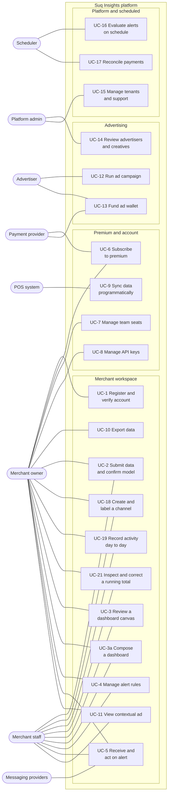
```mermaid
flowchart LR
    OWN(["Merchant owner"])
    STF(["Merchant staff"])
    ADV(["Advertiser"])
    ADM(["Platform admin"])
    POS(["POS system"])
    PAY(["Payment provider"])
    MSG(["Messaging providers"])
    SCH(["Scheduler"])

    subgraph SYS["Suq Insights platform"]
        direction TB
        subgraph G1["Merchant workspace"]
            UC1["UC-1 Register and<br/>verify account"]
            UC2["UC-2 Submit data<br/>and confirm model"]
            UC18["UC-18 Create and<br/>label a channel"]
            UC19["UC-19 Record activity<br/>day to day"]
            UC21["UC-21 Inspect and correct<br/>a running total"]
            UC3["UC-3 Review a<br/>dashboard canvas"]
            UC3A["UC-3a Compose<br/>a dashboard"]
            UC4["UC-4 Manage alert rules"]
            UC5["UC-5 Receive and<br/>act on alert"]
            UC10["UC-10 Export data"]
            UC11["UC-11 View contextual ad"]
        end
        subgraph G2["Premium and account"]
            UC6["UC-6 Subscribe<br/>to premium"]
            UC7["UC-7 Manage team seats"]
            UC8["UC-8 Manage API keys"]
            UC9["UC-9 Sync data<br/>programmatically"]
        end
        subgraph G3["Advertising"]
            UC12["UC-12 Run ad campaign"]
            UC13["UC-13 Fund ad wallet"]
            UC14["UC-14 Review advertisers<br/>and creatives"]
        end
        subgraph G4["Platform and scheduled"]
            UC15["UC-15 Manage tenants<br/>and support"]
            UC16["UC-16 Evaluate alerts<br/>on schedule"]
            UC17["UC-17 Reconcile payments"]
        end
    end

    OWN --- UC1
    OWN --- UC6
    OWN --- UC7
    OWN --- UC8
    OWN --- UC10
    OWN & STF --- UC2
    OWN & STF --- UC18
    OWN & STF --- UC19
    OWN & STF --- UC21
    OWN & STF --- UC3
    OWN & STF --- UC3A
    OWN & STF --- UC4
    OWN & STF --- UC5
    OWN & STF --- UC11
    ADV --- UC12
    ADV --- UC13
    ADM --- UC14
    ADM --- UC15
    POS --- UC9
    PAY --- UC6
    PAY --- UC13
    MSG --- UC5
    SCH --- UC16
    SCH --- UC17
```

The diagram separates who initiates work from who the platform calls back. Merchants and advertisers initiate; payment and messaging providers participate through callbacks; the scheduler is drawn as an actor because time-driven behavior (nightly alert sweeps, reconciliation) is a first-class source of system activity, not a hidden implementation detail.

### 3.3 Use case specifications

The three most consequential use cases are specified in full; the remainder are summarized in the table that follows.

---

**UC-2 — Upload and map a sales file**

| Field | Value |
|---|---|
| Actor | Merchant owner or staff |
| Goal | Get a body of business data understood by the platform so analytics reflect it |
| Preconditions | Authenticated; email verified; daily upload quota not exhausted |
| Trigger | The merchant submits a file, pastes a table, or photographs a document |
| Postconditions | A confirmed domain model exists, records stored under it, aggregates updated, alerts re-evaluated, rejects downloadable |

*Main success scenario*
1. Merchant submits a dataset in any supported form within the plan's size limit.
2. System validates size and content type, computes a content hash, and streams the source to object storage.
3. System creates an upload record, enqueues processing, and responds immediately with an identifier and a live progress stream.
4. Worker infers physical structure: encoding, delimiter and quoting, header location, data region, and numeric conventions — or, for a visual source, extracts a table by recognition first, carrying per-cell confidence and source coordinates.
5. Worker profiles every discovered column for type, distribution, and pattern, retaining competing interpretations with their evidence rather than resolving ambiguity silently.
6. Worker reconciles the profiled columns against the platform's analytical concepts using header text, value shape, statistical profile, and cross-column arithmetic relationships, producing a proposed domain model with a confidence and evidence per field.
7. System presents the review screen: the inferred model, per-field confidence, and a live preview of parsed values; low-confidence fields are flagged, and the screen states which analyses this model will and will not support.
8. Merchant inspects and edits — renaming fields, correcting types and roles, setting units or date order, excluding columns, defining constants, splitting or combining fields, or fixing individual cell values — with the preview re-rendering on every change.
9. Merchant confirms the model; the system saves it against the dataset's structural signature as a new model version.
10. Worker normalizes under the confirmed model, hashes personal identifiers, validates rows, resolves entities against the workspace catalog, loads records with duplicate suppression, promotes resolved roles into indexed columns and preserves everything else as typed attributes, updates aggregates for affected days only, bumps the cache version, and enqueues alert evaluation.
11. System marks the upload complete with counts of loaded, duplicate, and rejected rows, and refreshes which analyses the dataset now supports; the dashboard reflects the new data immediately.

*Alternate flows*
- **2a. Identical source already processed** — the system short-circuits, marks the upload complete as a duplicate of the earlier one, and tells the merchant no new data was needed.
- **6a. Known structural signature** — the confirmed model for this shape applies automatically, steps 7 to 9 are skipped, and the merchant is notified rather than prompted. This is the steady state for a returning merchant.
- **7a. Ambiguous date order** — when sample dates cannot prove day-first versus month-first, the field is flagged and an explicit choice is required before the model can be confirmed.
- **7b. Low-confidence recognition (visual sources)** — cells below the confidence threshold are highlighted and shown beside their cropped source region so the merchant verifies by eye and corrects in place.
- **7c. A concept is absent** — when no column resolves to a needed role, the screen names the missing concept in plain language and offers to assign it; the merchant may proceed without it, accepting that the dependent analyses stay unavailable until a role is assigned later.
- **10a. More than half the rows rejected** — the load is abandoned and the merchant is returned to the review screen, because that pattern nearly always indicates a misinterpreted model rather than bad data.
- **11a. Later remodeling** — the merchant edits the model after commit; the system previews the impact, creates a new model version, re-derives affected records from their stored payloads, and recomputes only the touched aggregate days, with no re-upload required.

*Exception flows*
- **E1. Source exceeds plan size limit** — rejected at the edge before reaching application code, with the plan comparison shown.
- **E2. Quota exhausted** — refused with the reset time and an upgrade prompt; no quota is consumed.
- **E3. Extraction fails on a visual source** — the merchant is told specifically what defeated it (blurred image, no table detected, skew beyond correction) with guidance for a better capture, rather than a generic failure.
- **E4. Worker crashes repeatedly** — after three attempts the upload is marked failed, the quota unit is refunded, an internal alert fires, and the merchant sees a localized failure with a support link.
- **E5. Review abandoned** — a pending review expires after seven days without holding the workspace's ingestion lock.
- **E6. Upload stalls** — a watchdog fails any upload stuck beyond thirty minutes and refunds the quota.

---

**UC-6 — Subscribe to premium**

| Field | Value |
|---|---|
| Actor | Merchant owner, with the payment provider as participating system |
| Goal | Unlock premium capabilities |
| Preconditions | Authenticated as owner; workspace on the free plan |
| Postconditions | Subscription active, entitlements live platform-wide within seconds, receipt issued |

*Main success scenario*
1. Owner opens the plans screen and selects a plan; regional price points and tax treatment are displayed.
2. System creates a hosted checkout session carrying the plan and workspace identifiers and redirects the owner to the provider.
3. Owner completes payment on the provider's page; the platform never sees card data.
4. Provider redirects the owner back to a pending confirmation screen and, independently, sends a signed webhook.
5. System verifies the webhook signature and timestamp, then re-fetches the transaction from the provider's API and compares amount, currency, and status against its own pending record.
6. System records the payment, activates the subscription with its billing period, invalidates the entitlement cache and the workspace's dashboard cache version, and writes an audit entry.
7. Owner's next request carries premium entitlements: history unlocks, ads stop being served, alert channels and API key creation become available.
8. System sends a localized receipt.

*Alternate and exception flows*
- **3a. Owner abandons checkout** — the pending payment expires; a daily reconciliation sweep closes it; the workspace stays free.
- **5a. Amount or currency mismatch** — the payment is flagged, no entitlement is granted, and an internal alert fires; this is the tampering guard.
- **4a. Webhook never arrives** — the daily reconciliation sweep re-verifies pending payments against the provider and completes activation.
- **E1. Renewal charge fails later** — the subscription enters retry, then a seven-day grace period with full features and a banner, then downgrades to free; history beyond ninety days becomes invisible but is retained thirteen months, extra seats deactivate, and API keys suspend rather than delete.

---

**UC-5 — Receive and act on an inventory alert**

| Field | Value |
|---|---|
| Actor | Merchant owner or staff; messaging providers participate |
| Goal | Learn early that stock will run out and act before it does |
| Preconditions | Product has sales history and at least one stock snapshot; a stockout rule is enabled |
| Postconditions | Alert visible and, for premium with channels enabled, delivered by email or SMS |

*Main success scenario*
1. Evaluation is triggered after an upload completes, or by the nightly sweep for the workspace's timezone.
2. System computes, per product, average daily sales over the trailing thirty days and derives current stock from the latest snapshot minus sales since that snapshot.
3. For premium workspaces with sufficient history, a weekday-seasonal forecast replaces the flat average, producing an earlier depletion date.
4. Days-of-stock-left places each product in a status band; products crossing into a warning band are alert candidates.
5. System upserts the alert by its deduplication key: a new condition creates an active alert, a persisting condition refreshes it without re-notifying, and a cleared condition resolves it.
6. On a new or escalating alert with channels enabled, the system enqueues delivery, subject to quiet hours and the daily message cap.
7. Merchant sees the alert in the dashboard, or receives the message, and acknowledges it.
8. Free-tier merchants see a contextual supplier advertisement rendered beside the alert.

*Alternate and exception flows*
- **2a. No stock snapshot exists** — the product's status is unknown and the interface prompts an inventory upload rather than showing a misleading figure.
- **6a. Daily message cap reached** — remaining alerts collapse into one digest message.
- **6b. Quiet hours in the merchant's timezone** — non-critical messages hold until morning; critical ones send immediately.
- **E1. Messaging provider fails** — the platform retries through the fallback provider and records the failure; the dashboard alert is unaffected because it never depended on delivery.

---

### 3.4 Remaining use cases in brief

| ID | Use case | Actor | Essential flow and rules |
|---|---|---|---|
| UC-1 | Register and verify account | Merchant owner | Email and password, verification link or code, workspace created with locale, currency, timezone; uploads blocked until verified |
| UC-3 | Review a dashboard canvas | Owner, staff | Open a named dashboard; the canvas resolves all its widgets in one batch call from cached, precomputed aggregates; never scans raw records |
| UC-3a | Compose a dashboard | Owner, staff | Add widgets from the picker, drag to arrange, resize, switch a widget's render, adjust its configuration, rename or remove it; layout auto-saves per user |
| UC-3b | Manage multiple dashboards | Owner, staff | Create, rename, and switch between named canvases; owners may publish one as the workspace template for others to adopt as a starting point |
| UC-4 | Manage alert rules | Owner, staff | Tune thresholds and channels; SMS and email channels refuse activation without premium and, for SMS, a verified phone |
| UC-7 | Manage team seats | Owner | Invite up to four staff by email; staff role excludes billing, team, and keys; downgrade deactivates extra seats reversibly |
| UC-8 | Manage API keys | Owner | Create scoped key shown once and stored hashed; revoke instantly; creation and revocation notify the owner and are audited |
| UC-9 | Sync data programmatically | POS system | Batches of up to five hundred rows authenticated by key; idempotent through row fingerprints; plan-driven rate limit with standard headers |
| UC-18 | Create and label a channel | Owner, staff | Name a recurring stream and declare what it carries; the label sets intent for everything arriving through it; offered automatically after a second dataset of the same shape |
| UC-19 | Record activity day to day | Owner, staff | Quick entry, batch grid, or corrections through a channel's own fields; entities autocomplete against the catalog; entries queue offline and sync on reconnection |
| UC-20 | Watch the canvas update live | Owner, staff | Widgets refresh as data lands, coalesced over a short window; entry updates optimistically and rolls back visibly on failure |
| UC-21 | Inspect and correct a running total | Owner, staff | Expand a derived figure to its baseline observation and subsequent events; amend or revert a load, and state recomputes forward |
| UC-10 | Export data | Owner | Background job produces CSV or XLSX with formula-injection neutralization, delivered by short-lived signed link; five jobs daily |
| UC-11 | View contextual ad | Free-tier merchant | One ad per page view in a context-matched slot, clearly labeled; premium receives an empty response enforced server-side |
| UC-12 | Run ad campaign | Advertiser | Define context, targeting, bid, budgets, schedule, localized creatives; creatives serve only after moderation approval |
| UC-13 | Fund ad wallet | Advertiser | Prepaid top-up through hosted checkout; ledger appended atomically with balance change; campaigns pause at exhaustion |
| UC-14 | Review advertisers and creatives | Platform admin | Approve or reject with notes against a one-day service target; kill switches per campaign, advertiser, and platform-wide |
| UC-15 | Manage tenants and support | Platform admin | Suspend or restore workspaces; time-boxed impersonation, every action audited |
| UC-16 | Evaluate alerts on schedule | Scheduler | Nightly per-timezone sweep catches time-driven transitions when no new data arrived |
| UC-17 | Reconcile payments | Scheduler | Daily re-verification of pending payments and comparison of subscription state against the provider; drift alarms |

### 3.5 Cross-cutting scenarios

These narrative scenarios cut across use cases and are the basis of the release-blocking end-to-end tests described later in this document.

**Scenario A — First week of a new Spanish-speaking merchant.** Mariana registers with email, verifies, and lands on an empty dashboard that explains what to upload. She uploads a semicolon-delimited export from her point-of-sale system: comma decimals, day-first dates, two title rows above the real header, and a totals row at the foot. The platform locates the header, bounds the data region, discards the totals row, and proposes a model — eleven of thirteen columns get a confident interpretation, including one it identifies as a line total because it equals quantity times unit price across the file despite being labeled only "Imp.". Two columns are flagged: a date whose order cannot be proven, and a column of codes it is unsure is an identifier. She sets the date order from a worked example, confirms the codes are product identifiers, renames a field for clarity, and excludes an internal column she does not care about. The review screen tells her the model supports revenue, unit velocity, and item analysis, but not retention, because nothing resolved to a customer identity. She confirms; processing completes in eighteen seconds; four rows are rejected for unreadable dates and she downloads the report. Two days later she uploads the next export: the structural signature matches, the saved model applies with no interaction, and rows overlapping the previous period are silently skipped. A week later she realizes a column she excluded held the customer phone number; she assigns it the customer identity role, the platform previews the impact, re-derives the affected records from their stored payloads, and retention analysis appears over the history she had already loaded.

**Scenario A2 — A merchant with no digital records at all.** Kwame keeps a paper ledger. He photographs a page with his phone and uploads the image. The platform corrects the page orientation, detects the table, segments its cells, and recognizes the handwriting, producing a table where most cells are confident and eleven are not. The review screen shows those eleven highlighted, each beside the cropped image region it came from; he corrects seven that were misread and confirms the rest. The inferred model names the columns from the ledger's own handwritten headings. From then on, his weekly photograph matches the same structural signature and only genuinely low-confidence cells interrupt him. He is doing analytics on a paper business, which is the point.

**Scenario A3 — An experienced merchant rebuilds her canvas.** Six weeks in, Mariana finds the default arrangement no longer matches how she works. She removes the units chart she never reads, drags the stock status table to the top because reordering is her morning job, and widens it to full width. She switches revenue-over-time from the recommended line to grouped bars, because she compares weekdays rather than reading a trend — the chart redraws instantly, with no request to the server. She adds a day-by-hour heatmap from the picker, previews it against her own data before placing it, and discovers her Thursday evenings are far busier than she assumed. Then she creates a second dashboard called "Weekly review", places the retention cohort and top customers on it, and leaves her morning canvas uncluttered. The next time she places a revenue chart anywhere, it defaults to bars, because the platform noticed.

**Scenario A4 — Stock that keeps itself.** Kwame stops photographing his ledger every week and starts recording as he goes. He creates two channels: "Monday stock count", labelled as observations, and "Daily sales", labelled as consumption. On Monday he counts his shelves — 50 of one item — and the canvas shows 50. Tuesday he sells two and taps them into quick entry; the stock tile drops to 48 before the request has finished, and stays there when the server confirms. He never typed 48. On Thursday he realises Monday's count was wrong and amends it to 45; the platform recomputes forward and stock becomes 43, with the figure expandable to show the count it started from and the sales applied since. That evening he uploads his supplier's delivery note into a third channel labelled as additions, and stock rises accordingly. Later he accidentally sends the delivery note a second time; the platform notices the period is already covered, applies the channel's fill policy, and skips it. The one time he sends a stock count into the sales channel by mistake, the load stops before touching anything: one row per item, round quantities, no monetary amounts — the platform asks whether this belongs in the count channel instead.

**Scenario B — Stockout to conversion.** Julien's Monday upload pushes a fast-moving product below five days of stock. The alert appears on his dashboard; because he is on the free tier, a packaging supplier's advertisement renders beside it, and he clicks it once — the advertiser is charged once, and a second click that day is recorded but not billed. Wanting the alert by message next time, he opens the alert rule, sees the SMS channel gated, compares plans, and subscribes. Within seconds his history extends past ninety days, advertisements stop appearing, and after verifying his phone he enables SMS delivery. The following week the predictive forecast, now with enough history, warns him two days earlier than the flat average would have.

**Scenario C — Integration and downgrade.** A point-of-sale vendor integrates on Julien's behalf using an API key he created. Their nightly job posts batches of five hundred orders; a network timeout causes a retry that resubmits an entire batch, and every row deduplicates on its fingerprint so nothing is double-counted. Months later a card expires; renewal fails, retries are exhausted, and the workspace enters its grace period with a banner. Julien does not act, so it downgrades: history beyond ninety days disappears from view but is retained, two staff seats deactivate, and the API key suspends — the vendor's next call is refused with a clear code. When he re-subscribes a week later, everything returns intact.

---

## 4. Development methodology and governance

### 4.1 Method
Iterative, incremental delivery in two-week sprints inside a phased project plan (chapter 12). Every sprint delivers user-visible behavior through the full stack — API, workers, UI, tests, documentation — never a backend-only sprint. Work is tracked as issues typed feature, bug, tech-debt, security, or ops, each linked to a requirement ID where applicable.

### 4.2 Team and responsibilities
Four people: product owner (requirements, priorities, release approval), tech lead (architecture decisions, review standards, security sign-off, incident command), and engineers across backend, frontend, and DevOps. Roles are hats, not headcount, but three approval points are always explicit and logged: production release approval, architecture decision acceptance, and security sign-off.

### 4.3 Phase gates
Every feature passes six gates. Small changes may compress gates into a single pull request; they may not skip them.

1. **Requirement ready** — ID assigned, story and acceptance criteria written, tier and localization noted. Owner: product owner.
2. **Design accepted** — a design note or architecture decision record exists for anything that crosses a module boundary, adds a table, or touches money or entitlements. Owner: tech lead.
3. **Merge** — continuous integration green, one reviewer approval against the review checklist (chapter 7). 
4. **Staging verified** — end-to-end journey added or updated; demonstrated in sprint review.
5. **Release** — release checklist passed; premium features additionally pass the premium launch gate: entitlement wired and verified in both upgrade and downgrade directions, negative tests green, billing reconciliation covers the feature where applicable, Spanish and French localization complete including the upsell surface, a help-center article exists, and usage metrics are emitting.
6. **Post-release** — metrics and alerts confirm expected behavior for 48 hours before the issue closes.

---

## 5. System design

### 5.1 Technology stack and rationale

| Layer | Choice | Why |
|---|---|---|
| API framework | FastAPI on Python 3.12 with Pydantic v2 | Async-first for a read-heavy cached workload; automatic OpenAPI powers the public Sync API documentation; one validation story across HTTP, workers, and configuration |
| ASGI serving | uvicorn workers under gunicorn | Mature process supervision and graceful reload |
| Database access | SQLAlchemy 2.0 async with asyncpg; Alembic migrations | Reviewable migrations; raw SQL escape hatch for analytics |
| Database | PostgreSQL 16 | Relational integrity for tenancy and billing; monthly range partitioning for large fact tables; row-level security for tenant isolation |
| Cache, queues, locks | Redis 7 | One system for application cache, rate-limit counters, task broker, distributed locks, and live progress events |
| Background jobs | Celery 5 with Redis broker | Mature retries, routing, and scheduling; separate queues per workload class |
| Tabular processing | Polars and DuckDB, with a Unix shell pre-pass (iconv, sed, awk) | Shell tools stream byte-level cleanup of dirty files at near-zero memory; Polars performs typed normalization; PostgreSQL COPY loads the result |
| Schema and type inference | Custom profiler over Polars, with `python-dateutil` and locale-aware numeric parsers | Type, unit, and role inference must expose evidence and confidence rather than return a bare guess, which rules out opaque black-box inference; the profiler is pure and property-tested |
| Document extraction (images, scanned PDFs) | OpenCV for page geometry and table segmentation, Tesseract (with language packs for English, Spanish, French) for recognition, `pdfplumber` for digital PDF text layers | Self-hosted keeps merchant documents inside our own EU infrastructure, which a cloud vision API would not; the pluggable extractor interface allows a hosted engine per workspace later if accuracy demands it |
| Object storage | MinIO, S3-compatible | Raw uploads, error reports, exports; presigned downloads; cloud migration is a configuration change |
| Frontend | React 19, TypeScript, Vite, standards-based vanilla CSS, TanStack Query, react-i18next, ECharts | One React major is shared with the Expo workspace to prevent duplicate native modules; plain `.css` files use custom properties and cascade layers for semantic design tokens and responsive layouts without a utility framework or CSS runtime; canvas charting performs well on low-end Android |
| Native mobile | Expo and React Native, consuming the generated TypeScript API client and platform-neutral design tokens | Kept as a first-class application boundary from foundation onward; product delivery remains triggered after launch by push-notification, camera-ingestion, or offline-entry demand |
| Edge | Caddy reverse proxy behind Cloudflare | Automatic TLS, compression, request size caps, coarse IP throttling; CDN shortens the last mile for static assets worldwide |
| Observability | Sentry, Prometheus with Grafana, Loki logs, OpenTelemetry traces | Errors, metrics, logs, and traces joined by request ID |
| Deployment | Docker Compose on Ubuntu 24.04, Hetzner EU | Single well-run host at launch; EU region is a data-residency commitment; every service stateless except PostgreSQL, Redis, MinIO |

### 5.2 Architecture overview
Clients (web app, mobile app, POS systems using the Sync API) reach stateless FastAPI replicas through the edge proxy. The API talks to Redis (cache, limits), PostgreSQL (system of record), and MinIO (files), and enqueues background work. Celery workers, organized into isolated queues — ingest, alerts, notify, ads, reports — consume from Redis and do all heavy work: parsing, rollups, alert evaluation, message dispatch, ad billing, export generation. External services (Stripe, SMS and email providers) are called only from workers and webhook handlers, behind provider-abstraction packages so a provider swap touches one package.

Every authenticated request passes a fixed middleware chain in order: request ID and tracing; body size guard; authentication (cookie session, bearer token, or API key); tenant resolution (binds the merchant ID to the request and to the database session so row-level security applies); entitlement snapshot attachment; rate limiting; idempotency handling for mutating endpoints; and conditional-request handling (ETags) for cacheable reads.

### 5.3 Multi-tenancy and data design
Single database, shared schema, a merchant ID column on every tenant-owned row. Two independent layers enforce isolation: explicit scoping in the data-access layer, and PostgreSQL row-level security policies keyed to a per-transaction setting, with no bypass role available to the application. Cross-tenant reads exist only in the audited admin surface and in ad targeting, which sees aggregate signals, never raw rows.

**The schema-on-read core.** Because merchant data has no guaranteed shape, the storage model separates three things that fixed-schema products conflate: what arrived (raw records), what the platform believes it means (the inferred and merchant-confirmed domain model), and what analytics require (a small set of resolved semantic roles). Records are stored once and interpreted through the model, so correcting an interpretation never requires re-uploading data.

- **datasets** — a named stream of records within a workspace (for example "POS exports", "inventory counts"), created automatically on first upload and identified by structural signature. Holds the active domain model version, record count, coverage window, and which analyses it currently supports.
- **field_definitions** — the inferred domain model, one row per discovered field per dataset version: source name as it appeared, display name (merchant-editable), inferred type, confirmed type, inferred role and confirmed role (or none), units and currency, format options such as date order, confidence score, evidence JSON (what the inference was based on), nullability, cardinality, sample values, and status (inferred, confirmed, edited, excluded). Versioned: editing a field creates a new model version rather than mutating history, so every record can be traced to the interpretation in force when it loaded.
- **records** — the universal fact table, range-partitioned by month on resolved event time. Each row carries the workspace, dataset, channel and its intent, model version, provenance (which load), a content fingerprint with a uniqueness constraint that makes loads idempotent, a small set of **resolved columns** promoted out of the payload for indexing and aggregation (event time, monetary amount, quantity, entity reference, category, location, channel — each nullable, because not every dataset has every concept), and a typed **attributes** JSONB payload holding every remaining field, including those with no analytical role. The resolved columns exist for query performance; the payload exists so nothing is ever lost.
- **entities** — the resolved catalog of things records refer to: items, customers, categories, locations, channels. One table with an entity kind rather than separate product and customer tables, because which kinds a workspace has depends entirely on what its data contained. Holds external identifier when present, display name, accent-folded normalized name (the resolution anchor when no identifier exists), merchant-editable attributes, and a merge target for deduplication.
- **entity_links** — the many-to-many between records and entities with a role (item sold, purchasing customer, location of sale), so a record can reference several entities without the schema anticipating how many.
- **measurements** — point-in-time values that are not transactions, most importantly stock levels: entity, measurement kind, value, unit, observed-at timestamp, source. Kept separate from records because they describe state at a moment rather than an event.
- **merchants** — workspace: name, country, city, business category, default locale (en, es, fr), default currency, timezone, status.
- **users** — email (primary identity, unique), optional verified phone, argon2id password hash, role, locale, optional TOTP secret encrypted at rest.
- **refresh_tokens** — hashed rotating tokens grouped into families for theft detection.
- **api_keys** — hashed keys with display prefix, scopes, expiry, revocation, last-used timestamp.
- **uploads**, **structural_profiles**, **upload_errors** — ingestion bookkeeping: status machine; the detected physical structure of a file (encoding, delimiter, quoting, header position, data region, separators) stored separately from the semantic model because the two are inferred by different means and reused independently; per-row rejects capped in the database with the full report in object storage.
- **channels** — a merchant-defined labelled stream: name, intent (observation, decrement, increment, adjustment, reference), the dataset and domain model that interprets it, fill policy for overlapping periods, arrival profile (column set, row-count range, value distributions, coverage, cadence), and status. The intent is the contract for everything arriving through the channel.
- **loads** — one delivery of data into a channel, whatever its input path: file, photograph, pasted table, typed entry batch, or API push. Holds provenance, record counts, the guard's verdict, and reversal state, because a load is the unit a merchant can undo.
- **derived_states** — materialized running quantities per entity and kind (stock first, other totals later), each recording the observation it derives from and the timestamp through which events have been applied, so the common read is a lookup rather than a fold over history.
- **entry_drafts** — client-generated entries pending synchronisation, keyed by client identifier so a retry after lost connectivity cannot double-record.
- **dashboards**, **widget_instances**, **widget_preferences** — the composable canvas: a dashboard belongs to a user (or to the workspace when it is a published template) and holds named, ordered widget instances; each instance records its widget key, chosen render, configuration, grid position and size, and any title override; preferences record a user's repeated render overrides per widget so future placements default to what they actually use.
- **model_revisions** — the audit trail of domain-model edits: who changed which field's type, role, or units, when, what the previous interpretation was, and how many records were re-derived as a result.
- **daily_workspace_rollups**, **daily_entity_rollups**, **cohorts** — the aggregates dashboards actually read, maintained incrementally inside the ingestion transaction for only the workspace-day keys each upload touches. Rollups are computed from *resolved roles*, so a dataset without a recognized quantity contributes revenue but not unit counts, and the dashboard says so rather than showing a misleading zero. A role change on the review screen recomputes only the affected days.
- **alert_rules**, **alerts**, **notifications** — alert configuration, alert state (unique per merchant and deduplication key), and an outbound message log with provider status and cost.
- **plans**, **subscriptions**, **payments** — plan rows hold price, currency, and the entitlements JSON; subscriptions mirror Stripe state including the provider subscription ID; payments record every transaction with a unique provider reference.
- **advertisers**, **ad_wallets**, **ad_wallet_ledger**, **campaigns**, **ad_creatives**, **ad_events** — the ad platform; wallet balances are integer micro-units with an append-only ledger written in the same transaction; ad events are partitioned monthly and unique per served-slot nonce.
- **audit_log**, **idempotency_records** — append-only security audit trail; stored idempotent responses keyed by merchant and client key.

Data retention: free-tier raw records are pruned past 90 days nightly (premium-era data is retained 13 months after a downgrade so re-upgrading restores it); raw upload files expire from object storage after 30 days (free) or 180 days (premium); ad events keep 13 months; audit logs 24 months; ephemeral records (tokens, idempotency, one-time codes) are pruned hourly past expiry.

Migration discipline: one Alembic revision per pull request, hand-reviewed; additive changes first; NOT NULL introduced by default-plus-backfill-plus-validate; indexes created concurrently; destructive changes only two releases after code stops referencing the object; every migration is applied in CI to a restored staging snapshot before merge.

### 5.4 API design
One versioned REST API under /v1 serves web, mobile, and the Sync API. Conventions: plural nouns, snake_case JSON, ISO-8601 UTC timestamps, money as string decimals with an explicit currency, UUID identifiers, localized error messages honoring the Accept-Language header.

Errors follow the problem-details format: a stable machine code, localized title and detail, the request ID, and per-field entries for validation failures. Server faults never leak internals.

Pagination is cursor-based everywhere (opaque, HMAC-signed cursors; page size capped at 100). Mutating endpoints where retries are dangerous accept an Idempotency-Key header: the same key with the same request replays the stored response; the same key with a different request returns a conflict; Sync API rows additionally deduplicate on their content fingerprint so at-least-once integrations are safe.

Endpoint groups: authentication and account; team management; uploads, datasets, and domain models (including a server-sent-events progress stream, a dry-run model preview that re-parses a sample under proposed edits, model confirmation, and post-commit remodeling with an impact preview); channels and entry (creating and labelling channels, submitting data through any input path, the entry surface's field definitions and drafts, load history with per-load reversal, and the guard's pending decisions); derived state (current values with inspectable provenance); a workspace event stream for live canvas updates; the widget platform (the widget catalog with its manifests, per-widget endpoints for isolated refresh, a batch resolve endpoint that returns a whole canvas in one round trip, and dashboard and layout management including named dashboards, instance placement, render selection, and workspace templates — all ETag-cacheable); entity catalog and record browsing; alerts and alert rules; ad slots and validated ad events; the advertiser portal (wallet, campaigns, creatives, statistics); billing (plans, subscribe via hosted checkout, customer portal, payment history, provider webhooks); the premium Sync API (batch records, entities, measurements, status); exports; the internal admin surface; and health and version endpoints for orchestration.

Authenticated responses carry standard rate-limit headers; refused requests return 429 with a Retry-After. Breaking API changes require a new major version with at least six months of overlap; deprecated endpoints announce themselves with Deprecation and Sunset headers.

### 5.5 Ingestion pipeline design — inference, reconciliation, review

The pipeline's job is not to force data into a schema but to **discover the schema the data already has**, propose what it means, let the merchant correct that proposal, and only then commit. Stages are Celery tasks with the upload row as the state machine, one concurrent pipeline per workspace, and every transition published as a live progress event.

**0. Channel resolution.** Every submission resolves to a channel, either named explicitly by the merchant or matched by structural signature to an existing one. A matched channel supplies the intent, the confirmed domain model, and the fill policy, so steps 3 through 5 below are skipped entirely and the data loads unattended. An unmatched submission proceeds through inference as a one-off, and after a second dataset of the same shape the platform offers to save it as a channel.

**1. Accept** (request path). Size and magic-byte checks; the source streams to object storage while a hash is computed; an identical previous source short-circuits the pipeline. Typed entries skip storage and enter directly as a load.

**1a. Document extraction** (visual sources only). Images and scanned PDFs are converted to a table before anything else: EXIF-aware orientation fix, deskew and dewarp, contrast normalization, table region detection, and cell segmentation by ruling-line detection with a whitespace-projection fallback for borderless tables. Text recognition runs per cell in the merchant's languages, producing a value, a confidence, and the pixel region it came from. Multi-page documents are stitched when their column structures agree and kept separate when they do not. Digital PDFs carrying a text layer bypass recognition entirely and use it, since extracted text is exact where recognition is probabilistic. The output joins the normal pipeline as a table whose cells carry provenance and confidence — which is what lets the review screen show a suspect value beside its cropped source image. Extraction runs in the dedicated heavy worker queue with a hard time budget, because it is an order of magnitude more expensive than parsing a file.

**2. Structural inference.** Encoding detected and normalized to UTF-8; byte-order marks, null bytes, and line-ending inconsistencies removed by streaming shell tools. Then the physical shape is inferred: delimiter and quoting by scoring candidate parses for column-count stability across a sample; header row located by looking for the first row whose cells are predominantly non-numeric, short, and distinct while the rows beneath it are type-consistent (this is what handles title rows, blank preambles, and report headers above the real table); the data region bounded by detecting where type consistency breaks at the foot (summary and total rows); merged or two-row headers joined. Spreadsheets contribute extra metadata — sheet names, cell formats, declared number and date formats, formulas — which is strong evidence and is used before falling back to value inspection. The result is a **structural profile**, stored separately from meaning.

**3. Type and statistical profiling.** Each column is profiled over a sample and then the full dataset: candidate types are scored with parse success rates, and the winner is kept along with runners-up and their evidence. Profiling produces null rate, distinct-value count, minimum and maximum, most frequent values, detected currency symbols and unit suffixes, string-length distribution, and pattern signatures (does this look like an identifier, a code, a phone number, an email, free text). Ambiguity is preserved, not resolved: a column of values below thirteen is recorded as "date, order undetermined" with both interpretations retained.

**4. Domain reconciliation.** The profiled columns are matched against the platform's analytical concepts using four independent signal families, combined into a confidence per candidate role:
   - *Lexical*: header text against a multilingual concept vocabulary (English, Spanish, French, with accent-folded and abbreviated variants), never as the sole basis for a decision.
   - *Value shape*: does the content parse as a timestamp, a monetary amount, a count, an identifier.
   - *Statistical*: cardinality relative to row count distinguishes an identifier from a category; a near-unique column is a key, a low-cardinality one is a dimension.
   - *Relational*: cross-column arithmetic checks — if column C equals column A times column B across most rows, then A is a unit price, B a quantity, and C a line total, regardless of what any of them are called. This is the signal that most often rescues a file with meaningless headers.
   
   The output is a **proposed domain model**: per field, a type, an optional role, units, format options, a confidence, and the evidence. Where the same structural signature has been confirmed before, the saved model is applied and the merchant is notified rather than prompted.

**5. Merchant review and editing.** Unless a confirmed model already applies, the upload pauses in a review state and the merchant sees the proposed model beside a live preview of parsed values. Everything is editable: names, types, roles, units and currency, date order, identifier designation, exclusion, simple split and combine rules, constants for values the file omits, and direct correction of individual cell values. Confidence is shown honestly — high-confidence fields are presented as settled, low-confidence ones are visually flagged for attention, and the evidence is inspectable so the merchant can see *why* the platform believes a column is a date. Every edit re-parses the sample and re-renders the preview immediately. The screen also states plainly which analyses the current model enables and which it does not, so the merchant can see the consequence of assigning a role before committing.

**6. Normalization** (Polars, streaming), under the confirmed model: typed conversion including localized month names and regional separators, accent-folded resolution keys, and personal identifiers reduced to keyed hashes so raw customer data is never persisted.

**7. Validation.** Per-row rules derived from the confirmed model, with localized, specific error codes. A reject rate above half returns the upload to the review screen rather than loading, because that pattern indicates a misinterpreted model.

**7a. Drift guard.** The dataset is scored against the channel's arrival profile. Structural drift loads with flags; a contradicted label on a state-moving channel pauses and asks; outliers load with prominent notice and one-click reversal; period overlap applies the channel's fill policy or asks once if unset.

**8. Load.** Bulk copy into staging, entity resolution against the workspace catalog, then insertion with fingerprint conflict handling in bounded batches. Resolved roles are promoted into indexed columns; every other field is written to the typed attribute payload.

**9. Finalize.** Derived state recomputed forward from the earliest affected point for the entities involved, incremental rollup upserts for touched days only, cache-version bump, a live event naming which widgets are stale, alert evaluation enqueued, dataset capability flags refreshed (which analyses this dataset now supports), status completed with statistics and a downloadable error report.

**Post-commit remodeling.** Changing a field's type, role, or units after load does not require re-upload. The change creates a new model version; affected records are re-derived from their stored payload, which still holds the original values; only the touched aggregate days are recomputed; and the merchant sees an impact preview — how many records and which analyses will change — before confirming. This is the practical payoff of storing records rather than parsed conclusions.

Failure handling: tasks are idempotent with acknowledged-late semantics and three retries with backoff; poison files fail cleanly with a localized message and an internal alert; a watchdog fails any upload stuck in a non-terminal state past 30 minutes and refunds its quota. Reviews left unattended expire after seven days without holding the workspace's ingestion lock.

### 5.6 Channels, derived state, and live updates

**Channels.** A channel is a named, labelled stream: an intent, a confirmed domain model, a fill policy, an arrival profile, and a set of loads. It is the unit that makes repeat ingestion unattended and makes meaning explicit. Because the intent is declared once by the merchant when they name the channel, the platform never has to infer the highest-stakes property of a dataset — what it asserts about the world — from the data itself.

Every input path resolves to a channel. A file, a photograph, a pasted table, a typed entry, and an API push differ only in how they reach the pipeline; past extraction and inference they are identical, producing records under the channel's model. This is what makes manual entry and file upload the same feature rather than two: the entry form is simply the channel's domain model rendered as fields.

**Intent and derived state.** Records carry an intent inherited from their channel — observation, decrement, increment, adjustment, or reference. Derived quantities are computed from these rather than stored:

```
state(entity, at) = value of the latest observation at or before `at`
                  + sum of increments after that observation and before `at`
                  - sum of decrements after that observation and before `at`
```

Stock is the first configured use of this mechanism; the same computation serves any running total. Observations act as checkpoints, which bounds the work: a stocktake resets the baseline and everything before it becomes irrelevant to current state. Derived values are materialized per entity with the observation they derive from, so the common read is a lookup rather than a fold.

**Recomputation.** A record arriving late, being edited, or being reverted invalidates derived state after its timestamp. The platform recomputes forward from the earliest affected point, scoped to the entities involved and bounded backward by the nearest preceding observation, then refreshes the affected rollup days and bumps the workspace cache version. Because loads are revertible units, this same path serves undo.

**Contradiction as a finding.** When decrements exceed what observations and increments can account for, the result is negative and is surfaced rather than clamped: a miscount, an unrecorded delivery, or a duplicated load. Suppressing it would hide exactly the discrepancy a merchant most needs to see.

**The drift guard.** Each channel maintains an arrival profile — column set, row-count range, value distributions, time coverage, cadence — and scores every incoming dataset against it. One mechanism covers four failures: structural drift, a contradicted label, statistical outliers, and overlap with data already held. The response scales with risk, not with surprise:

| Situation | Chart-only channel | State-moving channel |
|---|---|---|
| New columns appear | Load, flag as unmapped, propose roles | Same |
| Columns missing | Load what is present, note the gap | Pause if the absent role is one the intent depends on |
| Content contradicts the label | Load, note the anomaly | **Pause and ask** |
| Statistical outlier | Load, flag in the summary | Load, flag prominently, offer one-click reversal |
| Period overlaps existing data | Apply the channel's fill policy, ask if unset | Apply the fill policy, ask if unset |

The governing rule, which is the sentence to remember: **a channel may be permissive about what it accepts and must be conservative about what it changes.**

**Live updates.** The canvas subscribes to a workspace event stream over the same server-sent-events infrastructure that carries upload progress. When a load completes or an entry is saved, the affected rollup days and derived states update, the cache version bumps, and an event names which widgets are stale so the client re-resolves only those. Two behaviours make this feel right rather than frantic: updates **coalesce** over a short window, so a merchant entering ten sales in a minute triggers one canvas update rather than ten; and entry is **optimistic**, with the affected tiles updating the moment the merchant saves and rolling back visibly if the write fails. Waiting for a server round trip to see your own sale appear makes the product feel broken; seeing it immediately is the whole emotional payoff of a live dashboard.

**Offline entry.** The web client holds a local write queue. Entries made without connectivity are stored, shown as pending, and synchronised when the connection returns, deduplicated by client-generated identifier so a retry cannot double-record. This is the point at which the product genuinely needs a native application, and it is the trigger condition named in the mobile strategy.

### 5.7 Analytics computation design
All metric definitions are pure functions in a domain package with no database dependency, used identically by dashboards, exports, and alerts. Dashboards never scan raw records; every chart reads rollups, and ad-hoc ranges are rollup scans by primary key. Timezone bucketing happens once at ingestion in the workspace's timezone; daylight-saving transitions follow IANA rules. Version 1 assumes one currency per workspace unless a currency role is resolved per record; mixed-currency data without a resolved currency field is flagged on the review screen rather than silently summed.

**Capability-driven analytics.** Because the domain is inferred, every metric declares the semantic roles it requires, and the platform computes only what the confirmed model can support: revenue needs a time and an amount; unit velocity additionally needs a quantity; item-level analysis needs an item entity; retention needs a customer identity; stock intelligence needs measurements of stock level alongside sales. A workspace whose data lacks a concept sees that analysis presented as unavailable, naming the missing concept and linking to the review screen where a role can be assigned — never a chart of zeros and never a number computed from a guess. Assigning the missing role later backfills the analysis over history already loaded, because the underlying values were preserved in the record payload all along.

Fields with no analytical role are not dead weight: they remain available as filters and grouping dimensions across every dashboard, so a merchant whose file carried a "salesperson" or "payment method" column can segment by it without the platform having anticipated the concept.

### 5.8 Widget platform design

The dashboard is a composable canvas, and the widget is the unit of implementation. Each widget is an independently implemented backend module with its own endpoint, contract, tests, and cache policy — but the parts every widget would otherwise re-implement are inherited rather than re-typed, because thirty independent implementations of tenant scoping, history-window clamping, and timezone bucketing will not stay consistent.

**Query primitives.** Five primitives own the cross-cutting work: binding the tenant and row-level-security session, clamping the range to the entitled history window, bucketing by the workspace timezone, resolving semantic roles against the confirmed domain model, routing between rollups and records, and constructing cache keys.

| Primitive | Shape | Serves |
|---|---|---|
| **Scalar** | one value, optional comparison period | stat tiles, gauges |
| **Series** | time-bucketed values, optional breakdown dimension | line, bar, area, stacked renders |
| **Ranking** | top or bottom N entities by a measure | ranked bars, tables, treemaps |
| **Matrix** | two-dimensional aggregation | cohort heatmaps, day-by-hour patterns |
| **Table** | filtered, sorted, paginated records or entities | detail tables, status lists |

A widget module composes one or more primitives. An escape hatch allows a module to issue its own query when no primitive fits; using it requires a stated reason in the manifest, so the abstraction stays a convenience rather than a cage.

**The manifest.** Each widget registers a declarative manifest, which is the single source of truth for the widget picker, configuration validation, generated API schema, render options, and caching. One declaration, many consumers.

```
key, feature, version
roles:        semantic roles the widget reads
optional:     roles that unlock extra controls (breakdown, drill-down)
renders:      permitted renders, one marked catalog default
config_schema: range, granularity, breakdown, comparison, top_n, filters
primitive:    scalar | series | ranking | matrix | table
cache:        ttl and the config fields the key varies on
tier:         free | premium
```

**Render recommendation.** The default render is chosen from the shape of the merchant's own data using the profile statistics the ingestion pipeline already computes: few distinct categories favor composition views while many favor a ranked view with an aggregated remainder; short histories favor bars over lines, because a line through five points implies a continuity the data does not have; dense series are downsampled and rendered as an area; a series with little variance suppresses trend language rather than manufacturing a narrative. When a merchant has overridden the same question's render several times, that becomes their default for future placements, never altering widgets already on a canvas.

**Batch resolution.** A canvas of a dozen widgets must not become a dozen round trips. A single resolve endpoint accepts the canvas's widget instances and returns all payloads together, performing authentication, entitlement loading, tenant binding, and domain-model reading once for the whole set, and deduplicating overlapping queries so two widgets asking the same question over the same range hit the database once. Each widget also keeps an individually addressable endpoint for isolated refresh, testing, and embedding. Per-widget budget is 120 milliseconds; the canvas as a whole holds the 300-millisecond target.

**Caching.** Widget payloads are cached per workspace cache version, widget key, and a hash of the render-independent configuration. Render is deliberately excluded from the key, so switching a line chart to bars re-renders from cached data with no backend work at all. Per-widget keys give a better hit rate than whole-payload caching, because changing one widget's range does not invalidate the other eleven.

**Failure isolation.** A widget that errors returns an error object in its own slot while the rest of the canvas renders normally. A single broken widget may never take down a dashboard.

**Catalog at launch.** Roughly fourteen widgets across four features, each a question with several permitted renders rather than a chart type:

| Feature | Widgets |
|---|---|
| Sales velocity | revenue over time, transactions over time, units over time, headline stat tile, narrative insight summary |
| Item performance | top items, item mix composition, item detail table |
| Inventory | stock status table, days-of-stock gauge, depletion forecast, reorder list |
| Customers | retention cohort matrix, repeat versus new split, top customers |

**Catalog discipline.** A new widget requires a question no existing widget answers; adding a render to an existing widget is always preferred over adding a widget. Without this rule a catalog accumulates four near-identical revenue charts and a picker nobody can navigate.

**Extensibility.** Because widgets are registered modules with declared contracts, the same registry can later admit merchant-defined widgets built over the attributes the ingestion pipeline preserved but assigned no analytical role — a count of records by payment method, say. This is explicitly out of scope for the first release, but the registry is designed not to preclude it, which is what turns those retained attributes from dead weight into raw material.

### 5.9 Alerting design

The alert engine runs after every completed ingestion and nightly per timezone. It computes desired alert states from rollups and inventory snapshots, upserts by deduplication key (create, refresh, or resolve — never duplicate), and on a transition into an active state with premium channels enabled, enqueues notifications subject to quiet hours and daily caps.

### 5.10 Ad engine design
Serving is a strictly best-effort Redis-only path with a 150-millisecond budget; any failure returns an empty slot, never an error, and a global kill switch can disable ads platform-wide. Eligible campaigns come from a cached index rebuilt on campaign changes. The auction scores bid times pacing factor (throttling campaigns ahead of even delivery) times a smoothed click-through quality factor. The response includes a signed single-use nonce; impression and click events must present it, are deduplicated in the database, are capped per viewer per campaign per day, and only validated events are charged — wallet debit and ledger append in one transaction, with campaigns pausing automatically at budget or balance exhaustion. Advertisers see charged versus filtered events transparently, and audience statistics only in buckets of at least five merchants.

### 5.11 Caching design
Layers, outermost first: immutable hashed static assets with year-long cache headers; ETag conditional requests on all dashboard reads (a 304 with an empty body is a meaningful saving on mobile networks); a service-worker shell with stale-while-revalidate and an offline read-only mode showing last-known data with an as-of banner; the CDN for static assets; the Redis application cache; and finally the rollup tables that make cache misses cheap.

The Redis cache stores computed widget payloads keyed per workspace cache version, widget key, and render-independent configuration hash (5-minute lifetime), entitlement snapshots (60 seconds), ad indexes, and translation bundles. Because the render is excluded from the widget cache key, a user switching a chart type re-renders from cached data without touching the backend. Invalidation uses a per-merchant version counter embedded in every cache key: bumping it on ingestion completion, inventory edits, alert changes, or plan changes invalidates everything at once in constant time, and the same version feeds the ETag so browser caching stays coherent automatically. Stampedes are controlled by short single-flight locks; payloads are stored with a double-lifetime envelope so a failing recompute serves stale data instead of an error; if Redis itself is down, a circuit breaker bypasses the cache and the site degrades to slower but correct.

### 5.12 Rate limiting design
Token buckets in Redis, refill and take in one atomic Lua call, keyed per policy class after authentication, plus a coarse pre-authentication IP shield at the edge (300 requests per minute per IP, tighter on authentication routes). Initial policies, all configuration-driven and plan-scalable:

| Class | Limit |
|---|---|
| SMS one-time codes | 3 per hour and 5 per day per phone, plus per-IP caps — this is the SMS-budget defense |
| Verification and reset emails | 5 per hour per address |
| Login | 5 per minute per account and IP, with progressive lockout and a self-hosted proof-of-work challenge after repeated failures |
| Dashboard reads | 120 per minute |
| General reads / writes | 60 / 30 per minute |
| Upload creation | plan quota per day plus a 2-per-minute velocity cap |
| Sync API | 60 per minute per key (plan-driven) |
| Ad slots and events | 30 and 60 per minute |
| Exports | 5 jobs per day |
| Inbound webhooks | 120 per minute per provider |

Every refusal increments a metric; sustained spikes alert operations. If the limiter's Redis is unavailable, limiting fails closed to conservative in-process defaults, never open.

### 5.13 Security design
- **Passwords**: argon2id; breached-password list check; no arbitrary composition rules.
- **Sessions**: short-lived signed access tokens plus rotating refresh tokens in families; presenting a revoked family member (theft signal) revokes the family and forces re-login, audit-logged.
- **API keys**: shown once, stored as hashes, scoped, revocable instantly, creation and revocation notified to the owner.
- **Authorization**: centralized permission checks declared per endpoint; object access always re-verifies ownership — identifiers are never authorization.
- **Upload security**: size caps enforced before the application, magic-byte verification, bounded decompression for XLSX (zip-bomb guard), parsing only in resource-limited workers, antivirus scan of every binary source, decompression-bomb and pixel-dimension limits on images with rendering confined to the resource-capped extraction worker, PDF handling with JavaScript and embedded-file execution disabled, spreadsheet-formula neutralization on everything we export, files served only through short-lived signed URLs.
- **Web security**: strict content-security policy without inline script, SameSite cookies plus a double-submit CSRF token, HSTS, exact-origin CORS, all user content rendered as text, ad creatives text-plus-reviewed-image only.
- **Payments**: card data never touches the platform (hosted checkout only); webhook signatures verified with timestamp tolerance; every credit re-verified by fetching the object from the provider's API before money moves; integer micro-unit ledgers, append-only, balance-constrained.
- **Secrets**: environment-injected from encrypted files, rotated per runbook, never in code or images; application-level encryption for stored two-factor secrets; logs scrubbed of tokens, passwords, codes, and most of every phone number.
- **Privacy and compliance**: GDPR is the bar for all markets — lawful-basis records, data-processing agreements, self-serve export and deletion, 72-hour breach duty, EU hosting and EU backups; document extraction runs entirely on our own infrastructure so photographed ledgers and receipts never leave it, and because a photograph may capture personal data the merchant did not intend to submit, extracted text is subject to the same hashing rules as any other personal identifier and source images follow the shorter raw-upload retention; Mexico's federal data-protection law and similar regimes are covered by the same posture; the application itself sets only strictly necessary cookies.
- **Abuse controls**: SMS pumping caps and high-risk prefix blocklists, disposable-email blocklists, click-fraud filtering, per-merchant concurrent-parse limits, and cost alarms on every metered external spend.
- **Process**: dependency and image scanning blocking on criticals, static analysis in CI, secret scanning on every commit, an external penetration test before launch and annually, a responsible-disclosure channel, and quarterly access reviews.

### 5.14 Localization and notifications design
Three locales — English (source of truth), Spanish (Latin-American-neutral), French — as key-value catalogs shared across frontend, API errors, and message templates, formatted with ICU MessageFormat for plurals and interpolation, with French typographic conventions respected. CI fails on missing keys; machine-translated placeholders are flagged and blocked from release; runtime English fallbacks are metered against the localization quality target. Number, currency, and date rendering follows the locale (1,234.56 versus 1.234,56 versus 1 234,56 €; day-first versus month-first; Monday versus Sunday week starts), and the ingestion pipeline accepts the same conventions on input.

Notifications flow through an isolated worker queue: email is the primary channel (transactional provider with domain authentication); SMS through Twilio with a fallback provider behind one interface, used for phone verification and premium alerts, with per-country cost tables, daily budget alarms, quiet hours, per-merchant caps, and message lengths engineered against segment limits (accented Spanish and French text can silently double SMS cost; templates are checked in CI). WhatsApp Business messaging is a planned post-launch channel for Latin America; the message log is channel-generic so it is an integration, not a schema change.

### 5.15 Billing design
Stripe is the system of record for subscription state: hosted checkout, automatic renewal with smart retries, the customer portal for self-service, and Stripe Tax for VAT and sales taxes. The platform mirrors subscription state through verified webhooks plus a daily reconciliation sweep, and derives entitlements from plan rows so that a plan change, regional price point, or new tier is data, not code. The lifecycle is: free, active, past-due (provider retries), grace (7 days, full features, banner), expired (downgrade to free) — and cancellation runs out the paid period. Downgrade hides rather than deletes premium-era data for 13 months. Advertiser wallets are prepaid only, funded through the same checkout flow, with refunds admin-initiated and chargebacks auto-suspending the wallet pending review. Regional payment providers (Mercado Pago for Latin America, mobile-money providers for West Africa) are planned behind the same abstraction when market data justifies them.

---

## 6. Models and diagrams

This chapter is the visual specification of the system: structure (context, components, deployment, classes, database), behavior (sequences, states, activities), and the user experience (navigation and screen flows). Every diagram is followed by the reasoning it encodes, because a diagram without its rationale is decoration.

### 6.1 System context

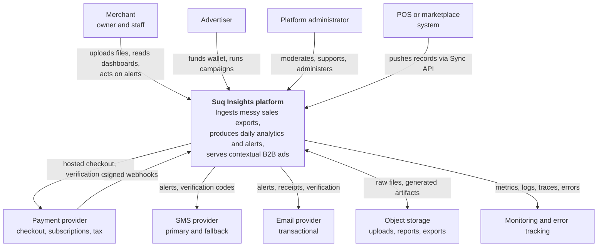
```mermaid
flowchart TB
    M["Merchant<br/>owner and staff"]
    A["Advertiser"]
    P["Platform administrator"]
    POS["POS or marketplace<br/>system"]

    SYS["<b>Suq Insights platform</b><br/>Ingests messy sales exports,<br/>produces daily analytics and alerts,<br/>serves contextual B2B ads"]

    PAY["Payment provider<br/>checkout, subscriptions, tax"]
    SMS["SMS provider<br/>primary and fallback"]
    EMAIL["Email provider<br/>transactional"]
    OBJ["Object storage<br/>uploads, reports, exports"]
    MON["Monitoring and error tracking"]

    M -->|"uploads files, reads dashboards,<br/>acts on alerts"| SYS
    A -->|"funds wallet, runs campaigns"| SYS
    P -->|"moderates, supports, administers"| SYS
    POS -->|"pushes records via Sync API"| SYS

    SYS -->|"hosted checkout, verification calls"| PAY
    PAY -->|"signed webhooks"| SYS
    SYS -->|"alerts, verification codes"| SMS
    SYS -->|"alerts, receipts, verification"| EMAIL
    SYS <-->|"raw files, generated artifacts"| OBJ
    SYS -->|"metrics, logs, traces, errors"| MON
```

The context diagram fixes the system boundary. Two properties matter for everything downstream. First, payment credentials never cross the boundary inward — the platform sends users to hosted checkout and receives only signed callbacks, which keeps compliance scope minimal. Second, the merchant's own customers are not actors: the platform analyzes sales records but never contacts or transacts with the people in them, which is why customer identifiers are stored only as irreversible hashes.

### 6.2 Component diagram

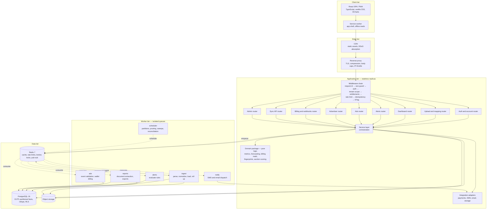
```mermaid
flowchart TB
    subgraph CLIENT["Client tier"]
        SPA["React SPA / PWA<br/>TypeScript, vanilla CSS, ECharts"]
        SW["Service worker<br/>app shell, offline reads"]
    end

    subgraph EDGE["Edge tier"]
        CDN["CDN<br/>static assets, DDoS absorption"]
        PROXY["Reverse proxy<br/>TLS, compression, body caps, IP throttle"]
    end

    subgraph API["Application tier — stateless replicas"]
        MW["Middleware chain<br/>request id → size guard → auth →<br/>tenant scope → entitlements →<br/>rate limit → idempotency → ETag"]
        R1["Auth and account router"]
        R2["Upload and mapping router"]
        R3["Dashboard router"]
        R4["Alerts router"]
        R5["Ads router"]
        R6["Advertiser router"]
        R7["Billing and webhooks router"]
        R8["Sync API router"]
        R9["Admin router"]
        DOM["Domain package — pure logic<br/>metrics, forecasting, billing math,<br/>fingerprints, auction scoring"]
        SVC["Service layer<br/>orchestration"]
        INT["Integration adapters<br/>payments, SMS, email, storage"]
    end

    subgraph WORK["Worker tier — isolated queues"]
        W1["ingest<br/>parse, normalize, load, roll up"]
        W2["alerts<br/>evaluate rules"]
        W3["notify<br/>SMS and email dispatch"]
        W4["ads<br/>event validation, wallet billing"]
        W5["reports<br/>document extraction, exports"]
        BEAT["scheduler<br/>partitions, pruning, sweeps, reconciliation"]
    end

    subgraph DATA["Data tier"]
        PG[("PostgreSQL 16<br/>OLTP, partitioned facts, rollups, RLS")]
        RD[("Redis 7<br/>cache, rate limits, broker, locks, pub-sub")]
        S3[("Object storage")]
    end

    SPA --> SW --> CDN --> PROXY --> MW
    MW --> R1 & R2 & R3 & R4 & R5 & R6 & R7 & R8 & R9
    R1 & R2 & R3 & R4 & R5 & R6 & R7 & R8 & R9 --> SVC
    SVC --> DOM
    SVC --> INT
    SVC --> PG
    SVC --> RD
    SVC --> S3
    SVC -.enqueue.-> RD
    RD -.consume.-> W1 & W2 & W3 & W4 & W5
    BEAT -.schedule.-> RD
    W1 & W2 & W4 & W5 --> PG
    W1 & W5 --> S3
    W3 --> INT
    W1 -.progress events.-> RD
```

Three structural rules are visible here. The middleware chain is a single funnel, so cross-cutting concerns — tenancy, entitlements, limits — are enforced once rather than per endpoint. The domain package is a sink with no outward dependencies, which is what makes metric and billing logic testable without a database and reusable identically by API and workers. Queues are separated by workload class so a fifty-megabyte parse can never delay a verification code, which is the single most important isolation decision in the system.

### 6.3 Deployment diagram

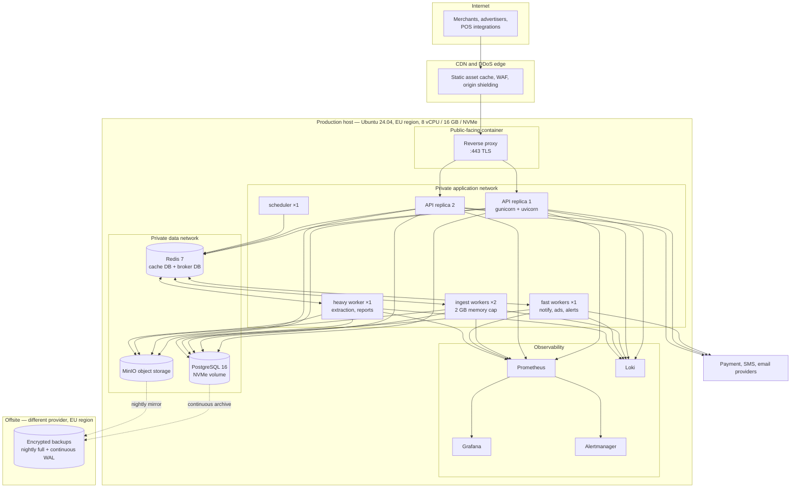
```mermaid
flowchart TB
    subgraph INET["Internet"]
        USERS["Merchants, advertisers,<br/>POS integrations"]
    end
    subgraph CF["CDN and DDoS edge"]
        EDGE["Static asset cache, WAF, origin shielding"]
    end
    subgraph HOST["Production host — Ubuntu 24.04, EU region, 8 vCPU / 16 GB / NVMe"]
        subgraph NETPUB["Public-facing container"]
            CADDY["Reverse proxy<br/>:443 TLS"]
        end
        subgraph NETAPP["Private application network"]
            API1["API replica 1<br/>gunicorn + uvicorn"]
            API2["API replica 2"]
            WI["ingest workers ×2<br/>2 GB memory cap"]
            WF["fast workers ×1<br/>notify, ads, alerts"]
            WH["heavy worker ×1<br/>extraction, reports"]
            BEATC["scheduler ×1"]
        end
        subgraph NETDATA["Private data network"]
            PGC[("PostgreSQL 16<br/>NVMe volume")]
            RDC[("Redis 7<br/>cache DB + broker DB")]
            MIN[("MinIO object storage")]
        end
        subgraph OBS["Observability"]
            PROM["Prometheus"]
            GRAF["Grafana"]
            LOKI["Loki"]
            ALERT["Alertmanager"]
        end
    end
    subgraph OFF["Offsite — different provider, EU region"]
        BAK[("Encrypted backups<br/>nightly full + continuous WAL")]
    end
    EXT["Payment, SMS, email providers"]

    USERS --> EDGE --> CADDY
    CADDY --> API1 & API2
    API1 & API2 --> PGC & RDC & MIN
    RDC <--> WI & WF & WH
    BEATC --> RDC
    WI & WF & WH --> PGC
    WI & WH --> MIN
    WF --> EXT
    API1 & API2 --> EXT
    PGC -.continuous archive.-> BAK
    MIN -.nightly mirror.-> BAK
    API1 & API2 & WI & WF & WH --> PROM & LOKI
    PROM --> ALERT
    PROM --> GRAF
```

One well-run host carries the launch load with headroom, and honesty about that beats a pretend-distributed architecture. The design that matters is what makes growth cheap: every application container is stateless, so the first scaling step is replicating containers, and the second is moving the data tier to its own host — neither requires code changes. Data and application networks are separate, and only the proxy is publicly reachable. Backups leave the provider entirely, because a backup on the same infrastructure as the primary is not a backup.

### 6.4 Entity-relationship model


```mermaid
erDiagram
    MERCHANTS ||--o{ USERS : "employs"
    MERCHANTS ||--o{ DATASETS : "owns"
    MERCHANTS ||--o{ ENTITIES : "catalogs"
    MERCHANTS ||--o{ UPLOADS : "submits"
    MERCHANTS ||--o{ ALERT_RULES : "configures"
    MERCHANTS ||--o{ ALERTS : "receives"
    MERCHANTS ||--o{ API_KEYS : "provisions"
    MERCHANTS ||--|| SUBSCRIPTIONS : "holds"
    MERCHANTS ||--o{ DAILY_WORKSPACE_ROLLUPS : "aggregated into"
    MERCHANTS ||--o{ COHORTS : "aggregated into"

    PLANS ||--o{ SUBSCRIPTIONS : "defines"
    SUBSCRIPTIONS ||--o{ PAYMENTS : "billed by"

    USERS ||--o{ REFRESH_TOKENS : "authenticates with"
    USERS ||--o{ API_KEYS : "created"
    USERS ||--o{ MODEL_REVISIONS : "authors"
    USERS ||--o{ DASHBOARDS : "arranges"
    USERS ||--o{ WIDGET_PREFERENCES : "accumulates"
    MERCHANTS ||--o{ DASHBOARDS : "scopes"
    DASHBOARDS ||--|{ WIDGET_INSTANCES : "lays out"

    MERCHANTS ||--o{ CHANNELS : "defines"
    CHANNELS ||--o{ LOADS : "receives"
    CHANNELS ||--|| DATASETS : "interpreted by"
    LOADS ||--o{ RECORDS : "delivers"
    LOADS ||--o| UPLOADS : "may originate from"
    ENTITIES ||--o{ DERIVED_STATES : "has running total"
    RECORDS ||--o{ DERIVED_STATES : "contributes to"
    USERS ||--o{ ENTRY_DRAFTS : "queues"
    DATASETS ||--|{ FIELD_DEFINITIONS : "described by"
    DATASETS ||--o{ RECORDS : "contains"
    DATASETS ||--o{ UPLOADS : "fed by"
    DATASETS ||--o{ MODEL_REVISIONS : "remodeled by"
    FIELD_DEFINITIONS ||--o{ MODEL_REVISIONS : "changed in"

    RECORDS ||--o{ ENTITY_LINKS : "references"
    ENTITIES ||--o{ ENTITY_LINKS : "referenced by"
    ENTITIES ||--o{ MEASUREMENTS : "observed as"
    ENTITIES ||--o{ DAILY_ENTITY_ROLLUPS : "aggregated into"
    ENTITIES ||--o{ ALERTS : "subject of"
    ENTITIES ||--o| ENTITIES : "merged into"

    UPLOADS ||--o{ UPLOAD_ERRORS : "rejects"
    UPLOADS ||--o{ RECORDS : "provenance of"
    UPLOADS ||--|| STRUCTURAL_PROFILES : "physically shaped by"

    ALERT_RULES ||--o{ ALERTS : "raises"
    ALERTS ||--o{ NOTIFICATIONS : "delivered as"

    ADVERTISERS ||--|| AD_WALLETS : "funds"
    AD_WALLETS ||--o{ AD_WALLET_LEDGER : "recorded in"
    ADVERTISERS ||--o{ CAMPAIGNS : "runs"
    CAMPAIGNS ||--|{ AD_CREATIVES : "presents"
    CAMPAIGNS ||--o{ AD_EVENTS : "generates"
    AD_CREATIVES ||--o{ AD_EVENTS : "measured by"
    ADVERTISERS ||--o{ PAYMENTS : "tops up with"

    MERCHANTS {
        uuid id PK
        text name
        char country
        text city
        text business_category
        text default_locale
        char default_currency
        text timezone
        text status
    }
    USERS {
        uuid id PK
        uuid merchant_id FK
        citext email UK
        text phone_e164 UK
        text password_hash
        text role
        text locale
        timestamptz email_verified_at
        timestamptz phone_verified_at
    }
    DATASETS {
        uuid id PK
        uuid merchant_id FK
        text name
        text structural_signature
        integer active_model_version
        text source_kind
        jsonb capabilities
        integer record_count
        timestamptz coverage_start
        timestamptz coverage_end
    }
    FIELD_DEFINITIONS {
        uuid id PK
        uuid dataset_id FK
        integer model_version PK
        text source_name
        text display_name
        text inferred_type
        text confirmed_type
        text inferred_role
        text confirmed_role
        text unit
        char currency
        jsonb format_options
        numeric confidence
        jsonb evidence
        numeric null_rate
        integer distinct_count
        jsonb sample_values
        text status
    }
    STRUCTURAL_PROFILES {
        uuid id PK
        uuid upload_id FK
        text encoding
        text delimiter
        text quote_char
        integer header_row
        integer data_start_row
        integer data_end_row
        text decimal_sep
        text thousands_sep
        jsonb source_metadata
        jsonb extraction_report
    }
    CHANNELS {
        uuid id PK
        uuid merchant_id FK
        text name
        text intent
        uuid dataset_id FK
        text fill_policy
        jsonb arrival_profile
        boolean moves_state
        text status
    }
    LOADS {
        uuid id PK
        uuid channel_id FK
        text input_path
        uuid upload_id FK
        integer records_loaded
        integer records_skipped
        jsonb guard_verdict
        boolean reverted
        timestamptz created_at
    }
    DERIVED_STATES {
        uuid merchant_id PK
        uuid entity_id PK
        text kind PK
        numeric value
        uuid baseline_record_id FK
        timestamptz applied_through
        boolean contradicted
    }
    ENTRY_DRAFTS {
        uuid client_id PK
        uuid merchant_id FK
        uuid user_id FK
        uuid channel_id FK
        jsonb values
        text sync_status
        timestamptz created_at
    }
    DASHBOARDS {
        uuid id PK
        uuid merchant_id FK
        uuid user_id FK
        text name
        boolean is_default
        boolean is_workspace_template
        uuid source_template_id FK
        timestamptz created_at
    }
    WIDGET_INSTANCES {
        uuid id PK
        uuid dashboard_id FK
        text widget_key
        text render
        jsonb config
        integer grid_x
        integer grid_y
        integer grid_w
        integer grid_h
        text title_override
    }
    WIDGET_PREFERENCES {
        uuid merchant_id PK
        uuid user_id PK
        text widget_key PK
        text preferred_render
        integer override_count
    }
    MODEL_REVISIONS {
        uuid id PK
        uuid dataset_id FK
        uuid field_definition_id FK
        integer from_version
        integer to_version
        uuid actor_user_id FK
        text change_kind
        jsonb before
        jsonb after
        integer records_rederived
        timestamptz created_at
    }
    RECORDS {
        uuid id PK
        uuid merchant_id FK
        uuid dataset_id FK
        uuid channel_id FK
        uuid load_id FK
        text intent
        integer model_version
        timestamptz event_time PK
        numeric amount
        char currency
        numeric quantity
        text category
        text location
        text channel
        text external_ref
        jsonb attributes
        uuid upload_id FK
        text fingerprint UK
    }
    ENTITIES {
        uuid id PK
        uuid merchant_id FK
        text kind
        text external_id
        text display_name
        text normalized_name
        jsonb attributes
        uuid merged_into FK
        text source
    }
    ENTITY_LINKS {
        uuid record_id PK
        uuid entity_id PK
        text role PK
        numeric quantity
        numeric unit_amount
        numeric line_amount
    }
    MEASUREMENTS {
        uuid id PK
        uuid merchant_id FK
        uuid entity_id FK
        text kind
        numeric value
        text unit
        timestamptz observed_at
        text source
    }
    UPLOADS {
        uuid id PK
        uuid merchant_id FK
        text filename
        bigint byte_size
        text content_sha256
        text s3_key
        text source_kind
        text status
        uuid dataset_id FK
        jsonb stats
        text idempotency_key
    }
    UPLOAD_ERRORS {
        bigint id PK
        uuid upload_id FK
        integer row_number
        text error_code
        jsonb error_context
    }
    DAILY_WORKSPACE_ROLLUPS {
        uuid merchant_id PK
        date day PK
        numeric revenue
        integer order_count
        numeric unit_count
        integer unique_customers
        integer new_customers
    }
    DAILY_ENTITY_ROLLUPS {
        uuid merchant_id PK
        uuid entity_id PK
        date day PK
        numeric revenue
        numeric unit_count
        integer order_count
    }
    COHORTS {
        uuid merchant_id PK
        text cohort_key PK
        date first_order_month
        date month PK
        integer order_count
        numeric revenue
    }
    ALERT_RULES {
        uuid id PK
        uuid merchant_id FK
        text kind
        boolean enabled
        jsonb params
        text_array channels
    }
    ALERTS {
        uuid id PK
        uuid merchant_id FK
        uuid rule_id FK
        uuid entity_id FK
        text kind
        text severity
        jsonb payload
        text dedup_key UK
        text status
    }
    NOTIFICATIONS {
        uuid id PK
        uuid merchant_id FK
        uuid alert_id FK
        text channel
        text destination
        text locale
        text template_key
        text status
        bigint cost_micro_usd
    }
    PLANS {
        text id PK
        jsonb name
        numeric price
        char currency
        text interval
        jsonb entitlements
        boolean active
    }
    SUBSCRIPTIONS {
        uuid id PK
        uuid merchant_id FK
        text plan_id FK
        text provider
        text provider_sub_id UK
        text status
        timestamptz current_period_start
        timestamptz current_period_end
        boolean cancel_at_period_end
    }
    PAYMENTS {
        uuid id PK
        uuid merchant_id FK
        uuid advertiser_id FK
        text provider
        text provider_ref UK
        numeric amount
        char currency
        text purpose
        text status
    }
    API_KEYS {
        uuid id PK
        uuid merchant_id FK
        text name
        text key_prefix
        text key_hash UK
        text_array scopes
        timestamptz last_used_at
        timestamptz revoked_at
    }
    REFRESH_TOKENS {
        uuid id PK
        uuid user_id FK
        text token_hash
        uuid family_id
        timestamptz expires_at
        timestamptz revoked_at
    }
    ADVERTISERS {
        uuid id PK
        text company_name
        uuid contact_user_id FK
        text status
    }
    AD_WALLETS {
        uuid advertiser_id PK
        bigint balance_micro
        char currency
    }
    AD_WALLET_LEDGER {
        bigint id PK
        uuid advertiser_id FK
        bigint delta_micro
        text reason
        uuid ref_id
        bigint balance_after_micro
    }
    CAMPAIGNS {
        uuid id PK
        uuid advertiser_id FK
        text name
        text status
        text trigger_context
        jsonb targeting
        text bid_model
        bigint bid_micro
        bigint daily_budget_micro
        timestamptz starts_at
        timestamptz ends_at
    }
    AD_CREATIVES {
        uuid id PK
        uuid campaign_id FK
        text locale
        text headline
        text body
        text cta_label
        text cta_url
        text review_status
    }
    AD_EVENTS {
        uuid id PK
        timestamptz occurred_at PK
        uuid campaign_id FK
        uuid creative_id FK
        uuid merchant_id FK
        text kind
        text context
        bigint charge_micro
        text dedup_key UK
    }
```

Ten decisions in this model deserve explanation.

**Intent is declared, not inferred.** A channel's label states what its data asserts about the world — an observation of state, a consumption, an addition, a correction, or mere description. This is the one property the platform never guesses, because a wrong chart is visible and self-correcting while a wrong stock direction is silent and compounds. Records inherit intent from their channel, which is why `RECORDS` carries both.

**Running quantities are computed, not stored.** `DERIVED_STATES` holds a materialized value, but it is a cache of a computation: the latest observation plus subsequent increments minus subsequent decrements. It records which observation it derives from and how far events have been applied, so late or corrected data recomputes forward from a bounded starting point rather than replaying all history.

**A load is the unit of undo.** Every delivery into a channel — file, photograph, typed batch, or API push — is a `LOADS` row, and reverting one recomputes derived state forward. Reversibility matters more than perfect detection, because it turns a misinterpretation from a support incident into a click.

**Meaning is data, not schema.** The domain model lives in `FIELD_DEFINITIONS` rows, not in table columns. A workspace whose files carry a salesperson, a delivery zone, or a payment method gets those as first-class fields without a migration, because the platform stores what arrived and interprets it through a model that is itself editable. This is the structural reason a merchant can correct an interpretation without re-uploading anything.

**Records are stored twice over, deliberately.** Every record keeps its full original payload in `attributes` while a handful of resolved semantic roles are promoted into indexed columns. The promoted columns make aggregation fast; the payload makes reinterpretation possible. When a merchant later assigns a role to a column that had none, the values are already there, so history backfills instead of being lost.

**Model versions are immutable.** Editing a field definition creates a new version rather than mutating the old one, and every record records the version under which it was interpreted. This makes remodeling auditable, makes an impact preview computable before a change is applied, and means a mistaken edit can be reverted rather than reconstructed.

**One entity table, not one per concept.** Items, customers, categories, and locations share `ENTITIES` with a kind discriminator, because which of them a workspace has depends entirely on what its data contained. `ENTITY_LINKS` carries the relationship and its role, so a single record can reference several entities without the schema having anticipated how many. A self-reference supports merging duplicates the merchant identifies.

**The tenant column is everywhere.** Every merchant-owned table carries the merchant identifier, including tables that could reach it through a join. This redundancy lets row-level security policies apply uniformly with a single-column predicate, and keeps every index tenant-leading so one workspace's queries never scan another's data.

**Facts are partitioned; aggregates are not.** `RECORDS` is range-partitioned by month on resolved event time, which is why that timestamp participates in the primary key. Rollups are small, unpartitioned, and keyed by workspace and day. Dashboards read only rollups, so query cost is proportional to the days displayed, not to the workspace's total data volume.

**Idempotency is a database constraint, not application logic.** The uniqueness constraint on the record fingerprint makes repeated loads harmless at the storage layer, which is what allows an ingestion worker to retry safely after a crash and an integration to resend a batch after a timeout. Because the fingerprint derives from the confirmed model, remodeling recomputes it consistently.

**Money is an integer ledger, and alerts are keyed by condition.** Wallet balances are integer micro-units over an append-only ledger updated in the same transaction under a non-negative constraint. Alerts are unique per workspace and deduplication key, which turns them from a noisy event stream into a state that can be raised, refreshed, resolved, and acknowledged without ever sending the same warning twice.

### 6.5 Class diagram — domain and service layer


```mermaid
classDiagram
    direction TB

    class Merchant {
        +UUID id
        +str name
        +str country
        +Locale default_locale
        +str default_currency
        +str timezone
        +local_day(instant) date
    }

    class Plan {
        +str id
        +Money price
        +Entitlements entitlements
    }

    class Entitlements {
        +int|None history_days
        +int uploads_per_day
        +int upload_max_mb
        +int seats
        +bool sync_api
        +bool sms_alerts
        +bool predictive_alerts
        +bool ad_free
        +bool export_full
        +int api_rate_per_min
        +allows(feature) bool
        +history_cutoff(today) date|None
    }

    class Subscription {
        +UUID id
        +SubscriptionStatus status
        +datetime period_end
        +is_entitled() bool
        +enter_grace() void
        +expire() void
    }

    class UploadJob {
        +UUID id
        +UploadStatus status
        +UploadStats stats
        +transition_to(status) void
        +can_resume() bool
    }

    class DomainModel {
        +UUID dataset_id
        +int version
        +str structural_signature
        +list~FieldDefinition~ fields
        +roles() dict~Role,FieldDefinition~
        +capabilities() set~Analysis~
        +apply(raw_frame) NormalizedFrame
        +with_edit(edit) DomainModel
    }

    class FieldDefinition {
        +str source_name
        +str display_name
        +DataType inferred_type
        +DataType confirmed_type
        +Role|None inferred_role
        +Role|None confirmed_role
        +str unit
        +float confidence
        +Evidence evidence
        +FieldStatus status
        +effective_type() DataType
        +effective_role() Role|None
    }

    class StructuralProfile {
        +str encoding
        +str delimiter
        +str quote_char
        +int header_row
        +int data_start
        +int data_end
        +str decimal_sep
        +bool|None day_first
    }

    class StructureInferrer {
        +infer(raw_bytes) StructuralProfile
        -score_delimiter(sample) dict
        -locate_header(rows) int
        -bound_data_region(rows) tuple
    }

    class ColumnProfiler {
        <<pure>>
        +profile(column) ColumnProfile
        -score_types(values) list~TypeCandidate~
        -pattern_signature(values) str
        -distribution(values) Stats
    }

    class DomainReconciler {
        -ConceptVocabulary vocabulary
        +reconcile(profiles) DomainModel
        -lexical_score(name) dict
        -shape_score(profile) dict
        -statistical_score(profile) dict
        -relational_score(profiles) dict
        -combine(scores) RoleProposal
    }

    class DocumentExtractor {
        <<interface>>
        +extract(source) ExtractedTable
        +supports(media_type) bool
    }

    class OcrExtractor {
        -deskew(image) Image
        -detect_table(image) Region
        -segment_cells(region) list~Cell~
        -recognize(cell, locales) CellValue
    }

    class PdfTextExtractor

    class ExtractedTable {
        +list~list~CellValue~~ rows
        +float mean_confidence
        +list~CellValue~ low_confidence_cells
    }

    class CellValue {
        +str text
        +float confidence
        +BoundingBox source_region
        +bool needs_review
    }

    class ModelEditor {
        +preview(model, edit) EditPreview
        +apply(model, edit, actor) DomainModel
        +impact_of(model, edit) ImpactReport
    }

    class RowValidator {
        +validate(row) ValidationResult
        -check_date_range(value) bool
        -check_amounts(row) bool
    }

    class Fingerprint {
        <<utility>>
        +for_order(merchant, row)$ str
        +for_header(headers)$ str
    }

    class MetricsCalculator {
        <<pure>>
        +sales_velocity(rollups, granularity) Series
        +kpi_summary(rollups, range) KpiSet
        +top_products(rollups, metric, n) list
        +retention_matrix(cohorts) Matrix
        +days_of_stock(product_stats) float
    }

    class Forecaster {
        <<pure>>
        +holt_winters(series, season) Forecast
        +depletion_date(stock, forecast) date
        +has_sufficient_history(series) bool
    }

    class AlertRule {
        +UUID id
        +AlertKind kind
        +bool enabled
        +dict params
        +list~Channel~ channels
        +evaluate(context) AlertState|None
    }

    class Alert {
        +UUID id
        +str dedup_key
        +Severity severity
        +AlertStatus status
        +raise_or_refresh(state) bool
        +resolve() void
        +acknowledge() void
    }

    class AdAuction {
        <<pure>>
        +select(candidates, context) Candidate|None
        -pacing_factor(campaign, now) float
        -quality_factor(creative) float
    }

    class AdWallet {
        +int balance_micro
        +charge(amount, ref) LedgerEntry
        +credit(amount, ref) LedgerEntry
        +can_afford(amount) bool
    }

    class Channel {
        +UUID id
        +str name
        +Intent intent
        +DomainModel model
        +FillPolicy fill_policy
        +ArrivalProfile profile
        +bool moves_state
        +accepts(dataset) GuardVerdict
        +entry_fields() list~FieldDefinition~
    }

    class ArrivalProfile {
        +set~str~ columns
        +Range row_count
        +dict distributions
        +Cadence cadence
        +score(dataset) DriftReport
    }

    class DriftGuard {
        +evaluate(channel, dataset) GuardVerdict
        -structural_drift(profile, dataset) Finding
        -label_contradiction(intent, dataset) Finding
        -outlier(profile, dataset) Finding
        -period_overlap(channel, dataset) Finding
    }

    class Load {
        +UUID id
        +InputPath input_path
        +GuardVerdict verdict
        +bool reverted
        +revert() RecomputeScope
    }

    class DerivedStateService {
        +current(entity, kind) StateValue
        +recompute_from(entity, kind, since) void
        +provenance(entity, kind) list~Record~
        -fold(baseline, events) numeric
    }

    class EntryService {
        -Channel channel
        +fields() list~FieldDefinition~
        +submit(values, client_id) Record
        +sync_drafts(drafts) SyncReport
        +suggest_fields(intent, business_type) list~Suggestion~
    }

    class LiveUpdatePublisher {
        +publish(merchant_id, stale_widgets) void
        -coalesce(events, window) Event
    }

    class IngestionService {
        -ObjectStore store
        -DocumentExtractor extractor
        -StructureInferrer structure
        -ColumnProfiler profiler
        -DomainReconciler reconciler
        -RowValidator validator
        -EntityResolver entities
        -RollupUpdater rollups
        +accept(source, merchant) UploadJob
        +extract_and_infer(upload_id) DomainModel
        +confirm_model(upload_id, edits) void
        +load(upload_id) UploadStats
        +remodel(dataset_id, edits) ImpactReport
    }

    class EntityResolver {
        +resolve(kind, identifier, name) Entity
        +merge(source, target) void
        -normalize(name) str
    }

    class AnalyticsService {
        -RollupRepository repo
        -CacheGateway cache
        +resolve_canvas(dashboard, user) CanvasPayload
        +resolve_widget(instance, user) WidgetPayload
        -deduplicate(instances) list~Query~
    }

    class WidgetManifest {
        +str key
        +str feature
        +list~Role~ roles
        +list~Role~ optional
        +list~Render~ renders
        +Render default_render
        +Schema config_schema
        +PrimitiveKind primitive
        +CachePolicy cache
        +Tier tier
    }

    class WidgetModule {
        <<interface>>
        +manifest() WidgetManifest
        +resolve(config, context) WidgetPayload
    }

    class WidgetRegistry {
        -dict~str,WidgetModule~ modules
        +register(module) void
        +get(key) WidgetModule
        +catalog(tier) list~WidgetManifest~
        +validate_config(key, config) Result
    }

    class RenderRecommender {
        +recommend(manifest, profile, prefs) Render
        -shape_rules(profile) list~Render~
        -learned_preference(user, key) Render|None
    }

    class QueryPrimitive {
        <<interface>>
        +execute(spec, context) ResultSet
    }
    class ScalarQuery
    class SeriesQuery
    class RankingQuery
    class MatrixQuery
    class TableQuery

    class Dashboard {
        +UUID id
        +str name
        +bool is_workspace_template
        +list~WidgetInstance~ instances
        +place(widget_key, position) WidgetInstance
        +rearrange(moves) void
    }

    class WidgetInstance {
        +str widget_key
        +Render render
        +dict config
        +GridPosition position
        +str title_override
        +set_render(render) void
    }

    class AlertService {
        -AlertRepository repo
        -Forecaster forecaster
        -NotificationDispatcher dispatcher
        +evaluate(merchant_id) list~Alert~
    }

    class BillingService {
        -PaymentGateway gateway
        -SubscriptionRepository repo
        +start_checkout(merchant, plan) Url
        +apply_webhook(event) void
        +downgrade(merchant) void
    }

    class EntitlementResolver {
        -CacheGateway cache
        +for_merchant(merchant_id) Entitlements
        +invalidate(merchant_id) void
    }

    class PaymentGateway {
        <<interface>>
        +create_checkout(purpose, amount, meta) Url
        +verify(provider_ref) VerifiedPayment
        +parse_webhook(request) Event
    }
    class MessageGateway {
        <<interface>>
        +send(destination, template, locale) Receipt
        +cost_of(receipt) Money
    }
    class ObjectStore {
        <<interface>>
        +put_stream(key, stream) str
        +presigned_url(key, ttl) str
    }
    class CacheGateway {
        <<interface>>
        +get_or_compute(key, fn, ttl) Any
        +bump_version(merchant_id) int
    }

    class StripeGateway
    class TwilioGateway
    class MinioStore
    class RedisCache

    Merchant "1" --> "1" Subscription
    Subscription "*" --> "1" Plan
    Plan "1" *-- "1" Entitlements
    Merchant "1" --> "*" UploadJob
    UploadJob "*" --> "0..1" DomainModel
    UploadJob "1" --> "0..1" StructuralProfile
    DomainReconciler ..> DomainModel : proposes
    ColumnProfiler ..> DomainReconciler : feeds
    StructureInferrer ..> ColumnProfiler : feeds
    DocumentExtractor ..> ExtractedTable : produces
    ExtractedTable "1" *-- "*" CellValue
    ExtractedTable ..> StructureInferrer : feeds
    DocumentExtractor <|.. OcrExtractor
    DocumentExtractor <|.. PdfTextExtractor
    DomainModel "1" *-- "*" FieldDefinition
    ModelEditor ..> DomainModel : versions
    Channel "1" *-- "1" ArrivalProfile
    Channel "1" --> "1" DomainModel
    Channel "1" o-- "*" Load
    DriftGuard ..> Channel : scores against
    DriftGuard ..> Load : gates
    Load ..> DerivedStateService : triggers recompute
    EntryService --> Channel
    EntryService ..> LiveUpdatePublisher : notifies
    DerivedStateService ..> LiveUpdatePublisher : notifies
    IngestionService --> Channel
    IngestionService --> DriftGuard
    IngestionService --> DerivedStateService
    IngestionService --> StructureInferrer
    IngestionService --> ColumnProfiler
    IngestionService --> DomainReconciler
    IngestionService --> DocumentExtractor
    IngestionService --> ModelEditor
    IngestionService --> EntityResolver
    IngestionService --> RowValidator
    IngestionService ..> Fingerprint : uses
    IngestionService --> ObjectStore
    AnalyticsService ..> DomainModel : reads capabilities
    AnalyticsService --> MetricsCalculator
    AnalyticsService --> CacheGateway
    AnalyticsService --> WidgetRegistry
    AnalyticsService --> RenderRecommender
    WidgetRegistry "1" o-- "*" WidgetModule
    WidgetModule ..> WidgetManifest : declares
    WidgetModule --> QueryPrimitive : composes
    QueryPrimitive <|.. ScalarQuery
    QueryPrimitive <|.. SeriesQuery
    QueryPrimitive <|.. RankingQuery
    QueryPrimitive <|.. MatrixQuery
    QueryPrimitive <|.. TableQuery
    QueryPrimitive ..> MetricsCalculator : uses
    Dashboard "1" *-- "*" WidgetInstance
    WidgetInstance ..> WidgetManifest : conforms to
    RenderRecommender ..> WidgetManifest : reads
    AlertService --> Forecaster
    AlertService --> AlertRule
    AlertRule ..> Alert : produces
    AlertService --> MessageGateway
    BillingService --> PaymentGateway
    BillingService ..> EntitlementResolver : invalidates
    EntitlementResolver --> CacheGateway
    EntitlementResolver ..> Entitlements : resolves
    AdAuction ..> AdWallet : checks
    PaymentGateway <|.. StripeGateway
    MessageGateway <|.. TwilioGateway
    ObjectStore <|.. MinioStore
    CacheGateway <|.. RedisCache
```

The class model expresses the layering rule that keeps this codebase maintainable. Classes marked pure — the metrics calculator, forecaster, auction, and fingerprint utility — hold the logic that is hardest to get right and easiest to get wrong silently, and they take plain data in and return plain data out. They can be exhaustively tested with property-based tests and no infrastructure, and both the API and the workers call the same implementations, so a dashboard number and the same number in an export or an alert cannot diverge.

Everything touching the outside world sits behind an interface: payments, messaging, object storage, and cache. This is what makes the fake providers used throughout development and testing possible, and it is why adding a regional payment provider later is a new implementation of one interface rather than a change spreading through billing logic.

The entitlement resolver deserves note as the single point where the paid contract is interpreted. Services ask it what a workspace may do; no endpoint interprets a plan directly. That is the structural reason premium enforcement cannot drift between features.

### 6.6 Sequence diagram — submission, inference, review, and load

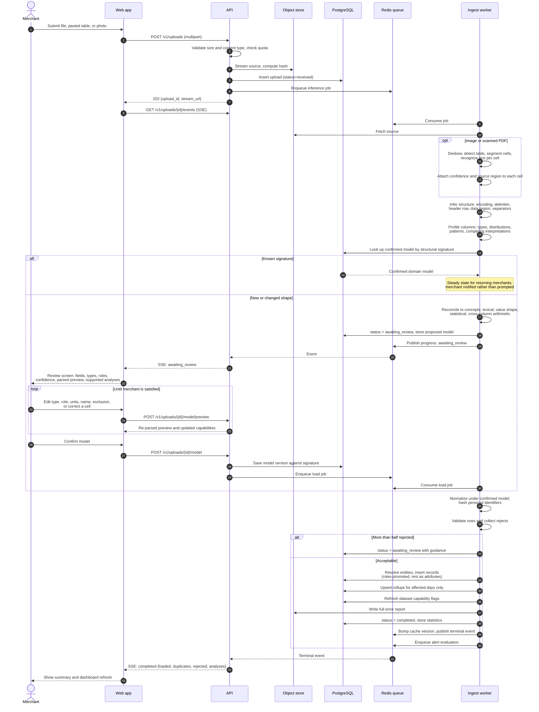
```mermaid
sequenceDiagram
    autonumber
    actor M as Merchant
    participant W as Web app
    participant API as API
    participant S as Object store
    participant DB as PostgreSQL
    participant Q as Redis queue
    participant IW as Ingest worker

    M->>W: Submit file, pasted table, or photo
    W->>API: POST /v1/uploads (multipart)
    API->>API: Validate size and content type, check quota
    API->>S: Stream source, compute hash
    API->>DB: Insert upload (status=received)
    API->>Q: Enqueue inference job
    API-->>W: 202 {upload_id, stream_url}
    W->>API: GET /v1/uploads/{id}/events (SSE)

    IW->>Q: Consume job
    IW->>S: Fetch source
    opt Image or scanned PDF
        IW->>IW: Deskew, detect table, segment cells,<br/>recognize text per cell
        IW->>IW: Attach confidence and source region to each cell
    end
    IW->>IW: Infer structure: encoding, delimiter,<br/>header row, data region, separators
    IW->>IW: Profile columns: types, distributions,<br/>patterns, competing interpretations
    IW->>DB: Look up confirmed model by structural signature

    alt Known signature
        DB-->>IW: Confirmed domain model
        Note over IW: Steady state for returning merchants,<br/>merchant notified rather than prompted
    else New or changed shape
        IW->>IW: Reconcile to concepts: lexical, value shape,<br/>statistical, cross-column arithmetic
        IW->>DB: status = awaiting_review, store proposed model
        IW->>Q: Publish progress: awaiting_review
        Q-->>API: Event
        API-->>W: SSE: awaiting_review
        W-->>M: Review screen: fields, types, roles,<br/>confidence, parsed preview, supported analyses
        loop Until merchant is satisfied
            M->>W: Edit type, role, units, name, exclusion,<br/>or correct a cell
            W->>API: POST /v1/uploads/{id}/model/preview
            API-->>W: Re-parsed preview and updated capabilities
        end
        M->>W: Confirm model
        W->>API: POST /v1/uploads/{id}/model
        API->>DB: Save model version against signature
        API->>Q: Enqueue load job
        IW->>Q: Consume load job
    end

    IW->>IW: Normalize under confirmed model,<br/>hash personal identifiers
    IW->>IW: Validate rows and collect rejects
    alt More than half rejected
        IW->>DB: status = awaiting_review with guidance
    else Acceptable
        IW->>DB: Resolve entities, insert records<br/>(roles promoted, rest as attributes)
        IW->>DB: Upsert rollups for affected days only
        IW->>DB: Refresh dataset capability flags
        IW->>S: Write full error report
        IW->>DB: status = completed, store statistics
        IW->>Q: Bump cache version, publish terminal event
        IW->>Q: Enqueue alert evaluation
    end
    Q-->>API: Terminal event
    API-->>W: SSE: completed {loaded, duplicates, rejected, analyses}
    W-->>M: Show summary and dashboard refresh
```

The sequence shows why the upload endpoint returns in about two seconds even for a large file: the request path does validation, a streaming write, and an enqueue, and nothing else. Everything expensive happens in a worker whose progress the browser watches over a one-way event stream, which survives flaky mobile networks better than a bidirectional socket and degrades to polling. The branch on structural signature is the product's core efficiency: review is a first-contact experience, and every subsequent submission of the same shape runs unattended. Note where the merchant sits in this sequence — between inference and load, never after it, because a model confirmed before commit costs a click while a model corrected after commit costs a re-derivation.

### 6.7 Sequence diagram — premium subscription activation

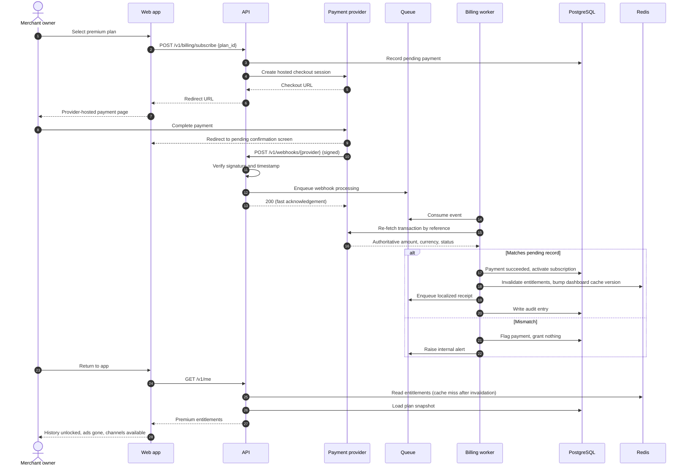
```mermaid
sequenceDiagram
    autonumber
    actor O as Merchant owner
    participant W as Web app
    participant API as API
    participant PAY as Payment provider
    participant Q as Queue
    participant BW as Billing worker
    participant DB as PostgreSQL
    participant RD as Redis

    O->>W: Select premium plan
    W->>API: POST /v1/billing/subscribe {plan_id}
    API->>DB: Record pending payment
    API->>PAY: Create hosted checkout session
    PAY-->>API: Checkout URL
    API-->>W: Redirect URL
    W-->>O: Provider-hosted payment page
    O->>PAY: Complete payment
    PAY-->>W: Redirect to pending confirmation screen

    PAY->>API: POST /v1/webhooks/{provider} (signed)
    API->>API: Verify signature and timestamp
    API->>Q: Enqueue webhook processing
    API-->>PAY: 200 (fast acknowledgement)

    BW->>Q: Consume event
    BW->>PAY: Re-fetch transaction by reference
    PAY-->>BW: Authoritative amount, currency, status
    alt Matches pending record
        BW->>DB: Payment succeeded, activate subscription
        BW->>RD: Invalidate entitlements, bump dashboard cache version
        BW->>Q: Enqueue localized receipt
        BW->>DB: Write audit entry
    else Mismatch
        BW->>DB: Flag payment, grant nothing
        BW->>Q: Raise internal alert
    end
    O->>W: Return to app
    W->>API: GET /v1/me
    API->>RD: Read entitlements (cache miss after invalidation)
    API->>DB: Load plan snapshot
    API-->>W: Premium entitlements
    W-->>O: History unlocked, ads gone, channels available
```

Two safeguards are structural rather than procedural. The platform never grants entitlements from webhook contents; it re-fetches the transaction from the provider and compares it against what it expected, so a forged or replayed callback grants nothing. And activation invalidates both the entitlement cache and the dashboard cache version, which is what makes the upgrade visible everywhere within seconds instead of at the next cache expiry.

### 6.8 Sequence diagram — canvas resolution with caching

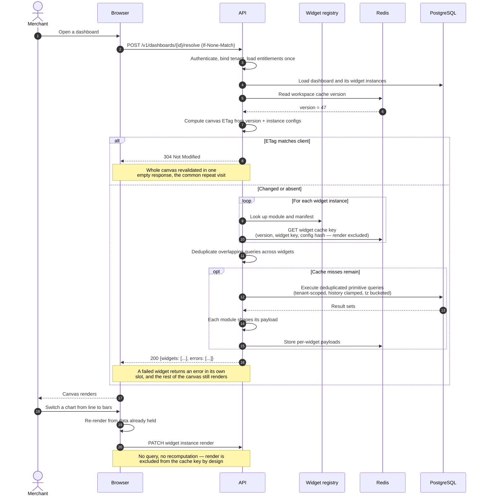
```mermaid
sequenceDiagram
    autonumber
    actor M as Merchant
    participant B as Browser
    participant API as API
    participant REG as Widget registry
    participant RD as Redis
    participant DB as PostgreSQL

    M->>B: Open a dashboard
    B->>API: POST /v1/dashboards/{id}/resolve (If-None-Match)
    API->>API: Authenticate, bind tenant, load entitlements once
    API->>DB: Load dashboard and its widget instances
    API->>RD: Read workspace cache version
    RD-->>API: version = 47
    API->>API: Compute canvas ETag from version + instance configs
    alt ETag matches client
        API-->>B: 304 Not Modified
        Note over B,API: Whole canvas revalidated in one<br/>empty response, the common repeat visit
    else Changed or absent
        loop For each widget instance
            API->>REG: Look up module and manifest
            API->>RD: GET widget cache key<br/>(version, widget key, config hash — render excluded)
        end
        API->>API: Deduplicate overlapping queries across widgets
        opt Cache misses remain
            API->>DB: Execute deduplicated primitive queries<br/>(tenant-scoped, history clamped, tz bucketed)
            DB-->>API: Result sets
            API->>API: Each module shapes its payload
            API->>RD: Store per-widget payloads
        end
        API-->>B: 200 {widgets: [...], errors: [...]}
        Note over API,B: A failed widget returns an error in its own<br/>slot, and the rest of the canvas still renders
    end
    B-->>M: Canvas renders

    M->>B: Switch a chart from line to bars
    B->>B: Re-render from data already held
    B->>API: PATCH widget instance render
    Note over B,API: No query, no recomputation — render is<br/>excluded from the cache key by design

```

The canvas resolves in one round trip: authentication, entitlement loading, tenant binding, and dashboard reading happen once for the whole set rather than once per widget, and overlapping queries collapse before touching the database. The final exchange is the payoff of excluding render from the cache key — an experienced user trying three visualizations of the same question costs three client-side re-renders and no backend work at all.

### 6.9 Sequence diagram — day-to-day entry with derived state

The scenario the model exists to serve: a stock count today, two sales tomorrow, and a stock figure that follows without anyone recording it.

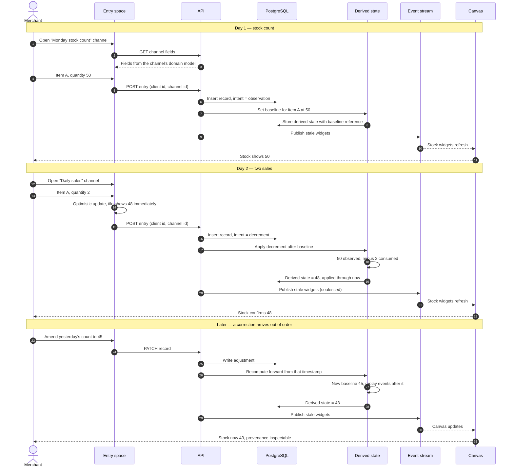
```mermaid
sequenceDiagram
    autonumber
    actor M as Merchant
    participant W as Entry space
    participant API as API
    participant DB as PostgreSQL
    participant ST as Derived state
    participant EV as Event stream
    participant C as Canvas

    Note over M,C: Day 1 — stock count
    M->>W: Open "Monday stock count" channel
    W->>API: GET channel fields
    API-->>W: Fields from the channel's domain model
    M->>W: Item A, quantity 50
    W->>API: POST entry (client id, channel id)
    API->>DB: Insert record, intent = observation
    API->>ST: Set baseline for item A at 50
    ST->>DB: Store derived state with baseline reference
    API->>EV: Publish stale widgets
    EV-->>C: Stock widgets refresh
    C-->>M: Stock shows 50

    Note over M,C: Day 2 — two sales
    M->>W: Open "Daily sales" channel
    M->>W: Item A, quantity 2
    W->>W: Optimistic update, tile shows 48 immediately
    W->>API: POST entry (client id, channel id)
    API->>DB: Insert record, intent = decrement
    API->>ST: Apply decrement after baseline
    ST->>ST: 50 observed, minus 2 consumed
    ST->>DB: Derived state = 48, applied through now
    API->>EV: Publish stale widgets (coalesced)
    EV-->>C: Stock widgets refresh
    C-->>M: Stock confirms 48

    Note over M,C: Later — a correction arrives out of order
    M->>W: Amend yesterday's count to 45
    W->>API: PATCH record
    API->>DB: Write adjustment
    API->>ST: Recompute forward from that timestamp
    ST->>ST: New baseline 45, replay events after it
    ST->>DB: Derived state = 43
    API->>EV: Publish stale widgets
    EV-->>C: Canvas updates
    C-->>M: Stock now 43, provenance inspectable
```

Three properties are visible here. The merchant never records a stock level of 48 — it is computed from an observation and the events after it, which is what lets a count and a sale, entered a day apart through different channels, combine correctly. Intent comes from the channel rather than from the data, so the platform never has to work out whether "2" means two in stock or two sold. And because the correction recomputes forward from its own timestamp rather than replaying all history, late data is cheap to absorb.

### 6.10 Sequence diagram — contextual ad serving and billing

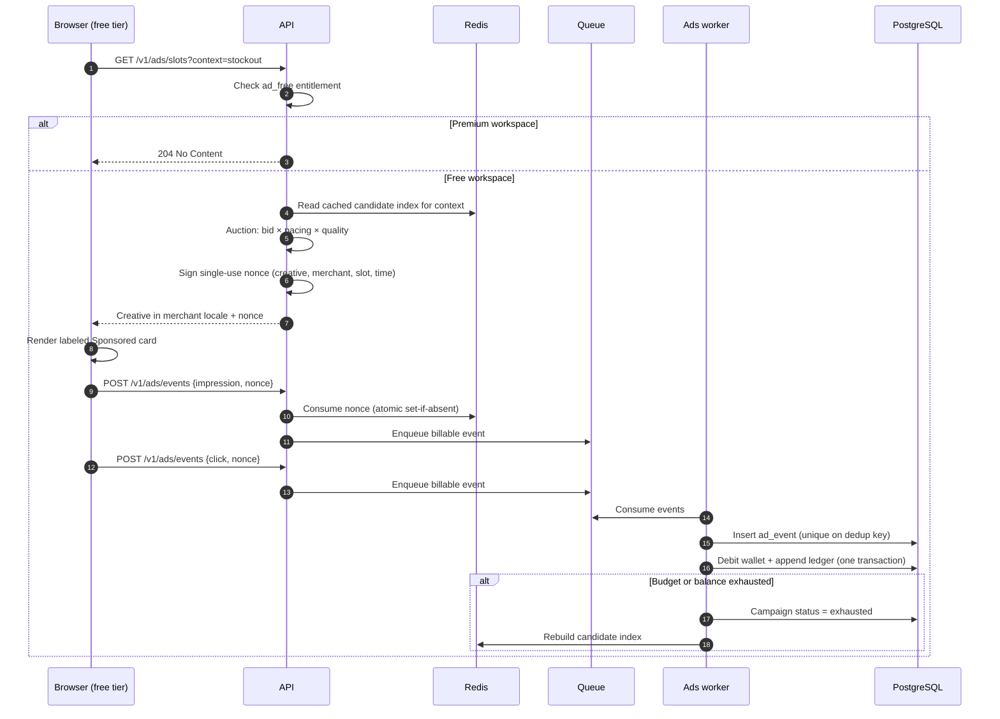
```mermaid
sequenceDiagram
    autonumber
    participant B as Browser (free tier)
    participant API as API
    participant RD as Redis
    participant Q as Queue
    participant AW as Ads worker
    participant DB as PostgreSQL

    B->>API: GET /v1/ads/slots?context=stockout
    API->>API: Check ad_free entitlement
    alt Premium workspace
        API-->>B: 204 No Content
    else Free workspace
        API->>RD: Read cached candidate index for context
        API->>API: Auction: bid × pacing × quality
        API->>API: Sign single-use nonce (creative, merchant, slot, time)
        API-->>B: Creative in merchant locale + nonce
        B->>B: Render labeled Sponsored card
        B->>API: POST /v1/ads/events {impression, nonce}
        API->>RD: Consume nonce (atomic set-if-absent)
        API->>Q: Enqueue billable event
        B->>API: POST /v1/ads/events {click, nonce}
        API->>Q: Enqueue billable event
        AW->>Q: Consume events
        AW->>DB: Insert ad_event (unique on dedup key)
        AW->>DB: Debit wallet + append ledger (one transaction)
        alt Budget or balance exhausted
            AW->>DB: Campaign status = exhausted
            AW->>RD: Rebuild candidate index
        end
    end
```

Ad serving touches only Redis on the request path and carries a hard time budget; any failure returns an empty slot, because a merchant's dashboard must never break because of an advertisement. Billing integrity rests on three layers: a signed nonce that cannot be forged, atomic single-use consumption that stops replay, and a database uniqueness constraint as the final guard against double-charging on worker retries.

### 6.11 State diagrams

**Upload lifecycle**

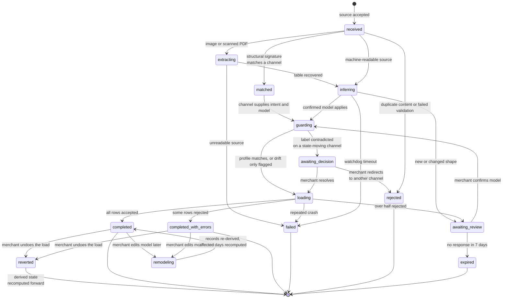
```mermaid
stateDiagram-v2
    [*] --> received: source accepted
    received --> matched: structural signature<br/>matches a channel
    matched --> guarding: channel supplies intent and model
    received --> extracting: image or scanned PDF
    extracting --> inferring: table recovered
    extracting --> failed: unreadable source
    received --> inferring: machine-readable source
    inferring --> awaiting_review: new or changed shape
    inferring --> guarding: confirmed model applies
    awaiting_review --> guarding: merchant confirms model
    guarding --> loading: profile matches, or drift only flagged
    guarding --> awaiting_decision: label contradicted<br/>on a state-moving channel
    awaiting_decision --> loading: merchant resolves
    awaiting_decision --> rejected: merchant redirects<br/>to another channel
    awaiting_review --> expired: no response in 7 days
    loading --> awaiting_review: over half rejected
    loading --> completed: all rows accepted
    loading --> completed_with_errors: some rows rejected
    loading --> failed: repeated crash
    received --> rejected: duplicate content or failed validation
    inferring --> failed: watchdog timeout
    completed --> reverted: merchant undoes the load
    completed_with_errors --> reverted: merchant undoes the load
    reverted --> [*]: derived state<br/>recomputed forward
    completed --> remodeling: merchant edits model later
    completed_with_errors --> remodeling: merchant edits model later
    remodeling --> completed: records re-derived,<br/>affected days recomputed
    completed --> [*]
    completed_with_errors --> [*]
    failed --> [*]
    rejected --> [*]
    expired --> [*]
```

Terminal states are distinguished deliberately: completed with errors is a success that needs the merchant's attention, while failed is an outcome that refunds the quota unit and never loads partial data. The expired path exists because an abandoned mapping should not hold a workspace's ingestion lock forever.

**Subscription lifecycle**

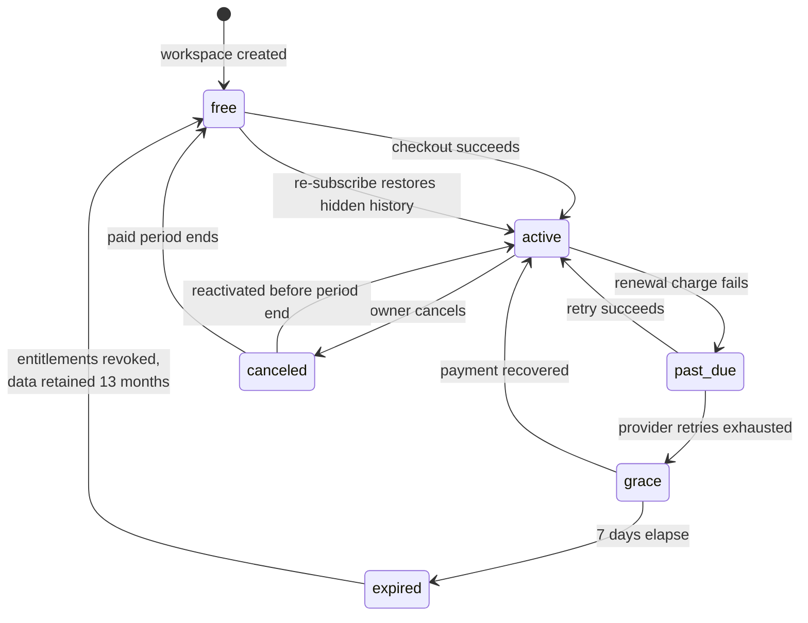
```mermaid
stateDiagram-v2
    [*] --> free: workspace created
    free --> active: checkout succeeds
    active --> past_due: renewal charge fails
    past_due --> active: retry succeeds
    past_due --> grace: provider retries exhausted
    grace --> active: payment recovered
    grace --> expired: 7 days elapse
    expired --> free: entitlements revoked,<br/>data retained 13 months
    active --> canceled: owner cancels
    canceled --> active: reactivated before period end
    canceled --> free: paid period ends
    free --> active: re-subscribe restores hidden history
```

The grace state is a product decision expressed in the state machine: a merchant whose card expired keeps working for a week rather than losing their dashboard the moment a bank declines a charge. The path from free back to active is drawn because reversibility is a feature — retaining premium-era data for thirteen months makes re-subscribing instant and is a deliberate conversion lever.

**Alert lifecycle**

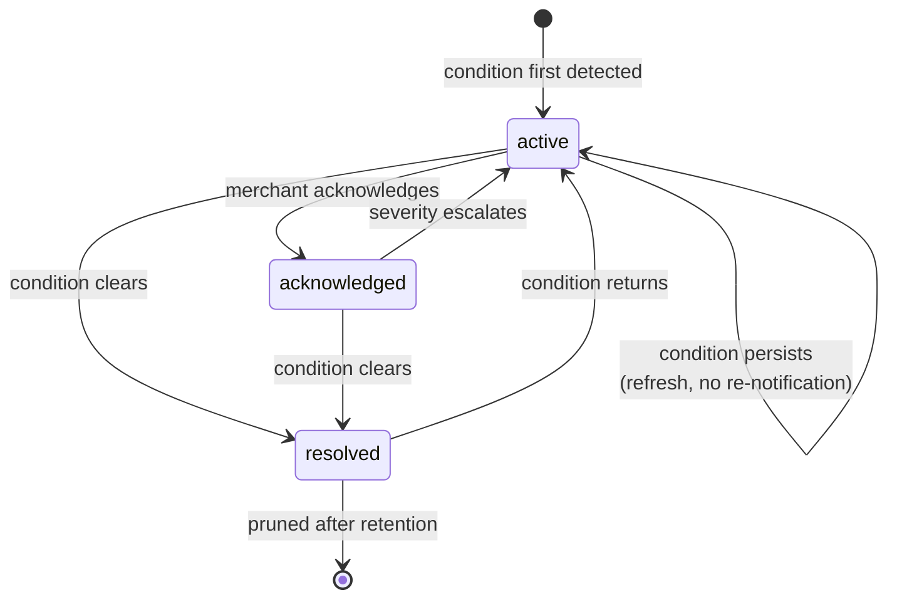
```mermaid
stateDiagram-v2
    [*] --> active: condition first detected
    active --> active: condition persists<br/>(refresh, no re-notification)
    active --> acknowledged: merchant acknowledges
    acknowledged --> active: severity escalates
    active --> resolved: condition clears
    acknowledged --> resolved: condition clears
    resolved --> active: condition returns
    resolved --> [*]: pruned after retention
```

The self-transition on active is the entire reason merchants tolerate alerting: a stockout that persists for five days is one alert refreshed five times, not five identical messages.

**Campaign lifecycle**

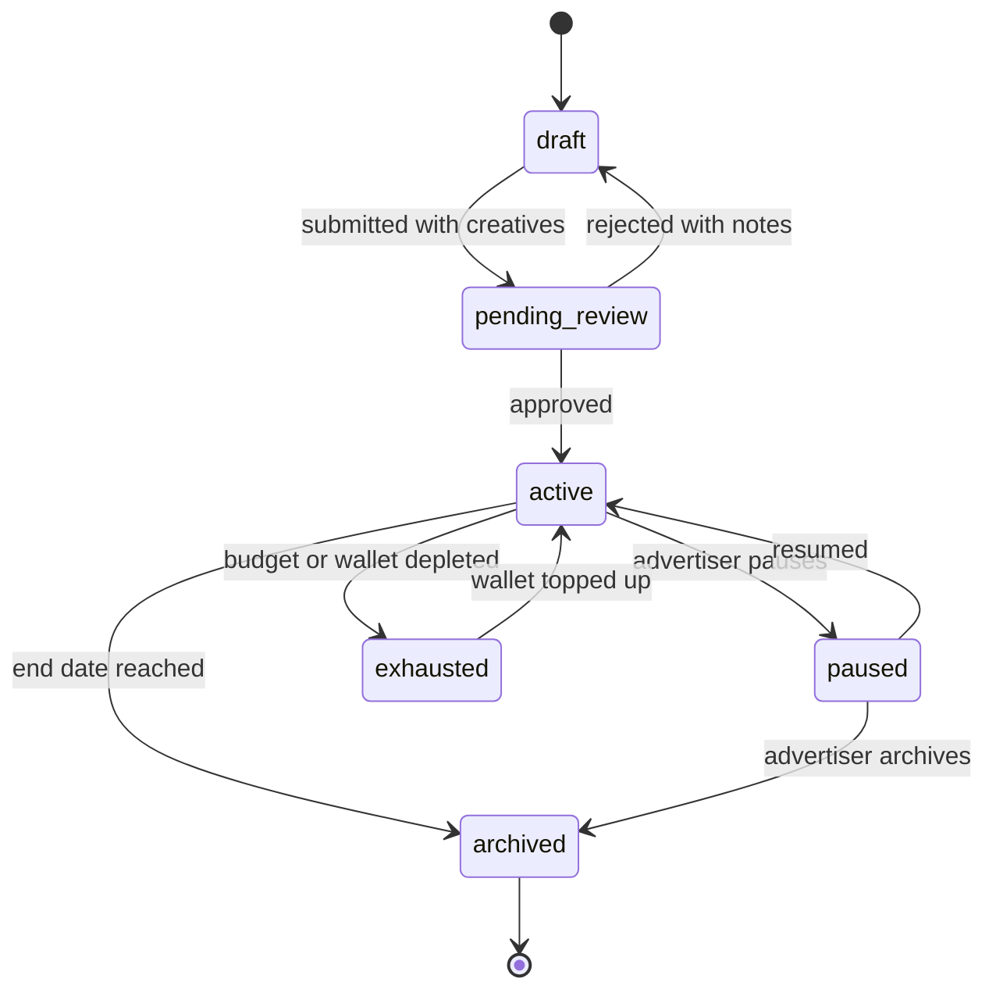
```mermaid
stateDiagram-v2
    [*] --> draft
    draft --> pending_review: submitted with creatives
    pending_review --> active: approved
    pending_review --> draft: rejected with notes
    active --> paused: advertiser pauses
    paused --> active: resumed
    active --> exhausted: budget or wallet depleted
    exhausted --> active: wallet topped up
    active --> archived: end date reached
    paused --> archived: advertiser archives
    archived --> [*]
```

### 6.12 Activity diagram — ingestion decision logic

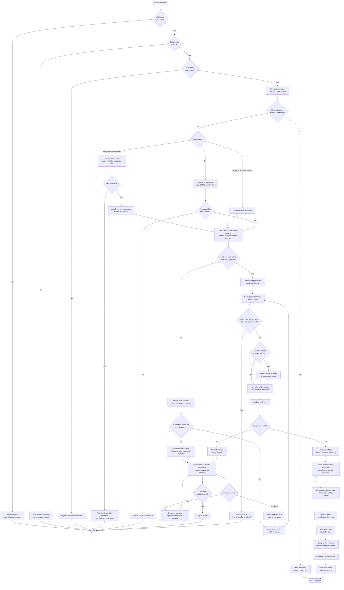
```mermaid
flowchart TD
    START([Data submitted]) --> SIZE{Within plan<br/>size limit?}
    SIZE -->|No| REJ1[Reject at edge<br/>show plan comparison] --> END1([End])
    SIZE -->|Yes| QUOTA{Daily quota<br/>available?}
    QUOTA -->|No| REJ2[Refuse with reset time<br/>and upgrade prompt] --> END1
    QUOTA -->|Yes| TYPE{Supported<br/>content type?}
    TYPE -->|No| REJ3[Reject: unsupported source] --> END1
    TYPE -->|Yes| HASH[Stream to storage,<br/>compute content hash]
    HASH --> DUP{Identical source<br/>already processed?}
    DUP -->|Yes| SHORT[Mark duplicate,<br/>report no new data] --> END2([End: complete])
    DUP -->|No| VIS{Visual source?}

    VIS -->|"Image or scanned PDF"| OCR[Deskew, detect table,<br/>segment cells, recognize text]
    OCR --> OCRQ{Table recovered?}
    OCRQ -->|No| REJ4[Reject with specific guidance:<br/>blur, skew, no table found] --> END1
    OCRQ -->|Yes| CONF[Attach per-cell confidence<br/>and source regions] --> STRUCT
    VIS -->|"Digital PDF with text layer"| PDFT[Use embedded text layer] --> STRUCT
    VIS -->|No| CLEAN[Normalize encoding,<br/>strip BOM and null bytes]
    CLEAN --> ARCH{Archive within<br/>safe bounds?}
    ARCH -->|No| REJ5[Reject: suspicious archive] --> END1
    ARCH -->|Yes| STRUCT[Infer structure: delimiter, quoting,<br/>header row, data region, separators]

    STRUCT --> CHAN{Matches an existing<br/>channel signature?}
    CHAN -->|Yes| INTENT[Channel supplies intent,<br/>model, and fill policy] --> GUARD
    CHAN -->|No| PROF[Profile each column:<br/>types, distribution, patterns]
    PROF --> SIG{Confirmed model for<br/>this signature?}
    SIG -->|Yes| APPLY[Apply saved model,<br/>notify merchant]
    SIG -->|No| RECON[Reconcile to concepts:<br/>lexical, shape, statistical, relational]
    RECON --> REVIEW[Review screen: model, confidence,<br/>preview, supported analyses]
    REVIEW --> EDIT{Merchant edits?}
    EDIT -->|Yes| REPARSE[Re-parse sample,<br/>update preview and capabilities] --> REVIEW
    EDIT -->|"Confirms"| SAVE[Save model version<br/>against signature] --> APPLY
    REVIEW --> WAIT{Confirmed<br/>within 7 days?}
    WAIT -->|No| EXP[Expire review] --> END1

    APPLY --> GUARD[Score against channel<br/>arrival profile]
    GUARD --> GDRIFT{Label contradicted on a<br/>state-moving channel?}
    GDRIFT -->|Yes| PAUSE[Pause and ask:<br/>this channel or another?] --> END1
    GDRIFT -->|No| GOVER{Period overlaps<br/>existing records?}
    GOVER -->|Yes| POLICY[Apply channel fill policy,<br/>or ask once if unset]
    GOVER -->|No| NORM
    POLICY --> NORM[Normalize under model,<br/>hash personal identifiers]
    NORM --> VAL[Validate each row]
    VAL --> RATE{Rejects over 50%?}
    RATE -->|Yes| BACK[Return to review<br/>with guidance] --> REVIEW
    RATE -->|No| RESOLVE[Resolve entities<br/>against workspace catalog]
    RESOLVE --> LOAD[Insert records: roles promoted<br/>to columns, rest as attributes]
    LOAD --> STATE
    STATE --> ROLL[Upsert rollups<br/>for affected days only]
    LOAD --> STATE[Recompute derived state<br/>forward from earliest change]
    ROLL --> CAP[Refresh dataset<br/>capability flags]
    CAP --> INVAL[Bump cache version,<br/>publish live update event]
    INVAL --> ALERTS[Enqueue alert evaluation]
    ALERTS --> REPORT[Write error report,<br/>record statistics]
    REPORT --> END2
```

Reading the diagram top to bottom shows the cost discipline: every cheap rejection happens before an expensive operation. Size and quota are checked before bytes are stored, the content hash is checked before parsing, and archive bounds are checked before decompression. The two human decision points — mapping confirmation and date-order disambiguation — are placed where a wrong automatic guess would silently corrupt a month of a merchant's data, which is the one failure this product cannot afford.

### 6.13 UX diagrams

**Information architecture and navigation**

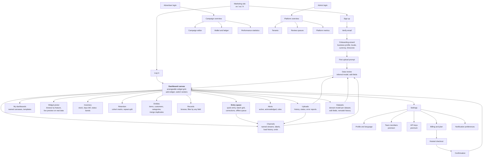
```mermaid
flowchart TB
    LANDING["Marketing site<br/>en / es / fr"] --> SIGNUP["Sign up"]
    LANDING --> LOGIN["Log in"]
    SIGNUP --> VERIFY["Verify email"]
    VERIFY --> ONBOARD["Onboarding wizard<br/>business profile, locale,<br/>currency, timezone"]
    ONBOARD --> FIRSTUP["First upload prompt"]
    LOGIN --> HOME

    FIRSTUP --> REVIEW["Data review<br/>inferred model, edit fields"] --> HOME

    HOME["<b>Dashboard canvas</b><br/>arrangeable widget grid,<br/>add widget, switch renders"]

    HOME --> ENTRY["<b>Entry space</b><br/>quick entry, batch grid,<br/>corrections, offline queue"]
    HOME --> CHAN["Channels<br/>named streams, labels,<br/>load history, undo"]
    CHAN --> REVIEW
    ENTRY --> CHAN
    HOME --> DASHES["My dashboards<br/>named canvases, templates"]
    HOME --> PICKER["Widget picker<br/>browse by feature,<br/>live preview on real data"]
    HOME --> INV["Inventory<br/>stock, days left, status bands"]
    HOME --> RET["Retention<br/>cohort matrix, repeat split"]
    HOME --> PROD["Entities<br/>items, customers, categories;<br/>merge duplicates"]
    HOME --> ORD["Records<br/>browse, filter by any field"]
    HOME --> UPL["Uploads<br/>history, status, error reports"]
    HOME --> ALR["Alerts<br/>active, acknowledged, rules"]
    HOME --> SET["Settings"]

    UPL --> REVIEW
    UPL --> CHAN
    HOME --> DATA["Datasets<br/>domain model per dataset,<br/>edit fields, remodel history"]
    DATA --> REVIEW
    SET --> S1["Profile and language"]
    SET --> S2["Team members<br/>premium"]
    SET --> S3["API keys<br/>premium"]
    SET --> S4["Billing and plan"]
    SET --> S5["Notification preferences"]

    S4 --> CHECKOUT["Hosted checkout"] --> CONFIRM["Confirmation"] --> HOME

    ADVLOGIN["Advertiser login"] --> ADVHOME["Campaign overview"]
    ADVHOME --> ADVCAMP["Campaign editor"]
    ADVHOME --> ADVWALL["Wallet and ledger"]
    ADVHOME --> ADVSTAT["Performance statistics"]

    ADMLOGIN["Admin login"] --> ADMHOME["Platform overview"]
    ADMHOME --> ADMTEN["Tenants"]
    ADMHOME --> ADMREV["Review queues"]
    ADMHOME --> ADMMET["Platform metrics"]
```

The merchant's information architecture is deliberately flat: every analytical view is one click from home, because the product's promise is a daily glance, not an exploration tool. The three portals — merchant, advertiser, administrator — share a codebase and a design system but never share navigation, since they are different jobs with different vocabularies.

**Onboarding flow, from signup to first insight**

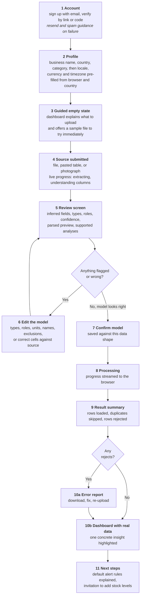
```mermaid
flowchart TB
    A["<b>1 Account</b><br/>sign up with email, verify by link or code<br/><i>resend and spam guidance on failure</i>"]
    A --> B["<b>2 Profile</b><br/>business name, country, category, then locale,<br/>currency and timezone pre-filled from browser and country"]
    B --> C["<b>3 Guided empty state</b><br/>dashboard explains what to upload<br/>and offers a sample file to try immediately"]
    C --> D["<b>4 Source submitted</b><br/>file, pasted table, or photograph<br/>live progress: extracting, understanding columns"]
    D --> E["<b>5 Review screen</b><br/>inferred fields, types, roles, confidence,<br/>parsed preview, supported analyses"]
    E --> F{"Anything flagged<br/>or wrong?"}
    F -->|Yes| G["<b>6 Edit the model</b><br/>types, roles, units, names, exclusions,<br/>or correct cells against source"]
    G --> E
    F -->|"No, model looks right"| H["<b>7 Confirm model</b><br/>saved against this data shape"]
    H --> I["<b>8 Processing</b><br/>progress streamed to the browser"]
    I --> J["<b>9 Result summary</b><br/>rows loaded, duplicates skipped, rows rejected"]
    J --> K{"Any<br/>rejects?"}
    K -->|Yes| L["<b>10a Error report</b><br/>download, fix, re-upload"]
    K -->|No| M["<b>10b Dashboard with real data</b><br/>one concrete insight highlighted"]
    L --> M
    M --> N["<b>11 Next steps</b><br/>default alert rules explained,<br/>invitation to add stock levels"]
```

The measured target for this flow is that at least sixty percent of registrations reach a first successful upload. Three design choices serve that number: the sample file gives a merchant with no export at hand something to try immediately; the mapping preview shows parsed values rather than field names, so a merchant validates meaning instead of schema; and the result summary always ends by pointing at one concrete insight, because a dashboard full of correct numbers with no interpretation is where first-time users disengage.

**Premium upgrade journey and upsell surfaces**

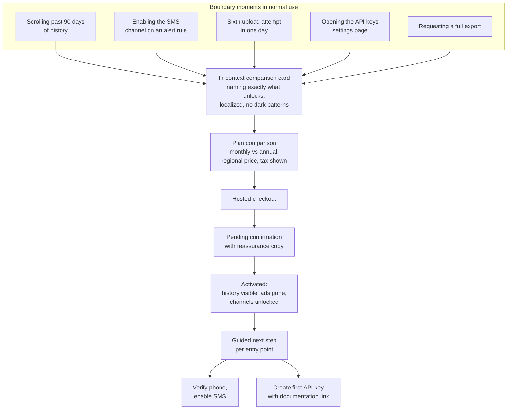
```mermaid
flowchart TB
    subgraph TRIGGERS["Boundary moments in normal use"]
        T1["Scrolling past 90 days<br/>of history"]
        T2["Enabling the SMS<br/>channel on an alert rule"]
        T3["Sixth upload attempt<br/>in one day"]
        T4["Opening the API keys<br/>settings page"]
        T5["Requesting a full export"]
    end
    T1 & T2 & T3 & T4 & T5 --> CARD["In-context comparison card<br/>naming exactly what unlocks,<br/>localized, no dark patterns"]
    CARD --> PLANS["Plan comparison<br/>monthly vs annual,<br/>regional price, tax shown"]
    PLANS --> CHECK["Hosted checkout"]
    CHECK --> PEND["Pending confirmation<br/>with reassurance copy"]
    PEND --> ACT["Activated:<br/>history visible, ads gone,<br/>channels unlocked"]
    ACT --> GUIDE["Guided next step<br/>per entry point"]
    GUIDE --> T2R["Verify phone,<br/>enable SMS"]
    GUIDE --> T4R["Create first API key<br/>with documentation link"]
```

Upsell surfaces are treated as product requirements with conversion metrics rather than as marketing overlays. Each one appears only at the moment a merchant actually wants the capability, names precisely what unlocks, and returns them to the task they were doing — the guided next step exists because the most common post-upgrade failure is a merchant who paid for a feature and never finished switching it on.

**Screen wireframe — dashboard canvas**

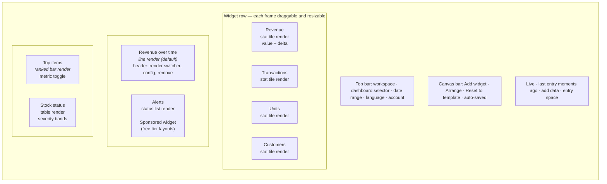
```mermaid
flowchart TB
    subgraph SCREEN[" "]
        direction TB
        NAV["Top bar: workspace · dashboard selector · date range · language · account"]
        BAR["Canvas bar: Add widget · Arrange · Reset to template · auto-saved"]
        subgraph ROW1["Widget row — each frame draggable and resizable"]
            direction LR
            W1["Revenue<br/>stat tile render<br/>value + delta"]
            W2["Transactions<br/>stat tile render"]
            W3["Units<br/>stat tile render"]
            W4["Customers<br/>stat tile render"]
        end
        subgraph ROW2[" "]
            direction LR
            W5["Revenue over time<br/><i>line render (default)</i><br/>header: render switcher, config, remove"]
            W6["Alerts<br/>status list render<br/><br/>Sponsored widget<br/>(free tier layouts)"]
        end
        subgraph ROW3[" "]
            direction LR
            W7["Top items<br/><i>ranked bar render</i><br/>metric toggle"]
            W8["Stock status<br/>table render<br/>severity bands"]
        end
        FOOT["Live · last entry moments ago · add data · entry space"]
    end
```

Every frame is a widget instance: draggable, resizable, removable, and carrying its own header controls for switching render and adjusting configuration. The arrangement above is what the platform builds automatically after a first data load — the three product questions in reading order — but nothing about it is fixed, which is the point. Advertising occupies a widget in the layout rather than a hard-coded slot, so removing it on upgrade closes the gap like any other removal.

### 6.14 Traceability of diagrams to requirements

| Diagram | Primary requirements illustrated |
|---|---|
| Context and component | Architecture-wide; non-functional targets for latency and availability |
| Deployment | Availability, durability, data residency, and privacy commitments |
| Entity relationship | Inferred domain model as data, record payload preservation, model versioning, ingestion idempotency, retention windows, tenant isolation, ledger integrity |
| Class | Inference and reconciliation pipeline, model editing and versioning, extractor abstraction, premium entitlement enforcement, metric consistency, provider abstraction |
| Sequence: upload | Ingestion requirements: structural and semantic inference, merchant review and editing before commit, asynchronous acceptance, safe re-upload |
| Sequence: subscription | Billing requirements and premium activation timing |

| Sequence: ad serving | Advertising requirements, including ad-free enforcement and charge integrity |
| State: upload, subscription, alert, campaign | Lifecycle requirements for ingestion, billing, alerting, and campaigns |
| Activity: ingestion | Source-type branching including visual extraction, inference and reconciliation, the review gate, and the no-silent-guessing rule |
| Sequence: day-to-day entry with derived state | Channel intent, derived-state computation and forward recomputation, live canvas updates, optimistic entry |
| Sequence: canvas resolution | Widget batch resolution, per-widget caching, render switching without backend work, failure isolation |
| UX: architecture, onboarding, upgrade, canvas wireframe | Activation, localization, upsell, and dashboard composition requirements |

---

## 7. Implementation phase

### 7.1 Repository and code organization
One multi-application monorepo. `apps/web` contains the launch React SPA/PWA and its vanilla CSS, feature folders, web components, service worker, and locale catalogs. `apps/mobile` contains the Expo/React Native client boundary; it stays buildable from foundation onward even though native product delivery remains gated by the post-launch demand triggers. `apps/api` contains FastAPI routers, core middleware, database models and migrations, a pure domain package for metrics, forecasting, billing math, and auction logic that imports nothing above it, services, Celery tasks, provider integrations, and versioned shell scripts. `packages/api-client` is generated from the API's checked-in OpenAPI contract, `packages/design-tokens` owns platform-neutral visual values and generates web custom properties, and `packages/shared-types` contains only client-safe primitives shared by web and mobile. `deploy` owns compose files, proxy and monitoring configuration, backup scripts, and runbooks; `docs` owns supporting documentation. All configuration comes from the environment and is validated at startup; an application refuses to boot on invalid configuration.

### 7.2 Engineering standards
- Trunk-based development: short-lived branches (at most about three days) merged to an always-releasable main by squash after review; releases are tags.
- Conventional commit messages drive generated release notes and version bumps.
- Feature flags for anything spanning sprints or risky at launch; every flag gets a removal issue at creation, due within two sprints of full rollout.
- Static gates: formatting is automated (never a review topic); linting, strict typing in the domain package, and security linters run on every pull request.
- Review checklist: tenant scoping on every new query; entitlement and limit checks in the single designated layer; no hardcoded user-facing strings and keys present in all three locales; error codes registered; migrations follow the zero-downtime rules; new paths emit metrics and logs; documentation updated in the same pull request.
- Definition of done: code, tests, documentation, localization, operational dashboards or alerts when behavior changes, and the requirement ID linked. Working on staging without the rest is not done.

---

## 8. Testing phase

### 8.1 Test levels
- **Unit (backend)**: pytest with property-based testing for the domain package — metrics, forecasting, money display, regional date and number parsing (round-trip properties per locale), fingerprints, auction scoring, column profiling, and role reconciliation. Coverage at least 95 percent in the domain package, 85 percent overall.
- **Unit (shell)**: every preprocessing script tested against fixture bytes (byte-order marks, carriage returns, null bytes, encodings).
- **Unit (frontend)**: components, rendering in all three locales, and formatters.
- **Integration**: real PostgreSQL, Redis, and MinIO in containers; API endpoints through the full middleware chain; the ingestion pipeline end to end on the fixture corpus; row-level security; webhook processing against fake providers. Payment and SMS providers ship fake implementations selected by configuration so money and messaging flows are fully testable.
- **Contract**: schema-driven fuzzing of every endpoint for conformance and authentication handling.
- **End-to-end**: browser automation of the critical journeys below against a staging build, on merge and nightly, including a throttled-3G profile and locale screenshot diffing (French text runs roughly 20 percent longer than English and is the standard layout breaker).
- **Load**: 500 concurrent merchants browsing dashboards within latency targets; 50 simultaneous 10 MB ingestions without dashboard degradation; abuse simulation validating limiter math. Run before launch and before capacity-relevant releases.
- **Security**: static analysis, dependency and image scans on every build; nightly dynamic baseline scan of staging; external penetration test before launch.

### 8.2 Release-blocking end-to-end journeys
1. Sign up in Spanish with email verification, upload a semicolon-delimited comma-decimal fixture carrying a title row and a footer total, verify the inferred model flags the ambiguous date and proposes the correct roles, edit one field, confirm, and see dashboard numbers matching the fixture's known totals.
1a. Upload a photographed ledger, verify low-confidence cells are flagged beside their cropped source regions, correct two, confirm, and see the resulting records.
1b. Post-commit remodeling: assign a role to a previously unmapped column, verify the impact preview is accurate, confirm, and verify the dependent analysis backfills over already-loaded history without re-upload.
2. Re-upload the same file and observe zero new rows with a friendly duplicate notice.
3. Trigger a stockout: inventory upload, alert appears, a free-tier merchant sees a matching contextual ad, one click charges once and a second click does not.
4. Upgrade through the payment provider's test mode: history unlocks, ads disappear, enable SMS alerts after phone verification, receive a localized French alert message; simulate renewal failure through past-due, grace, and expiry.
5. Sync API: create a key, post a batch of 500 records containing duplicates, verify idempotency, hit the rate limit and receive correct headers.
6. Advertiser lifecycle: register, pass review, top up, launch a campaign, verify it serves only in matching contexts and pauses at wallet exhaustion.
7. Downgrade: history windows to 90 days, extra seats deactivate, keys suspend; re-upgrade restores everything.
8. Channel lifecycle: submit a dataset twice, accept the offer to save it as a channel, label it, and confirm the next submission loads unattended.
9. Derived state: count stock through an observation channel, record sales through a consumption channel, confirm the running total follows, amend the count and confirm forward recomputation, then revert a load and confirm the prior state is restored.
10. Drift guard: send a stock count into a sales channel and confirm the load pauses and asks rather than loading; send an overlapping period and confirm the fill policy applies.
11. Live canvas: record entries and confirm affected widgets refresh, that updates coalesce rather than firing per entry, and that a failed write rolls back the optimistic update visibly.
12. Offline entry: record entries with the network disabled, confirm they are held and marked pending, restore the network, and confirm they sync exactly once.
13. Canvas composition: add widgets from the picker, drag and resize them, switch a widget's render and confirm no backend query is issued, reload and confirm the arrangement persisted for that user, and confirm a second user's canvas is unaffected.
14. Canvas resilience: force one widget to fail and confirm the remaining widgets still render, with the error confined to its own frame.
15. Isolation canary: authenticated as one merchant, request every endpoint with another merchant's resource identifiers and receive not-found on all — this matrix is generated automatically from the route table.

### 8.3 Inference accuracy testing

Schema inference is a prediction, so it is tested like one, not with pass-or-fail assertions. A **labeled corpus** pairs each fixture with its ground-truth domain model (the correct type, role, and units for every column). The suite reports, per commit:

- **Role precision and recall** per concept — how often a proposed role is right, and how often a present concept is found at all. Recall matters more for concepts a merchant can confirm cheaply; precision matters more where a wrong guess is expensive, so transaction time and monetary amount carry the strictest thresholds.
- **Confidence calibration** — among fields proposed at a stated confidence, the share actually correct should track that confidence. A model that is confidently wrong is worse than one that is honestly unsure, because the review screen's flagging depends on confidence meaning something real.
- **Edit distance to correct** — how many merchant edits a proposal needs before it is right. This is the number that reflects felt product quality, and it is the headline regression metric.
- **Structural accuracy** — header row located, data region bounded, delimiter and separators identified, across files with preambles, footers, merged headers, and several tables per sheet.
- **Extraction accuracy** (visual sources) — character and cell error rates by source quality tier (clean scan, phone photo of print, phone photo of handwriting), plus the correlation between reported per-cell confidence and actual correctness, since the review screen's flagging relies on it.

Thresholds are enforced in CI: a commit may not reduce role recall or worsen calibration. Because adding a hard new fixture can legitimately lower a score, thresholds compare against the previous commit's score on the same corpus revision.

### 8.4 The fixture corpus
A permanent, growing test asset of anonymized real-world sources, each labeled with its ground-truth domain model so it serves both regression and accuracy measurement. It spans: mis-encoded accents; semicolon and comma-decimal formats; day-first ambiguity sets; localized month names in three languages; title rows, blank preambles, merged headers, and trailing total rows; files whose headers are meaningless or absent, where only cross-column arithmetic recovers the roles; several tables in one spreadsheet; common point-of-sale and marketplace export shapes per market; datasets missing a concept entirely (no customer identity, no quantity) to prove analyses degrade honestly rather than silently; a 100-thousand-row size test; a zip-bomb that must be rejected; formula-injection cells that must be neutralized on re-export; and a visual tier of clean scans, phone photographs of printed reports, and photographed handwritten ledgers.

Every fixture has an expected-output file, so any pipeline change that alters results fails visibly. Every support incident that reveals a new shape, or a merchant correction that reveals a bad inference, must add a labeled fixture before the ticket closes — merchant corrections are the highest-value training signal the product generates, and letting them evaporate would be the single easiest way to stop improving.

### 8.5 Beta
A two-week closed beta with 15 to 20 real merchants spread across the three language markets, recruited through merchant communities and POS-vendor partners, on free premium in exchange for structured weekly interviews. Their real files, with consent, seed the per-market corpus; pricing interviews conclude here and set final price points.

---

## 9. Deployment phase

### 9.1 Environments
- **Development**: full stack in containers on developer machines, including object storage, a mail catcher, and fake payment and SMS providers.
- **Staging**: a small server with the identical topology; every merge deploys automatically; nightly restore of a scrubbed production snapshot keeps it realistic.
- **Production**: one Ubuntu 24.04 server (8 vCPU, 16 GB, NVMe) in an EU region behind Cloudflare, running: the edge proxy; two API replicas; ingestion workers (memory-capped); a fast worker pool for notifications, ads, and alerts; a heavy worker for reports; the scheduler; PostgreSQL (tuned, with query statistics and slow-query capture); Redis (cache and broker separated logically, eviction policies set accordingly); MinIO; and the monitoring stack. All application containers run as non-root with read-only filesystems and health checks.

### 9.2 Delivery pipeline
On every pull request: linting and type checks, unit tests, migration application against a restored snapshot, integration tests, frontend build with a performance budget, image builds with vulnerability scans, and dependency audits. On merge to main: tagged images are built and pushed, staging deploys automatically, a smoke suite runs (login, upload a fixture, dashboard, ad slot), and a manual approval gate releases to production. The production script pulls images, runs migrations (backward-compatible by rule), restarts API replicas one at a time behind health checks, warm-restarts workers so in-flight tasks finish, verifies readiness and synthetic checks, and tags the release in error tracking and dashboards. Rollback is a redeploy of the previous image tag, recorded before every deploy proceeds.

### 9.3 Release management
Releases at least weekly, any day except Friday; hotfixes ride the same pipeline with no side doors. Semantic versioning on the platform; the API's major version lives in its URL and changes only with a long overlap. Release notes are generated from commit messages plus shipped requirement IDs; customer-visible changes are published to a changelog, in all three languages when they touch premium behavior. Database changes follow expand, migrate, contract across at least two releases.

---

## 10. Operations and maintenance phase

### 10.1 Observability
Structured JSON logs (request ID, merchant ID, route, duration, status; sensitive values scrubbed) shipped to a log store with 30-day hot retention. Metrics cover request rate, error percentage, and latency per route class; business signals (uploads and their success rates, rows loaded and rejected, active alerts, messages sent and their cost by country, ad fill rate, refusals per limiter class, cache hit ratio, queue depth and task age, webhook lag); and infrastructure. Distributed traces are sampled at 10 percent and always on errors. Error tracking is release-tagged across API, workers, and frontend.

### 10.2 Alerting and service objectives
Pages fire on: server error rate above 1 percent for 5 minutes; dashboard latency degradation; notification-queue task age above 2 minutes (verification codes live there); any upload stuck past 30 minutes; disk or write-ahead-log pressure; payment webhook failures; daily SMS spend beyond budget; certificate expiry approaching; and any missed or unverified backup. Service objectives: 99.5 percent availability at launch, dashboard reads under 300 ms at the 95th percentile, ingestion of a 10 MB file under 60 seconds, verification delivery under 15 seconds, recovery point 15 minutes, recovery time 2 hours. An error budget is reviewed monthly.

### 10.3 Backup and disaster recovery
Nightly full database backups plus continuous write-ahead-log archiving to an offsite EU bucket at a different provider (residency applies to backups too), giving 14 days of point-in-time recovery. Object storage mirrors nightly. Redis is deliberately not backed up: queues drain and caches rebuild, and idempotent tasks make in-flight loss safe. A monthly automated drill restores the latest backup and verifies it; a failed drill is a top-severity incident. The disaster plan — provision a new server from the deployment repository, restore, repoint DNS — targets two hours and is rehearsed quarterly.

### 10.4 Scheduled jobs
Monthly partition creation ahead of need; nightly free-tier retention pruning; hourly expiry pruning of ephemeral records; a nightly alert-evaluation sweep batched by timezone; daily payment reconciliation and subscription-state comparison against the provider; daily SMS cost reporting; weekly rollup-consistency sampling (random merchants recomputed from raw facts and compared); monthly backup-restore verification.

### 10.5 Support and maintenance
Daily 15-minute triage with a severity ladder: data corruption, money, or security incidents preempt everything; broken features without workaround go in the next release; issues with workarounds enter the sprint backlog; cosmetic issues are batched. Premium-reported issues get one severity bump at equal impact — that is the paid support promise. Support runs async-first (in-app and email with a one-business-day premium commitment) with a localized help center, because a four-person team cannot staff six timezones synchronously. At least 15 percent of every sprint is reserved for technical debt, tracked as owned issues, never as code comments. Incident response follows written runbooks (database restore, queue backlog, payment or SMS provider outage, certificate issues, and a tenant-isolation incident procedure: revoke sessions, snapshot, audit); every significant incident gets a blameless postmortem within five days.

---

## 11. Project plan

Twenty weeks to commercial launch, four people. Six weeks beyond the original plan: three in ingestion and three in the dashboard phase. On ingestion, inference, a review and editing interface, and an accuracy corpus are materially more work than a fixed-schema mapping screen, and underestimating that is how this kind of product ships something that guesses badly and cannot be corrected. Channels, declared intent, derived state with forward recomputation, and the drift guard are what make the product continuous rather than retrospective, and they carry the highest correctness stakes in the system. On the dashboard, a widget platform plus a day-to-day entry space with offline sync and live updates is a platform rather than a set of screens, and the catalog is built on top of it rather than instead of it. Items with external lead times start in week one regardless of phase: Stripe account and tax registrations, SMS provider regulatory bundles per launch country, Spanish and French translation contracting, privacy paperwork, and beta-merchant recruitment in all three markets.

| Phase | Weeks | Scope | Exit criteria |
|---|---|---|---|
| 0 — Foundations | 1–2 | Repository, CI before features, container environments, core middleware chain, authentication slice, automatic staging deploys | A user can sign up, log in, and reach a tenant-scoped endpoint through the full middleware chain on staging |
| 1 — Ingestion, channels, and state | 3–7 | Schema and partitions, submission flow, structural inference, column profiling, domain reconciliation, the review and editing screen, channels with declared intent, the drift guard, derived-state computation with forward recomputation and per-load reversal, entity resolution, idempotent load, rollups, live progress, error reports, post-commit remodeling; labeled fixture corpus with accuracy thresholds in CI | A count followed by sales produces a correct running total; a mislabelled load pauses instead of corrupting state; reverting a load restores the prior state; accuracy and property tests green |
| 2 — Entry space and widget platform | 8–12 | Query primitives, widget registry and manifests, per-widget and batch resolve endpoints, per-widget caching with render excluded from the key, failure isolation, the canvas with drag-and-drop and per-user persistence, the widget picker with live previews, render recommendation from data shape, auto-built first dashboard, multiple named dashboards, and the launch catalog of roughly fourteen widgets across four features; the entry space with quick, batch, and correction modes, offline queue and sync, live canvas updates over the event stream, and the alert engine with dashboard channel | A merchant composes a canvas, switches renders with no backend round trip, keeps several named dashboards, and the whole canvas resolves within the latency target under load |
| 3 — Monetization | 13–15 | Plans and entitlements enforcement, subscription billing with tax and dunning, Sync API with keys and limits, email provider live, SMS verification and premium alerts | A real test-mode payment flips premium behavior everywhere within seconds; billing journeys green |
| 4 — Ads | 16–17 | Advertiser onboarding and review, wallets and ledgers, campaigns and moderation, serving path with auction and pacing, event validation and billing, admin panel | Ad journeys green; failure modes verified — ads degrade to empty, never to errors |
| 5 — Hardening and beta | 18–20 | Localization review by native speakers, load and penetration tests with a fix window, backup and disaster drills, runbooks, status page, closed beta across three markets, legal and tax verification | All release-blocking journeys green; restore drill passed; penetration criticals closed; billing reconciles to the cent; launch |

After launch, in demand order: refund and negative-row ingestion support; outbound webhooks for merchants; WhatsApp Business alerts for Latin America; Mercado Pago and West-African payment providers; the React Native mobile app (triggered by push-notification, camera-ingestion, or offline-entry demand); multi-currency dashboards and a Portuguese locale; inventory management; and read replicas or regional presence as scale triggers fire.

---

## 12. Risk management

| Risk | Likelihood | Impact | Mitigation |
|---|---|---|---|
| Launching in three language markets dilutes focus | High | High | One marketing beachhead (Latin America); French and English launch self-serve; the product is identical everywhere, only go-to-market is sequenced |
| Advertiser cold start in each market | High | Medium | Ads launch in Latin America first with hand-sold anchor advertisers; elsewhere, house ads promoting premium fill slots so the interface never looks broken |
| Inference proposes wrong roles often enough to erode trust | High | High | Confidence is surfaced honestly and low-confidence fields are flagged rather than asserted; the merchant reviews before commit and can remodel after; accuracy thresholds gate CI; every merchant correction becomes a labeled fixture |
| Inference is so permissive that data is loaded meaninglessly | Medium | High | Analyses declare the roles they require and are withheld when a role is unresolved; no metric is ever computed from a guessed role; the review screen states plainly what the model does and does not support |
| Review screen becomes a burden merchants abandon | Medium | High | Confirmed models auto-apply to matching shapes so review is first-contact only; high-confidence fields present as settled rather than demanding attention; edit-distance-to-correct is tracked as the headline quality metric |
| Visual extraction accuracy disappoints, especially on handwriting | High | Medium | Per-cell confidence with source-region display makes correction fast rather than blind; quality tiers are measured separately so the product can be honest about what it handles; a hosted recognition engine can be swapped in behind the extractor interface if self-hosted accuracy proves insufficient |
| Extraction cost and latency (CPU-bound OCR) | Medium | Medium | Isolated heavy-worker queue with hard time budgets so extraction never delays other work; digital PDFs bypass recognition; premium-tier sizing reflects real cost |
| SMS regulatory delays and cost variance by country | Medium | Medium | Email is the primary channel, so SMS delays degrade a premium feature, not signup; per-country cost tables, caps, and budget alarms from day one |
| Payment conversion in Latin America poor on cards alone | Medium | High | Ship with the primary provider's full method set; add the regional provider (cash vouchers, installments) as the first post-launch integration if conversion data demands it |
| Compliance gaps at launch | Medium | High | Tax handled by the provider; privacy paperwork on the week-one list; EU hosting removes data-transfer questions |
| Derived state silently wrong (mislabelled channel, missed duplicate) | Medium | **High** | Intent is declared by the merchant per channel rather than inferred; state-moving channels pause on contradiction instead of loading with a warning; every load is revertible as a unit; contradictions surface as findings rather than being clamped to zero; property tests assert order-independence and revert-exactness |
| Live entry and a later file both record the same day | High | High | Channels separate the two accounts; each channel carries a fill policy set once at creation or first overlap; period-overlap detection compares resolved semantics rather than raw bytes |
| Offline entries lost or double-recorded | Medium | High | Client-generated identifiers make sync idempotent; pending entries are visibly marked; interrupted syncs resume; this path is exercised by a release-blocking journey |
| Live updates feel frantic or fight the merchant's typing | Medium | Medium | Updates coalesce over a short window rather than firing per entry; entry is optimistic with visible rollback; the canvas never reorders itself under the user |
| Merchants ignore the entry space and it becomes dead weight | Medium | Medium | Entry is free rather than gated, because it is the habit-forming loop; the platform proposes channels only after a shape recurs; entry fields are the merchant's own choices rather than a fixed form |
| Widget catalog sprawls into an unnavigable picker | Medium | Medium | A new widget requires a question no existing widget answers, and adding a render to an existing widget is always preferred over adding a widget; the manifest-driven conformance suite makes every addition carry its own tests |
| Composability produces worse dashboards than a curated screen | Medium | Medium | The auto-built first canvas is genuinely good, templates exist per business type, and render recommendation follows data shape; freedom is offered on top of a strong default rather than instead of one |
| Canvas latency degrades as merchants add widgets | Medium | High | Batch resolution with query deduplication and per-widget caching, a 120 ms per-widget budget, render excluded from cache keys, and load tests that exercise dense canvases rather than single endpoints |
| Low premium conversion | Medium | High | Thirteen-month history retention as the re-upgrade lever; predictive alerts as the hero feature; pricing tested in beta including regional price points |
| Single-host outage or transatlantic latency | Medium | Medium | Honest 99.5 percent objective, rehearsed 2-hour recovery, aggressive edge and client caching; scale-out steps documented in advance |
| Schedule slip with a team of four | Medium | Medium | Phases are strict vertical slices; launching without the ad phase (premium-only monetization) is a planned, viable fallback |

---

## 13. Appendix A — Widget catalog

The launch catalog. Each row is a **question**, not a chart: the renders column lists the visualizations a user may switch between, with the catalog default marked in bold. Configuration is per instance. Adding a render to an existing widget is always preferred over adding a new widget.

### Sales velocity

| Widget | Question it answers | Renders | Notable configuration |
|---|---|---|---|
| `revenue-over-time` | How is money coming in over time? | **line**, bar, area, stacked bar, stat tile with sparkline, table | range, granularity (day/week/month), breakdown dimension, comparison period on/off, moving average overlay |
| `transactions-over-time` | How many sales are happening? | **bar**, line, area, stat tile, table | same as above |
| `units-over-time` | How much volume is moving? | **line**, bar, area, stat tile, table | same as above |
| `headline-stat` | What is the single number for this period? | **stat tile**, gauge, large numeral | measure, period, comparison basis |
| `insight-summary` | What changed and why? | **narrative text**, text with inline sparkline | measures to cover, verbosity, period |
| `sales-by-period-pattern` | Which days or hours sell best? | **heatmap**, grouped bar, table | day-of-week by hour, or day-of-month |

### Item performance

| Widget | Question it answers | Renders | Notable configuration |
|---|---|---|---|
| `top-items` | What sells most? | **ranked bar**, table, treemap, donut | measure (revenue/units/transactions), top N, ascending for worst performers, period |
| `item-mix` | How is the mix composed? | **stacked bar**, donut, treemap, 100 percent stacked area over time | dimension, top N with aggregated remainder |
| `item-detail-table` | Everything about each item | **table** with sparkline column | columns, sort, filters, page size |
| `item-trend-comparison` | How do a few items compare over time? | **multi-line**, small multiples, grouped bar | item selection, measure, normalization |
| `slow-movers` | What is not selling? | **table**, ranked bar | period without sales, stock-on-hand filter |

### Inventory

| Widget | Question it answers | Renders | Notable configuration |
|---|---|---|---|
| `stock-status-table` | What is the state of every item? | **table with severity bands**, grouped bar | status filter, sort, thresholds |
| `days-of-stock-gauge` | How long until a specific item runs out? | **gauge**, stat tile, bullet chart | item, band thresholds |
| `depletion-forecast` | When will things run out? | **timeline**, projected line with stock-out marker, table | horizon, items, forecast method |
| `reorder-list` | What should I buy today? | **checklist table**, ranked bar | horizon, minimum order quantity, grouping by supplier attribute |
| `stock-value` | How much capital is sitting on shelves? | **stat tile**, stacked bar by category, treemap | valuation basis, grouping |

### Customers

| Widget | Question it answers | Renders | Notable configuration |
|---|---|---|---|
| `retention-cohort` | Do customers come back? | **cohort heatmap**, retention curve lines, table | cohort granularity, horizon, measure (count or revenue) |
| `repeat-vs-new` | How much of the business is repeat? | **stacked area over time**, donut, stat pair, bar | period, measure |
| `top-customers` | Who matters most? | **ranked bar**, table | measure, top N, period |
| `purchase-frequency` | How often do people buy? | **histogram**, box plot, table | bucket width, period |

### Cross-cutting

| Widget | Question it answers | Renders | Notable configuration |
|---|---|---|---|
| `alerts-panel` | What needs attention? | **status list**, compact badge row | severity filter, acknowledged visibility |
| `data-freshness` | How current is what I am seeing? | **stat tile**, timeline | dataset selection |
| `record-table` | Let me look at the underlying records | **table** | filters across any field including unmapped attributes, columns, sort |
| `segment-comparison` | How do two segments differ? | **grouped bar**, side-by-side lines, table | segment definitions from any dimension, measure |
| `sponsored` | (Free tier) contextual supplier promotion | **card** | placement context; managed by the platform |

### Notes on the catalog

**Renders are not equivalent, and the picker does not pretend they are.** A donut with twenty slices is unreadable, so composition renders are offered where the dimension is small and a ranked view with an aggregated remainder is offered where it is not. The recommendation logic encodes these constraints so a user switching renders is choosing among sensible options rather than being handed enough rope to make an unreadable chart.

**Every widget is a module.** Each entry above is an independently implemented backend module with its own endpoint, manifest, tests, and cache policy, composed over the shared query primitives so that tenant scoping, entitled history clamping, timezone bucketing, and cache-key construction are inherited rather than reimplemented fourteen times.

**The catalog is expected to grow, under discipline.** New entries require a question none of the above answers. The likeliest additions, in rough order of demand: margin analysis once cost data is commonly present, basket affinity (what sells together), location comparison for multi-site merchants, and merchant-defined widgets built over retained unmapped attributes.

---

## 14. Document control

This standalone document is maintained alongside the codebase and updated in the same pull request as any change that invalidates a statement in it. A quarterly audit walks it against the running system. Version history is the repository history.
