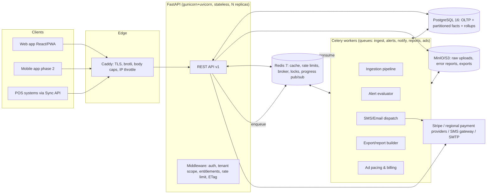
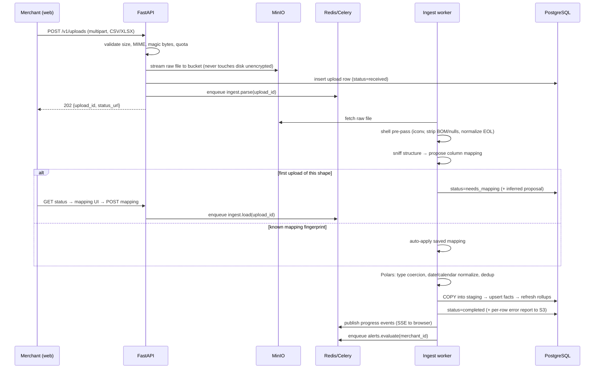

# 02 — System Architecture

## 1. Stack summary and rationale

| Layer | Choice | Rationale |
|---|---|---|
| API framework | **FastAPI** (Python 3.12, Pydantic v2) | Async-first for high-concurrency I/O (dashboard reads are cache/DB-bound); first-class OpenAPI generation feeds the public Sync API docs; Pydantic gives one validation story for HTTP, workers, and config |
| ASGI server | **uvicorn** workers under **gunicorn** supervisor | Battle-tested process model; graceful reload; per-worker isolation |
| ORM / migrations | **SQLAlchemy 2.0 (async, asyncpg)** + **Alembic** | Mature async support; Alembic migrations are reviewable SQL; escape hatch to raw SQL for analytics queries |
| Database | **PostgreSQL 16** | Relational integrity for tenancy/billing; declarative partitioning for the orders fact table; RLS for tenant isolation; materialized aggregates |
| Cache / rate limiting / locks | **Redis 7** | One system for app cache, rate-limit counters, Celery broker, distributed locks, pub/sub for job progress |
| Task queue | **Celery 5** (Redis broker, Redis result backend) | Ingestion, alert evaluation, SMS dispatch, report generation. Mature retry/routing/beat ecosystem; chosen over arq/Dramatiq for its scheduling (beat), routing, and operational tooling maturity — a commercial product needs boring queues |
| Heavy tabular parsing | **Polars** + **DuckDB**, with Unix shell pre-pass (`awk`/`sed`/`iconv`) | See [06-ingestion.md](06-ingestion.md); shell tools do streaming byte-level cleanup at near-zero memory, Polars does typed normalization, `COPY` loads Postgres |
| Object storage | **MinIO** (S3 API) self-hosted; swappable for S3/R2 | Raw uploads, rejected-row reports, generated exports. S3 API from day one so cloud migration is config-only |
| Web | **React 19 + TypeScript + Vite + vanilla CSS** | One React major is shared with the Expo workspace to prevent duplicate native modules; plain `.css` files with custom properties and cascade layers provide semantic tokens and responsive layouts without a utility framework or CSS runtime; TanStack Query handles server state; react-i18next handles localization |
| Mobile | **Expo + React Native** | Phase-2 native boundary reuses the generated API client and platform-neutral tokens while keeping native interaction and styling inside the app |
| Charts | **ECharts** (via echarts-for-react) | Handles dense time series on low-end Android browsers better than SVG-based libs; built-in canvas rendering, zoom/brush |
| Edge / TLS | **Caddy** (or nginx) reverse proxy | Automatic TLS, HTTP/2, gzip/brotli, static asset serving, coarse IP rate limiting, request size caps |
| Observability | **Sentry** (errors) + **Prometheus/Grafana** (metrics) + **Loki** (logs) + OpenTelemetry traces | See [12-operations.md](12-operations.md) |
| Deployment | **Docker Compose** on Ubuntu 24.04 (single host, vertically scaled) → compose-on-2-hosts → k8s only if warranted | Matches target environment; the compose file is the deployment unit; every service is stateless except Postgres/Redis/MinIO |

**Why FastAPI over Laravel (superseding the original spec):** one language (Python) across API, workers, and data processing removes the PHP↔shell↔queue impedance; Polars/DuckDB give the data pipeline real leverage; async endpoints suit the read-heavy cached dashboard workload; auto-generated OpenAPI is the premium Sync API's documentation. The shell-tool philosophy of the original spec is retained where it genuinely wins (streaming pre-clean of huge dirty files).

## 2. Component diagram



## 3. Request-path architecture

Every authenticated request passes an ordered middleware chain (order matters and is fixed):

1. **Request ID + tracing** — assigns `X-Request-ID`, opens OTel span.
2. **Body/size guard** — hard cap (1 MB JSON; uploads use dedicated multipart endpoints with tier-based caps).
3. **Authentication** — session cookie (web) or Bearer JWT (mobile) or API key (sync API). Resolves `principal`.
4. **Tenant resolution** — binds `merchant_id` from the principal; sets `app.current_merchant_id` on the DB session so Postgres RLS applies (defense in depth; the ORM layer also filters explicitly).
5. **Entitlements** — loads the plan snapshot (Redis-cached, 60 s TTL) and attaches allowed features/quotas.
6. **Rate limiting** — Redis token bucket keyed by principal + route class ([09-performance.md](09-performance.md)).
7. **Idempotency** — for mutating endpoints carrying `Idempotency-Key` ([04-api.md §8](04-api.md)).
8. **ETag / conditional GET** — for cacheable dashboard reads.

## 4. Data flow: ingestion (the core loop)



## 5. Data flow: dashboard read

Dashboard reads never scan raw order rows. Read path: **Redis cache → daily rollup tables → (only for uncached ad-hoc ranges) partitioned fact table with covering indexes.** Ingestion completion and alert changes invalidate the merchant's cache namespace by bumping a per-merchant version key (O(1) invalidation, no key scans). Details and TTLs: [09-performance.md](09-performance.md).

## 6. Multi-tenancy model

- **Single database, shared schema, `merchant_id` on every tenant-owned row.** At this product's scale (target: 10k merchants, low-GB per tenant) schema-per-tenant or DB-per-tenant adds operational cost with no benefit.
- **Postgres RLS enabled on all tenant tables** with policy `merchant_id = current_setting('app.current_merchant_id')::uuid`. The app sets this per-transaction. RLS is the safety net; explicit ORM scoping is the first line.
- Admin surface uses a separate DB role with `BYPASSRLS`, is audited, and is network-restricted.

## 7. Scaling path (documented now, built later)

| Bottleneck | First response | Second response |
|---|---|---|
| API CPU | Add uvicorn workers / replicas behind Caddy (stateless) | Second app host |
| Ingestion backlog | Scale `ingest` queue workers independently | Dedicated worker host |
| Dashboard query load | Redis cache hit-rate tuning; wider rollups | Read replica for analytics reads |
| Fact table size | Monthly partitions + free-tier 90-day pruning (drop partitions) | Move cold partitions to cheap storage; DuckDB over Parquet for archival queries |
| Redis | Separate cache vs broker instances | Redis Cluster |

## 8. Repository & code structure

Monorepo:

```text
/apps
  /web
    /src/{app,features,components,lib,locales,styles}
  /mobile               # Expo/React Native; demand-triggered phase 2 client
    /src/{features,components,lib,locales}
  /api
    /src/suq_api
      /api/v1           # routers: auth, uploads, widgets, billing, admin, sync
      /core             # config, security, limits, entitlements, errors, i18n
      /db               # sessions, models, RLS helpers, Alembic
      /domain           # pure metrics, forecasting, fingerprints, billing, auction
      /services         # orchestration between persistence, domain, and providers
      /workers          # Celery tasks: ingest, alerts, notify, ads, reports
      /integrations     # payments, messaging, email, object storage
    /scripts/shell      # versioned and tested streaming pre-pass scripts
    /tests
/packages
  /api-client           # generated TypeScript contract shared by web and mobile
  /design-tokens        # neutral source generating web CSS and native values
  /shared-types         # client-safe primitives only
/deploy                 # compose, Caddy, monitoring, backups, runbooks
/docs
```

Rules: `domain/` imports nothing from `api/` or `db/` (pure, unit-testable). Workers and API share `db/` and `domain/`. All config via environment (12-factor), validated at boot by pydantic-settings — the app refuses to start with missing/invalid config.

## 9. Key architectural decisions (ADR summary)

| # | Decision | Alternatives rejected | Why |
|---|---|---|---|
| 1 | FastAPI over Laravel | Laravel (original spec), Django | Single-language data+API stack, async reads, OpenAPI-native |
| 2 | Celery over arq/Dramatiq | arq (asyncio-native) | Beat scheduling, routing, mature ops; workers are sync-CPU anyway (Polars) |
| 3 | Single-DB multi-tenancy + RLS | Schema-per-tenant | Ops simplicity at target scale; RLS covers the risk |
| 4 | Precomputed rollups over query-time OLAP | ClickHouse, live aggregation | One fewer system; write volume is batch-shaped, perfect for rollup-on-ingest |
| 5 | Prepaid ad wallets | Invoiced advertising | No receivables risk in a self-serve SMB ad market |
| 6 | SSE for job progress | WebSockets | One-directional need; SSE survives proxies and flaky mobile networks better, trivially resumable |
| 7 | MinIO with S3 API | Local filesystem | Multi-host ready, presigned URLs, lifecycle rules for retention |
| 8 | PWA first, React Native phase 2 | Native-first | See [01-product.md §8](01-product.md) |
