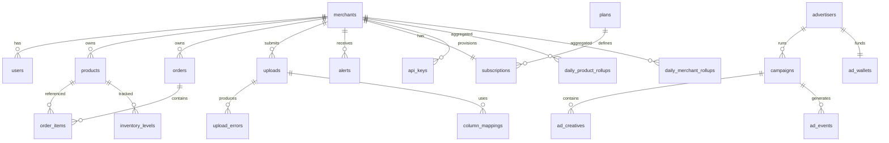

# 03 — Data Model

PostgreSQL 16. Conventions: `uuid` PKs (v7, time-ordered, generated app-side for index locality), `timestamptz` everywhere (UTC in DB; localization at the edge), `created_at`/`updated_at` on all tables, soft-delete (`deleted_at`) only where the product needs undo (products, campaigns) — hard delete elsewhere. Monetary values: `numeric(14,2)` + `currency char(3)`. All tenant tables carry `merchant_id` and RLS (see [05-security.md §4](05-security.md)).

## 1. Entity-relationship overview



## 2. Identity & tenancy

```sql
CREATE TABLE merchants (
    id              uuid PRIMARY KEY,
    name            text NOT NULL,
    slug            citext UNIQUE NOT NULL,
    country         char(2) NOT NULL,                 -- ISO 3166-1, chosen at signup
    city            text,
    business_category text,              -- taxonomy code; drives ad targeting
    default_locale  text NOT NULL DEFAULT 'en' CHECK (default_locale IN ('en','es','fr')),
    default_currency char(3) NOT NULL DEFAULT 'USD',  -- from supported list (USD,EUR,MXN,COP,ARS,CLP,GBP,XOF,...)
    timezone        text NOT NULL,                    -- IANA tz, inferred from country + browser at signup
    status          text NOT NULL DEFAULT 'active'    -- active|suspended|closed
                    CHECK (status IN ('active','suspended','closed')),
    created_at      timestamptz NOT NULL DEFAULT now(),
    updated_at      timestamptz NOT NULL DEFAULT now()
);

CREATE TABLE users (
    id              uuid PRIMARY KEY,
    merchant_id     uuid REFERENCES merchants(id),    -- NULL for platform admins & advertiser-only users
    email           citext UNIQUE,                    -- primary identifier
    phone_e164      text UNIQUE,                      -- optional; required only for SMS alert channel
    password_hash   text,                             -- argon2id; NULL until set
    full_name       text NOT NULL,
    role            text NOT NULL CHECK (role IN ('owner','staff','advertiser','platform_admin')),
    locale          text NOT NULL DEFAULT 'en',
    phone_verified_at timestamptz,
    email_verified_at timestamptz,
    totp_secret     text,                             -- encrypted at rest (app-level AES-GCM)
    last_login_at   timestamptz,
    status          text NOT NULL DEFAULT 'active' CHECK (status IN ('active','disabled')),
    created_at      timestamptz NOT NULL DEFAULT now(),
    updated_at      timestamptz NOT NULL DEFAULT now(),
    CONSTRAINT email_or_phone CHECK (email IS NOT NULL OR phone_e164 IS NOT NULL)
);
CREATE INDEX ON users (merchant_id) WHERE merchant_id IS NOT NULL;

CREATE TABLE refresh_tokens (          -- rotating refresh tokens, hashed
    id              uuid PRIMARY KEY,
    user_id         uuid NOT NULL REFERENCES users(id) ON DELETE CASCADE,
    token_hash      text NOT NULL,     -- sha256; raw token never stored
    family_id       uuid NOT NULL,     -- rotation family for reuse detection
    expires_at      timestamptz NOT NULL,
    revoked_at      timestamptz,
    user_agent      text,
    ip              inet,
    created_at      timestamptz NOT NULL DEFAULT now()
);
CREATE INDEX ON refresh_tokens (user_id, family_id);

CREATE TABLE api_keys (
    id              uuid PRIMARY KEY,
    merchant_id     uuid NOT NULL REFERENCES merchants(id),
    name            text NOT NULL,
    key_prefix      text NOT NULL,          -- first 8 chars, shown in UI: "sqk_live_ab12cd34"
    key_hash        text NOT NULL UNIQUE,   -- sha256 of full key
    scopes          text[] NOT NULL DEFAULT '{sync:write,sync:read}',
    last_used_at    timestamptz,
    expires_at      timestamptz,
    revoked_at      timestamptz,
    created_by      uuid NOT NULL REFERENCES users(id),
    created_at      timestamptz NOT NULL DEFAULT now()
);
CREATE INDEX ON api_keys (merchant_id);
```

## 3. Catalog & facts

```sql
CREATE TABLE products (
    id              uuid PRIMARY KEY,
    merchant_id     uuid NOT NULL REFERENCES merchants(id),
    sku             text,                        -- merchant's code, nullable (many have none)
    name            text NOT NULL,
    normalized_name text NOT NULL,               -- lowercased/trimmed/de-diacriticized for matching
    category        text,
    unit_price      numeric(14,2),
    currency        char(3) NOT NULL,                -- defaults to merchant's default_currency at insert
    reorder_point   integer,                     -- merchant override; NULL = use computed
    deleted_at      timestamptz,
    created_at      timestamptz NOT NULL DEFAULT now(),
    updated_at      timestamptz NOT NULL DEFAULT now(),
    UNIQUE NULLS NOT DISTINCT (merchant_id, sku),
    UNIQUE (merchant_id, normalized_name)        -- dedup anchor when no SKU exists
);

-- The big fact table: monthly range partitions on occurred_at.
CREATE TABLE orders (
    id              uuid NOT NULL,
    merchant_id     uuid NOT NULL,
    external_ref    text,                        -- order number from source system
    customer_key    text,                        -- normalized phone/name hash for retention analysis
    occurred_at     timestamptz NOT NULL,        -- business time (normalized from source format)
    total_amount    numeric(14,2) NOT NULL,
    currency        char(3) NOT NULL,            -- merchant's default_currency; mixed-currency rows rejected v1
    channel         text,                        -- pos|marketplace|whatsapp|shop|other
    upload_id       uuid,                        -- provenance
    row_fingerprint text NOT NULL,               -- dedup hash (see 06-ingestion §6)
    created_at      timestamptz NOT NULL DEFAULT now(),
    PRIMARY KEY (merchant_id, occurred_at, id),
    UNIQUE (merchant_id, occurred_at, row_fingerprint)
) PARTITION BY RANGE (occurred_at);
-- Partitions created by a Celery beat task 3 months ahead; free-tier retention
-- enforced by row pruning (not partition drop — partitions are shared across tenants).
CREATE INDEX ON orders (merchant_id, occurred_at DESC);
CREATE INDEX ON orders (upload_id);

CREATE TABLE order_items (
    id              uuid NOT NULL,
    merchant_id     uuid NOT NULL,
    order_id        uuid NOT NULL,
    occurred_at     timestamptz NOT NULL,        -- denormalized for partition alignment
    product_id      uuid NOT NULL,
    quantity        numeric(12,3) NOT NULL,
    unit_price      numeric(14,2) NOT NULL,
    line_total      numeric(14,2) NOT NULL,
    PRIMARY KEY (merchant_id, occurred_at, id)
) PARTITION BY RANGE (occurred_at);
CREATE INDEX ON order_items (merchant_id, product_id, occurred_at DESC);

CREATE TABLE inventory_levels (                  -- latest known stock per product (snapshot log)
    id              uuid PRIMARY KEY,
    merchant_id     uuid NOT NULL REFERENCES merchants(id),
    product_id      uuid NOT NULL REFERENCES products(id),
    quantity        numeric(12,3) NOT NULL,
    as_of           timestamptz NOT NULL,
    source          text NOT NULL,               -- upload|manual|api
    created_at      timestamptz NOT NULL DEFAULT now()
);
CREATE INDEX ON inventory_levels (merchant_id, product_id, as_of DESC);
```

## 4. Ingestion bookkeeping

```sql
CREATE TABLE uploads (
    id              uuid PRIMARY KEY,
    merchant_id     uuid NOT NULL REFERENCES merchants(id),
    filename        text NOT NULL,
    byte_size       bigint NOT NULL,
    content_sha256  text NOT NULL,
    s3_key          text NOT NULL,
    kind            text NOT NULL DEFAULT 'sales' CHECK (kind IN ('sales','inventory','products')),
    status          text NOT NULL DEFAULT 'received' CHECK (status IN
                     ('received','preprocessing','needs_mapping','loading',
                      'completed','completed_with_errors','failed','rejected')),
    mapping_id      uuid,                        -- FK set once resolved
    stats           jsonb NOT NULL DEFAULT '{}', -- {rows_total, rows_loaded, rows_rejected, duration_ms}
    error_report_s3_key text,                    -- per-row rejects, merchant-downloadable
    idempotency_key text,
    created_by      uuid REFERENCES users(id),   -- NULL when via API key
    api_key_id      uuid REFERENCES api_keys(id),
    created_at      timestamptz NOT NULL DEFAULT now(),
    completed_at    timestamptz,
    UNIQUE NULLS NOT DISTINCT (merchant_id, idempotency_key)
);
CREATE INDEX ON uploads (merchant_id, created_at DESC);
-- Same-content re-upload detection:
CREATE INDEX ON uploads (merchant_id, content_sha256);

CREATE TABLE column_mappings (                   -- saved "shapes" so repeat uploads auto-map
    id              uuid PRIMARY KEY,
    merchant_id     uuid NOT NULL REFERENCES merchants(id),
    header_fingerprint text NOT NULL,            -- hash of normalized header row
    kind            text NOT NULL,
    mapping         jsonb NOT NULL,              -- {"Total Price":"line_total","Date Sold":"occurred_at",...}
    options         jsonb NOT NULL DEFAULT '{}', -- {date_format, day_first:bool, decimal_sep:","|".", delimiter, encoding}
    created_at      timestamptz NOT NULL DEFAULT now(),
    UNIQUE (merchant_id, header_fingerprint, kind)
);

CREATE TABLE upload_errors (                     -- capped at 1000 rows/upload; full report in S3
    id              bigint GENERATED ALWAYS AS IDENTITY PRIMARY KEY,
    upload_id       uuid NOT NULL REFERENCES uploads(id) ON DELETE CASCADE,
    merchant_id     uuid NOT NULL,
    row_number      integer NOT NULL,
    error_code      text NOT NULL,               -- i18n key: e.g. "err.date_unparseable"
    error_context   jsonb NOT NULL DEFAULT '{}',
    raw_row         text                         -- truncated to 2 KB
);
CREATE INDEX ON upload_errors (upload_id);
```

## 5. Rollups (the dashboard's real data source)

Plain tables (not materialized views) maintained incrementally by the ingestion worker inside the load transaction — a materialized view would force full refresh; incremental upsert touches only affected (merchant, day, product) keys.

```sql
CREATE TABLE daily_merchant_rollups (
    merchant_id     uuid NOT NULL,
    day             date NOT NULL,               -- merchant's local day (tz-aware bucketing)
    revenue         numeric(16,2) NOT NULL DEFAULT 0,
    order_count     integer NOT NULL DEFAULT 0,
    unit_count      numeric(14,3) NOT NULL DEFAULT 0,
    unique_customers integer NOT NULL DEFAULT 0,
    new_customers   integer NOT NULL DEFAULT 0,
    PRIMARY KEY (merchant_id, day)
);

CREATE TABLE daily_product_rollups (
    merchant_id     uuid NOT NULL,
    product_id      uuid NOT NULL,
    day             date NOT NULL,
    revenue         numeric(16,2) NOT NULL DEFAULT 0,
    unit_count      numeric(14,3) NOT NULL DEFAULT 0,
    order_count     integer NOT NULL DEFAULT 0,
    PRIMARY KEY (merchant_id, product_id, day)
);

CREATE TABLE customer_cohorts (                  -- retention matrix source
    merchant_id     uuid NOT NULL,
    customer_key    text NOT NULL,
    first_order_month date NOT NULL,
    month           date NOT NULL,               -- activity month
    order_count     integer NOT NULL,
    revenue         numeric(16,2) NOT NULL,
    PRIMARY KEY (merchant_id, customer_key, month)
);
```

## 6. Alerts

```sql
CREATE TABLE alert_rules (                       -- per-merchant config; defaults created at signup
    id              uuid PRIMARY KEY,
    merchant_id     uuid NOT NULL REFERENCES merchants(id),
    kind            text NOT NULL CHECK (kind IN ('stockout','velocity_spike','velocity_drop','retention_dip')),
    enabled         boolean NOT NULL DEFAULT true,
    params          jsonb NOT NULL DEFAULT '{}', -- {horizon_days:7, min_stock_days:5,...}
    channels        text[] NOT NULL DEFAULT '{dashboard}',  -- dashboard|sms|email (sms/email premium-gated)
    created_at      timestamptz NOT NULL DEFAULT now(),
    updated_at      timestamptz NOT NULL DEFAULT now()
);

CREATE TABLE alerts (
    id              uuid PRIMARY KEY,
    merchant_id     uuid NOT NULL REFERENCES merchants(id),
    rule_id         uuid REFERENCES alert_rules(id),
    kind            text NOT NULL,
    product_id      uuid,
    severity        text NOT NULL CHECK (severity IN ('info','warning','critical')),
    payload         jsonb NOT NULL,              -- {days_of_stock_left: 3, avg_daily_units: 12.4, ...}
    dedup_key       text NOT NULL,               -- e.g. "stockout:<product_id>"
    status          text NOT NULL DEFAULT 'active' CHECK (status IN ('active','acknowledged','resolved','expired')),
    first_seen_at   timestamptz NOT NULL DEFAULT now(),
    last_evaluated_at timestamptz NOT NULL DEFAULT now(),
    resolved_at     timestamptz,
    UNIQUE (merchant_id, dedup_key)              -- an alert is a state, not a stream of duplicates
);
CREATE INDEX ON alerts (merchant_id, status, severity);

CREATE TABLE notifications (                     -- outbound message log (SMS/email), for audit + dedup + cost tracking
    id              uuid PRIMARY KEY,
    merchant_id     uuid NOT NULL,
    user_id         uuid,
    alert_id        uuid REFERENCES alerts(id),
    channel         text NOT NULL CHECK (channel IN ('sms','email')),
    destination     text NOT NULL,
    locale          text NOT NULL,
    template_key    text NOT NULL,
    status          text NOT NULL DEFAULT 'queued' CHECK (status IN ('queued','sent','delivered','failed')),
    provider        text,
    provider_msg_id text,
    cost_micro_usd  bigint,
    created_at      timestamptz NOT NULL DEFAULT now(),
    sent_at         timestamptz
);
CREATE INDEX ON notifications (merchant_id, created_at DESC);
```

## 7. Billing (details in [11-billing.md](11-billing.md))

```sql
CREATE TABLE plans (
    id              text PRIMARY KEY,            -- 'free', 'premium_monthly', 'premium_annual'
    name            jsonb NOT NULL,              -- localized names
    price           numeric(14,2) NOT NULL,
    currency        char(3) NOT NULL DEFAULT 'USD',   -- regional price points live as separate plan rows (e.g. premium_monthly_mx)
    interval        text CHECK (interval IN ('month','year')),
    entitlements    jsonb NOT NULL,
    -- {"history_days": 90, "uploads_per_day": 5, "upload_max_mb": 10, "seats": 1,
    --  "sync_api": false, "sms_alerts": false, "ad_free": false,
    --  "api_rate_per_min": 0, "export_full": false}
    active          boolean NOT NULL DEFAULT true
);

CREATE TABLE subscriptions (
    id              uuid PRIMARY KEY,
    merchant_id     uuid NOT NULL UNIQUE REFERENCES merchants(id),
    plan_id         text NOT NULL REFERENCES plans(id),
    provider        text,                        -- 'stripe' for auto-renewing; NULL for free
    provider_sub_id text UNIQUE,                 -- Stripe subscription id; webhook reconciliation anchor
    status          text NOT NULL CHECK (status IN ('active','past_due','grace','canceled','expired')),
    current_period_start timestamptz NOT NULL,
    current_period_end   timestamptz NOT NULL,
    cancel_at_period_end boolean NOT NULL DEFAULT false,
    created_at      timestamptz NOT NULL DEFAULT now(),
    updated_at      timestamptz NOT NULL DEFAULT now()
);

CREATE TABLE payments (
    id              uuid PRIMARY KEY,
    merchant_id     uuid REFERENCES merchants(id),
    advertiser_id   uuid,                        -- ad wallet top-ups reuse this table
    provider        text NOT NULL CHECK (provider IN ('stripe','mercadopago','flutterwave','manual')),  -- stripe at launch; others reserved
    provider_ref    text UNIQUE,                 -- provider tx id — idempotency anchor for webhooks
    amount          numeric(14,2) NOT NULL,
    currency        char(3) NOT NULL,
    purpose         text NOT NULL CHECK (purpose IN ('subscription','wallet_topup')),
    status          text NOT NULL CHECK (status IN ('pending','succeeded','failed','refunded')),
    raw_payload     jsonb,
    created_at      timestamptz NOT NULL DEFAULT now()
);
```

## 8. Ad platform (details in [08-ads.md](08-ads.md))

```sql
CREATE TABLE advertisers (
    id              uuid PRIMARY KEY,
    company_name    text NOT NULL,
    contact_user_id uuid NOT NULL REFERENCES users(id),
    status          text NOT NULL DEFAULT 'pending_review'
                    CHECK (status IN ('pending_review','active','suspended')),
    created_at      timestamptz NOT NULL DEFAULT now()
);

CREATE TABLE ad_wallets (
    advertiser_id   uuid PRIMARY KEY REFERENCES advertisers(id),
    balance_micro   bigint NOT NULL DEFAULT 0 CHECK (balance_micro >= 0),  -- micro-units of wallet currency, integer math only
    currency        char(3) NOT NULL DEFAULT 'USD',  -- one currency per wallet, fixed at creation
    updated_at      timestamptz NOT NULL DEFAULT now()
);

CREATE TABLE ad_wallet_ledger (                  -- append-only; balance is derivable, wallet row is the cache
    id              bigint GENERATED ALWAYS AS IDENTITY PRIMARY KEY,
    advertiser_id   uuid NOT NULL,
    delta_micro     bigint NOT NULL,
    reason          text NOT NULL CHECK (reason IN ('topup','click_charge','impression_charge','refund','adjustment')),
    ref_id          uuid,                        -- payment id or ad_event id
    balance_after_micro bigint NOT NULL,
    created_at      timestamptz NOT NULL DEFAULT now()
);

CREATE TABLE campaigns (
    id              uuid PRIMARY KEY,
    advertiser_id   uuid NOT NULL REFERENCES advertisers(id),
    name            text NOT NULL,
    status          text NOT NULL DEFAULT 'draft'
                    CHECK (status IN ('draft','pending_review','active','paused','exhausted','archived')),
    trigger_context text NOT NULL,               -- stockout|velocity_spike|dashboard_general|retention
    targeting       jsonb NOT NULL DEFAULT '{}', -- {cities:[], categories:[], languages:[]}
    bid_model       text NOT NULL CHECK (bid_model IN ('cpc','cpm')),
    bid_micro       bigint NOT NULL,
    daily_budget_micro bigint NOT NULL,
    total_budget_micro bigint,
    starts_at       timestamptz NOT NULL,
    ends_at         timestamptz,
    deleted_at      timestamptz,
    created_at      timestamptz NOT NULL DEFAULT now(),
    updated_at      timestamptz NOT NULL DEFAULT now()
);
CREATE INDEX ON campaigns (status, trigger_context) WHERE status = 'active';

CREATE TABLE ad_creatives (
    id              uuid PRIMARY KEY,
    campaign_id     uuid NOT NULL REFERENCES campaigns(id),
    locale          text NOT NULL,
    headline        text NOT NULL,
    body            text NOT NULL,
    cta_label       text NOT NULL,
    cta_url         text NOT NULL,
    image_s3_key    text,
    review_status   text NOT NULL DEFAULT 'pending' CHECK (review_status IN ('pending','approved','rejected')),
    review_note     text
);

CREATE TABLE ad_events (                         -- partitioned monthly like orders
    id              uuid NOT NULL,
    occurred_at     timestamptz NOT NULL,
    campaign_id     uuid NOT NULL,
    creative_id     uuid NOT NULL,
    merchant_id     uuid NOT NULL,               -- viewer context (never exposed to advertiser row-level)
    kind            text NOT NULL CHECK (kind IN ('impression','click')),
    context         text NOT NULL,               -- slot/trigger that served it
    charge_micro    bigint NOT NULL DEFAULT 0,
    dedup_key       text NOT NULL,               -- prevents double-billing on retries
    PRIMARY KEY (occurred_at, id),
    UNIQUE (occurred_at, dedup_key)
) PARTITION BY RANGE (occurred_at);
```

## 9. Audit & platform

```sql
CREATE TABLE audit_log (                         -- append-only, security-relevant actions
    id              bigint GENERATED ALWAYS AS IDENTITY PRIMARY KEY,
    actor_user_id   uuid,
    merchant_id     uuid,
    action          text NOT NULL,               -- 'user.login','api_key.created','plan.changed','admin.impersonate',...
    target          jsonb,
    ip              inet,
    user_agent      text,
    created_at      timestamptz NOT NULL DEFAULT now()
);
CREATE INDEX ON audit_log (merchant_id, created_at DESC);
CREATE INDEX ON audit_log (actor_user_id, created_at DESC);

CREATE TABLE idempotency_records (               -- see 04-api §8; TTL-pruned by beat task
    key             text NOT NULL,
    merchant_id     uuid NOT NULL,
    request_hash    text NOT NULL,
    response_status integer,
    response_body   jsonb,
    created_at      timestamptz NOT NULL DEFAULT now(),
    PRIMARY KEY (merchant_id, key)
);
```

## 10. Retention & pruning policy

| Data | Free | Premium | Mechanism |
|---|---|---|---|
| Orders / order_items | 90 days | Unlimited | Nightly beat task deletes free-tier rows older than 90 d (batched, off-peak); premium untouched |
| Rollups | 90 days visible (rows kept 13 months for upgrade incentive: upgrading instantly reveals history we still hold) | Unlimited | Visibility enforced at query layer via entitlement |
| Raw upload files (S3) | 30 days | 180 days | S3 lifecycle rules per prefix |
| upload_errors | 90 days | 90 days | Beat prune |
| ad_events | 13 months | — | Partition drop |
| audit_log | 24 months | — | Partition/prune |
| notifications | 12 months | — | Beat prune |
| refresh_tokens / idempotency_records | expiry + 7 d | — | Beat prune |

## 11. Migration discipline

- Alembic, one revision per PR, autogenerate always hand-reviewed.
- Zero-downtime rules: additive first; `NOT NULL` added via `DEFAULT` + backfill + validate; index creation always `CONCURRENTLY`; destructive changes only two releases after code stops referencing them.
- Every migration tested in CI against a snapshot-restored copy of staging.
